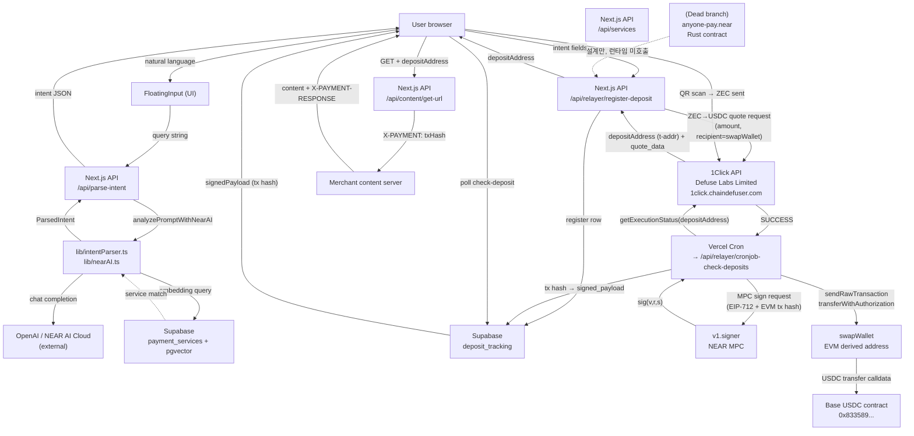

# Pay Anyone Legend — Deep Dive (§0 Big Picture)

> **Spec coverage: complete.** Tasks 1–12 완료 후 작성됨 (2026-05-11).

---

## §0.1 Anyone-Pay이 되고 싶어한 것 (What it tried to be)

Pay Anyone Legend(PAL)는 "자연어로 말하면 AI가 알아서 Zcash로 결제해주는 어시스턴트"를 표방하며, AI intent 파싱 + Zcash shielded 결제 + NEAR Chain Signatures + x402 HTTP paywall 해제를 하나의 Next.js 앱으로 묶은 hackathon 프로젝트다. 기술적 베팅은 x402(HTTP 402 paywall 프로토콜) + NEAR Chain Signatures(키를 보유하지 않는 EVM 서명) + 1Click cross-chain 브리지 + OpenAI/NEAR AI intent 파싱의 조합이었다. 실제 동작 범위는 mainnet 전용, 단일 happy path(ZEC → USDC → Base), hackathon 규모의 코드베이스로 한정되며, 환불·장애 복구·사용자 격리가 구현되지 않았다. 가장 중요한 사실은 **프로젝트의 실제 구현이 README 설명보다 훨씬 얕다는 점**이다 — 특히 Zcash 측은 1Click(Defuse Labs Limited, Gibraltar) 외부 서비스에 전부 위임되어 있고, x402는 표준 HTTP 402 challenge/response 없이 Base USDC를 직접 on-chain push하는 방식으로 구현되어 있다.

---

## §0.2 다섯 단계 사용자 스토리 (Five-step user story)

1. **자연어 입력** — 사용자가 "Pay onlyfan" 또는 "0.1 USDC to 0x... on Base"를 입력하면 `FloatingInput`이 `POST /api/parse-intent`로 전달한다. (see [§1.1 intent parser](./01-intent-parser.md))

2. **AI 서비스 매칭** — 서버가 pgvector 시맨틱 검색으로 등록된 service와 매칭(임계값 0.6)하거나, 미매칭 시 LLM(`gpt-4o-mini` 또는 `deepseek-chat-v3-0324`)으로 `{amount, currency, chain, receivingAddress}` 추출. (see [§1.1](./01-intent-parser.md), [§1.2 service registry](./02-service-registry.md))

3. **1Click quote 요청 + QR 표시** — `POST /api/relayer/register-deposit`이 1Click API에 `ZEC → USDC` quote를 요청하고, 응답의 `depositAddress`(transparent t-addr, 1Click 소유)를 QR로 표시한다. PAL은 Zcash 주소를 자체 생성하지 않는다. (see [§1.3 z-address](./03-z-address-generation.md), [§1.5 1Click bridge](./05-one-click-bridge.md))

4. **ZEC 입금 + cron 폴링** — 사용자가 QR로 ZEC를 송금하면, Vercel cron(`*/1 * * * *`)이 1Click SDK `getExecutionStatus(depositAddress)`를 폴링하다가 `SUCCESS` 시 다음 단계로 진입한다. Zcash 체인을 직접 조회하지 않고 1Click 응답을 blind trust한다. (see [§1.4 deposit tracking](./04-deposit-tracking.md), [§1.5](./05-one-click-bridge.md))

5. **NEAR Chain Signatures → EVM broadcast → X-PAYMENT** — 1Click `SUCCESS` 감지 즉시 cron이 `signX402TransactionWithChainSignature()`를 호출, NEAR MPC(`v1.signer`)로 두 번 서명하여 Base mainnet에 USDC `transferWithAuthorization`을 broadcast한다. 반환된 Ethereum tx hash가 `X-PAYMENT` 헤더로 content 서버에 전달되어 paywall이 해제된다. (see [§1.6 NEAR Chain Signatures](./06-near-chain-signatures.md), [§1.7 x402 client](./07-x402-client.md))

---

## §0.3 아키텍처 맵 (Architecture map)



**ASCII fallback (Mermaid 미지원 환경):**

```
[User browser]
     │ query
     ▼
[FloatingInput] ──POST /api/parse-intent──▶ [lib/intentParser + lib/nearAI]
                                                    │ embedding query
                                                    ▼
                                           [Supabase: payment_services + pgvector]
                                                    │ service match / fallback
                                                    ▼
                                           [OpenAI / NEAR AI Cloud]
                                                    │ ParsedIntent
                                                    ▼
[User] ──intent fields──▶ [POST /api/relayer/register-deposit]
                                    │ ZEC→USDC quote (amount, recipient=swapWallet)
                                    ▼
                           [1Click API — Defuse Labs Limited]
                                    │ depositAddress (transparent t-addr) + quote_data
                                    ▼
                           [Supabase: deposit_tracking] ←── cron writes tx hash
                                    │
    [User scans QR, sends ZEC]      │
           │                        │
           ▼                        │
    [1Click API]  ←── polling ── [Vercel Cron → /api/relayer/cronjob-check-deposits]
           │ SUCCESS                │
           └────────────────────────┘
                                    │ MPC sign request (EIP-712 + legacy EVM tx)
                                    ▼
                              [v1.signer — NEAR MPC]
                                    │ sig(v,r,s)
                                    ▼
                         [swapWallet — EVM derived address]
                                    │ transferWithAuthorization calldata
                                    ▼
                         [Base USDC contract 0x833589...]
                                    │ tx hash → signed_payload
                                    ▼
[User] ──GET /api/content/get-url──▶ [Next.js API]
                                    │ X-PAYMENT: txHash
                                    ▼
                           [Merchant content server]
                                    │ content + X-PAYMENT-RESPONSE
                                    ▼
                              [User sees content]

(Dead branch) [anyone-pay.near Rust contract] — 설계만 존재, 런타임 미호출
```

---

## §0.4 읽기 가이드 (Reading guide)

| 알고 싶은 것 | 읽을 곳 |
|---|---|
| 자연어가 어떻게 service 매칭이 되는가 | [§1.1](./01-intent-parser.md) + [§1.2](./02-service-registry.md) |
| 입금 주소가 어떻게 생성되는가 (truth: 안 만든다) | [§1.3](./03-z-address-generation.md) |
| 입금이 어떻게 확인되는가 (truth: 1Click을 blind-trust) | [§1.4](./04-deposit-tracking.md) |
| ZEC가 어떻게 USDC가 되는가 (truth: 1Click solver network) | [§1.5](./05-one-click-bridge.md) |
| 키를 보유하지 않고 어떻게 EVM tx를 서명하는가 | [§1.6](./06-near-chain-signatures.md) |
| paywall이 어떻게 풀리는가 (truth: 직접 USDC push, 진짜 x402 dance 없음) | [§1.7](./07-x402-client.md) |
| Rust 컨트랙트는 무슨 역할인가 (truth: dead code) | [§1.8](./08-near-rust-contract.md) |
| 우리 팀이 카테고리 E로 가야 하는가? 무엇을 베끼고 무엇을 다시 만들어야 하는가? | [§2 category-E extraction](./category-E-extraction.md) |
| Zcash 측은 어떻게 outsource됐고, 무엇을 썼어야 했는가? | [§3 zcash-tool-inventory](./zcash-tool-inventory.md) |

---

## §0.5 핵심 발견 (Key findings)

- **PAL의 "x402"는 실제 HTTP 402 dance를 구현하지 않는다.** 표준 흐름(서버가 `402 + paymentRequirements` 발행 → 클라이언트가 `X-PAYMENT` 헤더로 재요청)이 없다. 대신 cron이 USDC를 미리 on-chain broadcast하고 Ethereum tx hash를 `X-PAYMENT` bearer로 사용하는 post-hoc proof 방식이다. facilitator도 없다. ([§1.7](./07-x402-client.md), [§2.1](./category-E-extraction.md))

- **PAL은 Zcash 트랜잭션을 한 줄도 생성하지 않는다.** 입금 주소부터 swap 실행까지 전부 1Click(Defuse Labs Limited, Gibraltar 법인)에 위임된다. PAL 코드베이스에 Zcash 암호화 라이브러리는 단 하나도 없다. ([§1.3](./03-z-address-generation.md), [§3](./zcash-tool-inventory.md))

- **1Click은 transparent t-address만 지원한다.** 공식 문서에 "⚠️ Partially supported — Transparent addresses only (`t1`/`t3` prefix)"가 명시되어 있다. PAL의 README가 주장하는 "shielded transactions hide amounts, sender, and recipient"는 L1에서 false다. ([§3.1](./zcash-tool-inventory.md), [§1.5](./05-one-click-bridge.md))

- **1Click `/v0/quote`는 sender ZEC 주소와 최종 EVM recipient를 같은 요청에 담는다.** `refundTo`(송신자 ZEC 주소) + `recipient`(최종 EVM 주소)가 단일 API 호출에 포함되어 1Click에 전달된다. API 레벨에서 unlinkability(송신자-수신자 비연결성)가 완전히 무효화된다. ([§1.5](./05-one-click-bridge.md))

- **모든 사용자가 같은 `swapWallet`을 공유한다.** `MPC_PATH = 'base-1'`이 `lib/chainSig.ts:18`에 하드코딩되어 있어, 모든 사용자·모든 주문이 동일한 EVM 파생 주소를 사용한다. per-user isolation이 없다. ([§1.6](./06-near-chain-signatures.md))

- **`lib/nearAI.ts`는 사실상 OpenAI 클라이언트다.** 파일 이름과 달리 `openai` npm 패키지를 사용하며 `OPENAI_API_KEY`가 있으면 `gpt-4o-mini`(OpenAI), 없으면 `deepseek-chat-v3-0324`(NEAR AI Cloud)를 호출한다. 파일 최상단에 "TEMPORARILY using OpenAI for testing" 주석이 있다. ([§1.1](./01-intent-parser.md))

- **Rust 컨트랙트의 x402 메서드들은 배포·테스트 스크립트에서만 호출되는 dead code다.** `execute_x402_payment()`, `verify_deposit()`, `mark_funded()` 등 핵심 메서드 중 어느 것도 런타임 TypeScript 코드에서 호출되지 않는다. `rg` 검색 결과 0건. ([§1.8](./08-near-rust-contract.md))

- **TypeScript Zcash 네이티브 라이브러리 생태계 자체가 비어 있다.** `@zec`, `zcash-wasm`, `librustzcash`, `bellman`, `orchard`, `sapling-crypto`, `pczt` 등 어떤 Zcash 암호화 라이브러리도 npm에 production-ready 상태로 존재하지 않는다. JS-first 팀이 Category E를 진짜로 구현하려면 Rust 백엔드(`zcash_client_backend`, `zcash_primitives` crate) 또는 Swift/Kotlin native SDK가 필요하다. ([§3.4](./zcash-tool-inventory.md))

- **환불 endpoint는 존재하지 않는다.** DEPLOY.md가 `POST /api/relayer/refund`를 문서화하지만 실제 route 파일이 없다. x402 실행이 실패하거나 deadline이 만료되면 USDC가 `swapWallet`에 잠겨 사용자 복구 수단이 없다. ([§1.4](./04-deposit-tracking.md), [§1.7](./07-x402-client.md))

- **Vercel cron 실제 주기는 1분이다.** DEPLOY.md와 `scripts/run-cronjob.js`는 "5초마다"라고 명시하지만 `vercel.json:9`의 실제 schedule은 `*/1 * * * *`(매 1분)이다. Vercel Hobby tier의 cron 최솟값이 1분이다. ([§1.4](./04-deposit-tracking.md))

---

## §0.6 한 줄 결론 (One-line takeaway)

> **PAL은 'x402 + Zcash' 프로젝트가 아니라 'AI intent + NEAR Chain Signatures + 1Click 브리지 + Base USDC push' 프로젝트이며, x402와 Zcash 양쪽 모두 이름만 빌렸다. 우리 팀이 Category E를 진짜로 구현하면 — Zcash를 shielded settlement asset으로 직접 사용하고, 표준 HTTP 402 challenge/response를 구현하면 — 차별화 여지는 매우 크다.**

---

## §0.7 이 디렉토리의 파일들 (Files in this dive)

- `01-intent-parser.md` — 자연어 입력 → `ParsedIntent` 변환 파이프라인. OpenAI(이름은 NEAR AI) + pgvector 시맨틱 검색 + regex fallback의 3단계 구조.
- `02-service-registry.md` — Supabase `payment_services` 테이블 + pgvector IVFFlat 인덱스 + `match_services` SQL 함수. insert-time 임베딩 생성, query-time cosine distance 검색.
- `03-z-address-generation.md` — PAL의 "z-address 생성"은 생성이 아니라 1Click API 응답 pass-through. `crypto.getRandomValues + 'zs1' prefix` 패턴은 존재하지 않음. week2 claim 부분 수정.
- `04-deposit-tracking.md` — Supabase `deposit_tracking` 상태 머신, Vercel cron(실제 1분 주기), 1Click SDK polling blind trust, x402 실행 트리거 로직.
- `05-one-click-bridge.md` — 1Click(Defuse Labs Limited, Gibraltar) API 호출 패턴. `/v0/quote`, `getExecutionStatus`, `submitDepositTx`. Privacy story 붕괴 분석.
- `06-near-chain-signatures.md` — `chainsig.js` + `v1.signer` NEAR MPC로 EVM tx 서명하는 전체 흐름. MPC 2회 호출(EIP-712 auth + EVM tx), `MPC_PATH = 'base-1'` 하드코딩, `lib/kdf.ts` 판정(A: NEAR path derivation, Zcash 무관).
- `07-x402-client.md` — PAL의 x402는 표준 402 dance 없음. cron이 Base mainnet에 USDC `transferWithAuthorization`을 direct broadcast하고 tx hash를 `X-PAYMENT` bearer로 전달. facilitator 없음. Secure Legion NLx402 패턴과의 비교.
- `08-near-rust-contract.md` — `AnyonePay` NEAR 컨트랙트의 모든 public 메서드 분석. `execute_x402_payment`, `verify_deposit`, `mark_funded` 등 핵심 메서드가 런타임 TS에서 전혀 호출되지 않는 dead code임을 `rg` 증거로 확립.
- `category-E-extraction.md` — PAL vs. Secure Legion/NLx402 패턴 비교. lift-and-use vs. redo 분류. 차별화 방향(Zcash를 x402 settlement rail로).
- `zcash-tool-inventory.md` — 1Click의 실체(Defuse Labs, Gibraltar, transparent-only, AML screening), PAL의 Zcash 의존성 전무, TypeScript Zcash 라이브러리 생태계 공백, 우리 팀 권장 스택(`zcash_client_backend`, lightwalletd, PCZT).
- `_claims-to-verify.md` — upstream README/SETUP/DEPLOY 문서에서 추출한 claim 검증 매트릭스. Tasks 1–12 완료 후 전부 `[x]` 또는 `[~]` 처리됨.

---

## §0.8 남은 의문 (Open questions for the team)

1. **1Click의 실제 Zcash deposit address 형식** — 공식 문서는 `t1`/`t3` prefix라고 하지만 PAL은 주소 형식을 검증하지 않는다. 실제 배포 환경에서 1Click이 반환하는 주소가 mainnet t-address인지 확인이 필요하다. *resolved by: 실제 `/v0/quote` 호출 후 응답 로깅.*

2. **`x402.near` facilitator 컨트랙트의 실존 여부** — Rust 컨트랙트가 `x402.near`에 `pay()`를 호출하도록 설계되어 있으나, NEAR mainnet에 이 계정이 실제 컨트랙트로 배포되어 있는지 확인되지 않았다. *resolved by: `near view x402.near ...` RPC 조회.*

3. **1Click swap 중 ZEC 보관 주소의 on-chain 검증** — PAL은 1Click을 blind trust하지만, 1Click의 solver 지갑이 실제로 어떤 Zcash 주소를 사용하는지 chain explorer로 확인하면 신뢰 모델을 평가할 수 있다. *resolved by: Zcash block explorer에서 1Click treasury 주소 조회.*

4. **swapWallet USDC 잔고 실제 확인** — `MPC_PATH = 'base-1'` 하드코딩으로 파생된 EVM 주소가 실제 Base mainnet에서 USDC를 수령하고 있는지, 여러 사용자의 USDC가 혼재하고 있는지 확인이 필요하다. *resolved by: `getEthereumAddressFromProxyAccount()` 실행 후 Base explorer 조회.*

5. **1Click JWT 수수료 실제 값** — PAL README는 "0.1%"라고 하고 공식 문서는 "0.2%"라고 한다. 실제 quote 응답의 fee 필드를 비교하면 정확한 값을 확인할 수 있다. *resolved by: JWT 유무 조건에서 각각 `/v0/quote` 호출 후 fee 필드 비교.*
