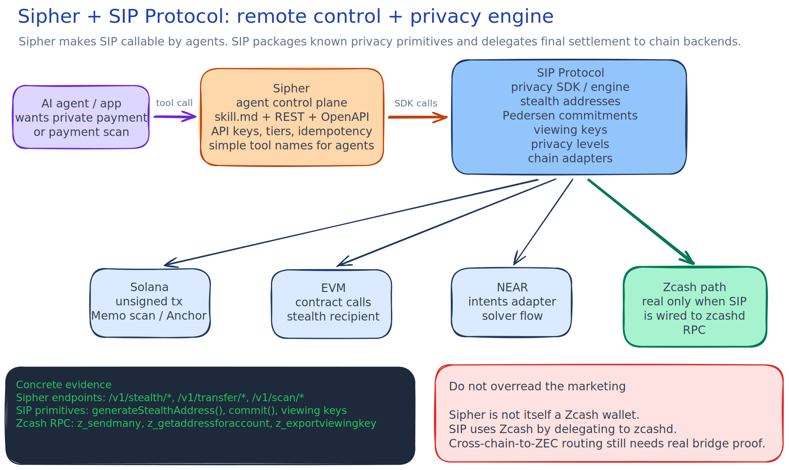

# Sipher And SIP Protocol
  
**Repos:** `sip-protocol/sipher` @ `ded380f`, `sip-protocol/sip-protocol` @ `7afc597`  
**Local clones:** `/private/tmp/sipher`, `/private/tmp/sip-protocol`

## Bottom Line

SIP Protocol is the privacy SDK/protocol layer. Sipher is the agent-facing API wrapper around that layer.

The clean mental model:

```text
SIP Protocol = privacy machine
Sipher       = robot-friendly remote control for that machine
Zcash        = one backend SIP can talk to, if wired to zcashd
```

SIP is useful as a reference for packaging known privacy primitives into one developer API: stealth addresses, commitments, viewing keys, shielded intent language, NEAR/Solana/EVM adapters, and Zcash RPC wrappers. It does not look like a cryptographic breakthrough; it is mostly integration and product packaging around known ideas.

Sipher is useful as a reference for exposing those tools to AI agents through `skill.md`, REST endpoints, OpenAPI SDKs, and agent integrations. It does not itself look like a real Zcash payment rail.

## Big Picture Diagram



Source: [sipher-and-sip-protocol-big-picture.excalidraw](./sipher-and-sip-protocol-big-picture.excalidraw).

## What SIP Protocol Is

SIP, or Shielded Intents Protocol, pitches itself as a cross-chain privacy layer: "one toggle" that hides sender, amount, and recipient for swaps/payments. The repo README frames this as "HTTPS for blockchain intents."

In code, SIP is a monorepo with:

- `packages/sdk`: TypeScript SDK and the main reusable surface.
- `packages/sdk/src/stealth`: stealth address generation for chain families.
- `packages/sdk/src/commitment.ts`: Pedersen commitment helpers.
- `packages/sdk/src/privacy.ts`: viewing-key and encrypted disclosure helpers.
- `packages/sdk/src/zcash`: Zcash RPC, shielded service, swap, and bridge wrappers.
- `programs/` and `contracts/`: Solana and EVM privacy-contract experiments.

The core product thesis is:

```text
normal chain intent
  -> SIP wraps it with stealth recipient + hidden amount + optional audit key
  -> adapter sends it through NEAR / Solana / EVM / Zcash-ish backend
```

## Does SIP Use Zcash?

Yes, but narrowly.

SIP has actual Zcash-named SDK code. `ZcashRPCClient` calls `zcashd` JSON-RPC methods such as `z_validateaddress`, `z_getnewaccount`, `z_getaddressforaccount`, `z_getbalanceforaccount`, `z_sendmany`, `z_getoperationstatus`, and `z_exportviewingkey`.

The architecture is:

```text
SIP SDK
  -> ZcashRPCClient
  -> zcashd JSON-RPC
  -> real Zcash wallet/node handles Sapling/Orchard work
```

So SIP does not implement Zcash cryptography itself. It delegates to a real Zcash node.

The less solid part is cross-chain routing into Zcash. `ZcashSwapService` and `ZcashBridge` have demo-mode quotes, mock prices, mock deposit addresses, and fallback mock transaction IDs unless a real bridge provider and `ZcashShieldedService` are configured. Treat "ETH/SOL/NEAR -> shielded ZEC" as scaffolded unless proven live.

## What Sipher Is

Sipher is the AI-agent-facing product surface.

It exposes privacy tools as simple agent-callable actions:

- generate stealth addresses
- derive one-time payment addresses
- prepare private/shielded transfer artifacts
- scan for payments
- create commitments
- create or disclose viewing keys
- check privacy/compliance metadata

The important interface pieces are:

- `skill.md`: markdown contract for agents.
- Express REST API: the main runtime.
- OpenAPI and generated SDKs.
- Eliza and LangChain-style examples.

In plain English:

```text
Agent says: "prepare private payment"
Sipher receives a simple API call
Sipher calls SIP SDK primitives
Sipher returns addresses, commitments, keys, or unsigned tx material
Wallet / chain-specific code must still execute and verify settlement
```

## Does Sipher Use Zcash?

Not in the strong sense.

Sipher depends on `@sip-protocol/sdk`, but the Sipher repo we inspected mostly exercises SIP's stealth-address, commitment, viewing-key, Solana transaction, scan, and API wrapper surfaces. We did not find Sipher acting as a Zcash wallet, scanning Zcash notes, handling UFVKs, using `lightwalletd`, constructing Orchard/Sapling transactions, or verifying ZEC settlement.

So:

```text
SIP Protocol: has a Zcash RPC wrapper
Sipher: agent API around SIP primitives, not a Zcash payment app
```

## What They Actually Do Together

Together, they are trying to make privacy payments usable by software agents.

The stack looks like:

```text
AI agent / app
  -> Sipher agent API
  -> SIP SDK
  -> privacy primitive or chain adapter
  -> Solana / EVM / NEAR / zcashd / bridge provider
```

The strongest reusable pattern is the split:

- Sipher owns agent ergonomics: tool names, endpoint taxonomy, API keys, rate limits, idempotency, OpenAPI, examples.
- SIP owns privacy machinery: stealth generation, commitments, viewing-key encryption, Zcash RPC wrapper, adapter interfaces.

That split is more valuable than the exact implementation.

## Cryptographic Novelty

I would not treat SIP as a cryptographic breakthrough.

It appears to assemble known privacy ideas:

- stealth addresses
- Pedersen commitments
- viewing keys
- shielded-payment language from Zcash
- ZK proof systems as roadmap/integration material
- chain adapters and payment-intent wrappers

The contribution is closer to "developer and agent UX for privacy primitives" than "new cryptographic primitive."

## Relevance To Our Work

Useful:

- Agent-readable API shape.
- Small privacy tool taxonomy.
- Explicit trust levels for endpoints that touch private keys or plaintext.
- Separation between agent wrapper and privacy SDK.
- Zcash RPC wrapper as a possible reference, if we need `zcashd`-based flows.

Weak or risky:

- Marketing overstates how complete the Zcash story is.
- Sipher does not prove Zcash-native settlement.
- Cross-chain-to-ZEC route appears partially scaffolded.
- Some "shielded" language means "stealth/commitment wrapper on another chain," not "Zcash shielded transaction."

Best synthesis for our project:

```text
Use Sipher's agent API shape.
Use SIP's SDK split as a reference.
Use real Zcash tooling for actual shielded payment settlement.
Do not copy the vague "shielded" terminology without proving what settles where.
```
