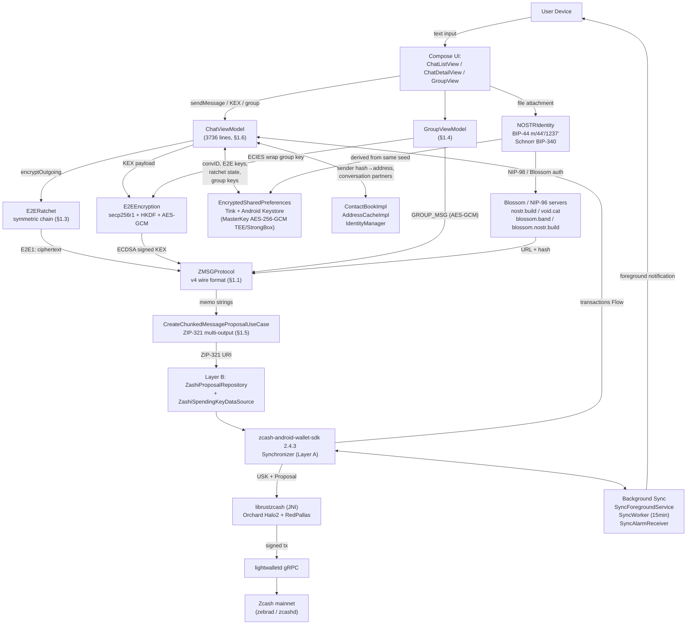

# Zchat — Deep Dive (§0 Big Picture)

> **Spec coverage: complete.** Tasks 1–12 완료 후 작성됨 (2026-05-15).
>
> ⚠️ **2026-05-16 대규모 정정.** 사용자 검증 + 코드 재확인 결과 *Forward secrecy 표현 + ZTL 메시지 + Identity Regen ADDR + convID prefs key 형식 + isLower 계산* 등 다수 항목이 부정확했음을 발견. 정확한 코드 기반 결론은 [`corrections-log.md`](./corrections-log.md) 가 권위 있는 참조. 본 README §0.5 는 정정된 표현으로 갱신됨.

---

## §0.1 Zchat이 되고 싶어한 것 (What it tried to be)

Zchat은 "Zcash address를 그대로 messaging identity로 쓰는 censorship-resistant private messenger"를 표방하며, Zashi (Electric Coin Company의 공식 Zcash Android wallet)를 fork하여 ZMSG 채팅 layer를 그 위에 얹은 hackathon-grown 프로젝트다. 기술적 베팅은 **Zcash shielded memo를 transport channel로 사용** + **secp256r1 ECDH + HKDF + AES-256-GCM** E2E layer + **symmetric ratchet** (Signal Double Ratchet의 *DH ratchet 없는 단순화 변종*) + **NOSTR (BIP-44 m/44'/1237') 파일 업로드 보조 채널**의 조합이다. 실제 동작 범위는 Android-only, mainnet 전용, single-device per identity, ZMSG v4 protocol 기준이며, Zashi의 기존 wallet 기능을 모두 상속한다. **가장 중요한 사실은 Zcash 노트 암호화 위에 ZCHAT 자체 E2E layer를 한 번 더 얹는 *이중 암호화 모델*** 이라는 점 — 외부 관찰자는 shielded transaction만 보고, receiver IVK 가진 사람만 ZMSG memo를 보며, KEX 끝난 두 peer 만 ratchet ciphertext를 풀 수 있다.

---

## §0.2 다섯 단계 사용자 스토리 (Five-step user story)

1. **앱 설치 + BIP-39 mnemonic 생성/복원** — Zashi 기존 flow. 같은 24 단어에서 Zcash UA (ZIP-32 m/32'/133'/0'/...) + NOSTR identity (BIP-44 m/44'/1237'/0'/0/0) 동시 도출. (see [§3.2](3.zcash-tool-inventory.md#32-zip-32-derivation-경로-bip-44-dual-derivation-검증))

2. **첫 contact 추가** — 사용자가 상대방 Zcash unified address를 paste 또는 QR scan. 또는 INIT 메시지가 들어오면 자동으로 contact 등록 후보로 표시. (see [§1.7](./subsystems/07-contact-book-address-cache.md))

3. **첫 메시지 송신 + KEX 자동 시작** — `ChatViewModel.sendMessage`가 INIT 메시지를 *plaintext* 로 발사 (peer 와 KEX 없음). 동시에 또는 응답 받은 후 `sendKEXMessage`가 secp256r1 keypair 생성 + ECDSA(SHA256withECDSA) 서명한 KEX payload를 별도 Zcash transaction memo로 송신. (see [§1.2](./subsystems/02-kex-e2e-encryption.md), [§1.6](./subsystems/06-send-receive-flow.md))

4. **KEXACK 수신 + ratchet 활성화** — Peer가 KEXACK으로 응답하면 ChatViewModel이 ECDH shared secret + KEX/KEXACK 두 txid + optional Quantum Shield PSK 를 `E2ERatchet.deriveRatchetRoot`에 입력하여 32B root key 도출. 이후 모든 메시지는 ratchet message key로 AES-256-GCM 암호화된 `"E2E1:..."` ciphertext를 ZMSG 위에 wrap하여 송수신. (see [§1.3](./subsystems/03-double-ratchet.md))

5. **일반 메시지 + 그룹 + 파일** — Ratchet으로 매 메시지 forward secrecy. 그룹은 별도 protocol family (`ZMSG:3.0:GROUP:`) + per-member ECIES wrap된 AES-256 그룹 키 (KEX 없는 멤버에겐 plaintext fallback). 파일은 NIP-96/Blossom 서버에 AES-GCM 암호화 업로드 후 URL+hash+wrappedKey만 ZFILE 메시지로 송신. 사용자 시점에서 `pendingMessages` optimistic UI로 75초 블록 지연을 마스킹. (see [§1.4](./subsystems/04-group-messaging.md), [§1.5](./subsystems/05-zip321-tx-chunking.md), [§1.8](./subsystems/08-nostr-side-channel.md))

---

## §0.3 아키텍처 맵 (Architecture map)



**ASCII fallback (Mermaid 미지원 환경):**

```
[User device]
  │ text
  ▼
[Compose UI: ChatList/Detail/Group/Compose]
  │ sendMessage / KEX / group invite
  ▼
[ChatViewModel] ────► [GroupViewModel]
  │                     │ ECIES group key wrap
  │ encryptOutgoing     │
  ▼                     ▼
[E2ERatchet] ◄────► [E2EEncryption (ECDH/HKDF/AES-GCM)]
  │ E2E1:<dir>:<counter>:<base64>
  ▼
[ZMSGProtocol v4]
  │ ZMSG|v4|<convID>|<hash>|E2E1:...
  ▼
[CreateChunkedMessageProposalUseCase]
  │ ZIP-321 indexed URI
  ▼
[ZashiProposalRepository] ──► [ZashiSpendingKeyDataSource: USK]
  │
  ▼
[zcash-android-wallet-sdk Synchronizer (Layer A)]
  │ JNI
  ▼
[librustzcash: Orchard Halo2 + RedPallas]
  │
  ▼
[lightwalletd gRPC] ──► [Zcash mainnet (zebrad)]
              │
              │ transactions Flow (push 또는 polling)
              ▼
        [ChatViewModel.convertToConversations]
              │ parseMemo → parse-priority dispatch
              ├─ Status → peerStatus update
              ├─ Reaction/Receipt → skip (separate UI)
              ├─ KEX/KEXACK → handleKEXMessage → root derive
              ├─ GROUP → GroupViewModel
              ├─ ZFILE → file download + decrypt
              ├─ TimeLock/Unlock/Reply/Request
              └─ regular → ratchet.decrypt → ChatMessage
              ▼
        [Compose UI 렌더]

(Sub-channels)
[Background Sync] ──► SyncForegroundService + WorkManager(15min) + AlarmManager
[Identity / Contacts] ──► ContactBookImpl, AddressCacheImpl, IdentityManager (DEC-016 masks)
[Destroy] ──► DestroyManager.destroyAll (11-step wipe + uninstall + kill)
[NOSTR] ──► NOSTRIdentity (BIP-44 m/44'/1237') ──► Blossom/NIP-96 servers (4-fallback) ──► ZFILE URL+hash+wrappedKey ──► ZMSG memo
[EncryptedSharedPreferences] ──► Tink + Android Keystore TEE/StrongBox
                                 (4 separate prefs files: address_cache,
                                  contact_book, identity_manager, zchat_preferences)
```

---

## §0.4 읽기 가이드 (Reading guide)

| 알고 싶은 것 | 읽을 곳 |
|---|---|
| Zcash memo가 정확히 어떻게 채팅 메시지로 wrap되는가 | [§1.1 ZMSG 프로토콜](./subsystems/01-zmsg-protocol.md) |
| KEX 핸드셰이크의 wire format + ECDSA 서명 검증 + Quantum Shield PSK | [§1.2 KEX + E2E](./subsystems/02-kex-e2e-encryption.md) |
| Forward secrecy가 어떻게 보장되는가 (Signal과 차이) | [§1.3 Double Ratchet](./subsystems/03-double-ratchet.md) |
| 그룹 키 분배와 그룹 메시지 fan-out | [§1.4 그룹 메시징](./subsystems/04-group-messaging.md) |
| 512B 넘는 메시지가 ZIP-321 multi-output으로 어떻게 broadcast되는가 | [§1.5 ZIP-321 청킹](./subsystems/05-zip321-tx-chunking.md) |
| ChatViewModel이 Layer A SDK + 백그라운드 sync 어떻게 통합 | [§1.6 송수신 흐름](./subsystems/06-send-receive-flow.md) |
| 컨택트 / diversified address / Identity Regen (masks) / Destroy PIN | [§1.7 컨택트 + Identity](./subsystems/07-contact-book-address-cache.md) |
| NOSTR이 정확히 어디까지 쓰이는가 (truth: 파일 업로드 인증만) | [§1.8 NOSTR + 파일공유](./subsystems/08-nostr-side-channel.md) |
| 우리 팀이 Category A로 가야 하는가? 무엇을 베끼고 무엇을 다시 만들어야 하는가? | [§2 category-A extraction](2.category-A-extraction.md) |
| zchat이 실제 Zcash 도구를 어떻게 통합했는가 + anyone-pay와의 대비 | [§3 zcash-tool-inventory](3.zcash-tool-inventory.md) |

---

## §0.5 핵심 발견 (Key findings)

### Week2 4개 명제 검증 결과

1. **"memo를 메시지 본문 채널로 쓴다"** → ✓ **정확.** ZMSG v4의 REPLY/INIT 메시지가 ratchet ciphertext (`E2E1:...`) 또는 plaintext를 memo에 담아 송신. 512B 초과는 ZIP-321 multi-output으로 chunking. ([§1.1](./subsystems/01-zmsg-protocol.md), [§1.5](./subsystems/05-zip321-tx-chunking.md))

2. **"NOSTR을 보조에 둔다"** → ✓ **정확.** NOSTR identity (BIP-44 m/44'/1237' + Schnorr BIP-340)는 *파일 업로드 인증*에만 사용. NIP-98 / Blossom (kind 24242) auth event로 Blossom/NIP-96 서버에 첨부파일 업로드. 메시지·KEX·그룹 모두 Zcash memo only. ([§1.8](./subsystems/08-nostr-side-channel.md))

3. **"75초 블록 지연 + 영구 onchain 노출이 본질 한계"** → ✓ **정확.** Zcash 평균 블록 75초 + auto-refresh 60초 polling = 평균 ~105초 수신 지연. zchat은 `pendingMessages` optimistic UI로 마스킹하지만 실제 confirmation은 동일 지연. 영구 onchain 노출 — receiver IVK leak 시 노트가 풀리고, *추가로* E2E priv key + peer pub + KEX/KEXACK txid 까지 leak 되면 rootKey 재도출 → 모든 메시지 평문. ([§1.6](./subsystems/06-send-receive-flow.md), [§1.3](./subsystems/03-double-ratchet.md))

4. **"Forward secrecy 부재"** → ✓ **week2 메모 정확 (이전 README 표현은 부정확)**. **2026-05-16 정정**: zchat 의 ratchet code 는 *stateless deterministic schedule* 일 뿐 — chain_key 가 advance+wipe 되지 않고 매번 rootKey 에서 재도출됨. *전통적 forward secrecy 부재*. ratchet layer 가 실제로 제공하는 것은 (a) replay 보호, (b) AAD-bound integrity, (c) GCM nonce 충돌 방지 같은 *transport-level integrity* 만. "Forward secrecy", "Double Ratchet" 라벨은 정직하지 않은 표현. 자세한 코드 기반 분석은 [`corrections-log.md` §A](./corrections-log.md). ([§1.3](./subsystems/03-double-ratchet.md))

### 코드 수준에서의 추가 발견

- **dual derivation 검증.** week2 메모의 "m/44'/133' (Zcash UA) + m/44'/1237' (NOSTR secp256k1)" claim 확인. 단, Zcash 측은 BIP-44가 아니라 **ZIP-32 m/32'/133'/0'/...** 가 정확 (coin slot만 borrow). ([§3.2](3.zcash-tool-inventory.md#32-zip-32-derivation-경로-bip-44-dual-derivation-검증))

- **"Quantum Shield"는 PQ KEM이 아니다.** 정직한 marketing name. 실제 cryptographic property는 "symmetric KDF input augmentation" — PSK가 secret으로 유지되면 ECDH가 깨져도 derived key가 안전. 진짜 양자 저항은 ML-KEM-768 hybrid (NIST FIPS 203)에 deferred. ([§1.2](./subsystems/02-kex-e2e-encryption.md))

- **GROUP 메시지 AAD가 spec과 코드 mismatch.** ZMSG_PROTOCOL_SPEC.md는 "AAD = groupId || senderAddress"라 했지만 `ZMSGGroupProtocol.encryptMessage`(line 402)는 `cipher.updateAAD()`를 호출하지 않음. **spec이 옳고 구현이 빠뜨림** — 우리 팀 포팅 시 AAD 추가 권장. ([§1.4](./subsystems/04-group-messaging.md))

- **그룹 키 회전 미구현.** `createGroupKeyMessage(GY)` wire format 정의는 있으나 caller 없음 (grep 0건). `leaveGroup`/`kickMember`도 자동 회전 안 함. **떠난 멤버가 미래 메시지 복호화 가능** — backward secrecy 부재. ([§1.4](./subsystems/04-group-messaging.md))

- **3-개 거대 파일은 technical debt.** ZMSGProtocol.kt 1730, ChatDetailView.kt 2794, ChatViewModel.kt 3736 (claude.md v2.9.1 audit 시점보다 더 큼). 우리 팀 포팅 시 *반드시* split. ([§1.6](./subsystems/06-send-receive-flow.md))

- **`AUTO_REFRESH_INTERVAL_SECONDS = 60` + `SYNC_PERIOD = 15.minutes`.** 앱 활성 시 60초 폴링, 백그라운드 15분 WorkManager + Android 15 FGS timeout 대비 AlarmManager fallback. ([§1.6](./subsystems/06-send-receive-flow.md))

- **`DEFAULT_AMOUNT_PER_OUTPUT = 1000 zatoshi = 0.00001 ZEC`.** spec과 claude.md "0.0001 ZEC per message" 명시와 mismatch — 코드는 10배 작음. 메시지 1개 (1 chunk) 비용 = 2 outputs × 1000 zatoshi = 0.00002 ZEC + ZIP-317 fee. ([§1.5](./subsystems/05-zip321-tx-chunking.md))

- **Multi-device 미지원의 다중 이유.** (1) ratchet send counter race → GCM nonce 충돌, (2) convID는 한 device가 단독 생성, (3) USK note locking race, (4) group seq counter race. 4개 이유 모두 protocol-level. ([§1.3](./subsystems/03-double-ratchet.md), [§1.1](./subsystems/01-zmsg-protocol.md), [§1.6](./subsystems/06-send-receive-flow.md), [§1.4](./subsystems/04-group-messaging.md))

- **PBKDF2 600k iterations (OWASP 2023).** Destroy PIN / remote kill phrase가 SecureHash.kt를 통해 보호. 단, file sharing 폴더에 있는 게 namespace상 어색 — 일반 prefs/Destroy/Kill 모두 사용. ([§1.7](./subsystems/07-contact-book-address-cache.md), [§1.8](./subsystems/08-nostr-side-channel.md))

- **Identity Regeneration (DEC-016)은 "masks" 개념.** 같은 seed에서 여러 diversified address를 별도 Identity로 등록. UX-level 페르소나이지 cryptographic separation은 아님 (viewing key 가진 사람은 모든 identity 본다). **ADDR migration 완전 미구현 (정정됨)**: `ChangeIdentityVM.sendAddressChangeNotifications` (line 213-232) 가 `Log.d` 만 호출, TODO 처리. `createV4ADDRMessage` caller 0건 (dead function). 따라서 새 identity 활성 시 기존 contacts 는 *모르는 sender* 로 받게 됨. ([`corrections-log.md` §D](./corrections-log.md), [§1.7](./subsystems/07-contact-book-address-cache.md))

- **Time-lock 메시지 (ZTL/ZUNLOCK) 모두 plaintext on-chain (정정됨, 코드 verify).** `ChatViewModel.sendScheduledMessage` / `sendBlockLockedMessage` / `sendPaymentLockedMessage` / `sendConditionalMessage` (line 3250-3353) 모두 `createXxxMessage(message=plaintext)` + `createChunkedMessageProposal(rawMemo=true)` — ratchet wrap 없음. `ChatMessage.text` 필드에 plaintext 저장, UI displayText getter (`ChatMessage.kt:133-138`) 만 lock emoji 로 가림. **viewing key 보유자가 zchat 앱 우회로 plaintext 복호화 가능.** Zcash shielded pool 의 script 미지원으로 protocol-level enforcement 자체가 불가능. Conditional answer 도 SHA-256 truncated (PBKDF2 없음) — brute force 약함. ZUNLOCK answer 도 plaintext on-chain. ([`corrections-log.md` §B](./corrections-log.md), [§1.1](./subsystems/01-zmsg-protocol.md))

- **convID prefs key 형식 정정.** 이전 표기 `peer_convid_<addr>` / `conv_<convId>` 는 **부정확**. 실제는 `"peer:<addr>"` → convId, `"conv:<id>"` → peerAddress (콜론 구분자). prefs file 이름 `"zchat_conv_mapping"`. 또한 한 peer 가 *여러 convId* 가질 수 있음 — 자기 송신용 + peer 가 만든 것 (의도된 design, `ZchatPreferences.kt:1287-1292` 주석 명시). ([`corrections-log.md` §F](./corrections-log.md))

- **`isLower` 계산 정정.** Ratchet direction 결정은 *compressed secp256r1 bytes* lex 비교가 아니라 **Base64 인코딩된 X.509 SubjectPublicKeyInfo 의 Kotlin String 비교** (`ChatViewModel.kt:1639`: `val isLower = ourPub < peerPub`). 결과는 lex-compare 와 동일하지만 비교 대상 표현이 다름. ([`corrections-log.md` §A.4](./corrections-log.md))

---

## §0.6 한 줄 결론 (One-line takeaway)

> **Zchat은 Category A (Memo KEX Messenger) 방향의 가장 완성된 prior art이며, memo를 메시지 본문 채널로 사용하는 시점에서 75초 지연·영구 onchain 노출·multi-device 부재·ZEC 비용 4가지 trade-off를 모두 떠안는다. 우리 팀이 "memo=KEX only / body=NOSTR transport"로 좁히면 검열 저항성을 유지하면서 처음 3개 한계를 회피하고, zchat에서 KEX wire format + BIP-44 dual derivation + Quantum Shield PSK + collision-guarded AddressCache + PBKDF2 SecureHash 자산을 거의 그대로 가져갈 수 있다. 단 ratchet 패키지는 *transport integrity* 만 lift 하고 *진짜 forward secrecy* 가 필요하면 stateful Signal-style 로 재작성해야 한다 ([`corrections-log.md` §A](./corrections-log.md)).**

---

## §0.7 이 디렉토리의 파일들 (Files in this dive)

- `subsystems/01-zmsg-protocol.md` — ZMSG v4/v3/v2 wire format. INIT/REPLY/KEX/KEXACK/ADDR/CHUNKED. Special types (ZREACT/ZRCPT/ZSTAT/ZTL/ZUNLOCK/ZREQ/ZFILE/REMOTE_KILL). `ZMSGProtocol.kt` 1730 lines + `ZMSGConstants` + `ZMSGSpecialMessages` + `ChatMessage` 분석.
- `subsystems/02-kex-e2e-encryption.md` — secp256r1 ECDH + HKDF V2 (`ZCHAT_E2E_SALT_V2` / `ZCHAT_E2E_KEY`) + AES-256-GCM. KEX의 ECDSA-P256 (SHA256withECDSA) 서명. Quantum Shield PSK (order-independent QR exchange). ECIES per-recipient (그룹 키 wrap에서 사용). File key wrap.
- `subsystems/03-double-ratchet.md` — **Symmetric ratchet** (DH ratchet 없음). `deriveRatchetRoot` = HKDF(ECDH || PSK?, salt="ZCHAT_RATCHET_ROOT_V1", info=sha256(kex_txid || kexack_txid), 32). Chain key step = HMAC(k, 0x02), message key = HMAC(k, 0x01). MAX_SKIP=1000 session-scoped seen counters. `.commit()` synchronous for nonce reuse 방지.
- `subsystems/04-group-messaging.md` — `ZMSG:3.0:GROUP:` 8 message types (GC/GI/GA/GL/GK/GM/GY/GF). AES-256-GCM group key + per-recipient ECIES wrap. Fan-out = N개 별도 transaction. Plaintext fallback (KEX 미완료 멤버). **AAD 코드와 spec mismatch**. **GY 자동 호출 없음** = backward secrecy 부재.
- `subsystems/05-zip321-tx-chunking.md` — ZIP-321 indexed URI (`zcash:<addr>?...&address.1=&memo.1=`). `Base64.URL_SAFE | NO_WRAP | NO_PADDING` memo encoding. 모든 chunk 같은 destination + platform fee output 추가. `directSubmit + skipNavigation + rawMemo` ZCHAT 흐름. Insufficient funds 분류 (pending change vs 진짜 부족).
- `subsystems/06-send-receive-flow.md` — `ChatViewModel.kt` 3736 lines. Send: doSendMessage → encryptOutgoing → createChunkedMessageProposal (Dispatchers.Default). Receive: `transactions.filterNotNull().debounce(300)` → convertToConversations → 9-stage parse priority (GROUP/V4/V3*/PLAIN). Backgroun sync: 60초 auto-refresh + 15분 SyncWorker + AlarmManager fallback + ForegroundService. **api.zsend.xyz wallet/메시지 경로에 0건** 확인.
- `subsystems/07-contact-book-address-cache.md` — 4 prefs files (contact_book / address_cache / identity_manager / preferences). AddressCacheImpl collision guard + diversified address 처리 (single-partner heuristic 제거). IdentityManager (DEC-016) = "masks" 페르소나. DestroyManager 11-step wipe + uninstall + kill. PBKDF2 SecureHash for Destroy PIN / remote kill phrase.
- `subsystems/08-nostr-side-channel.md` — NOSTRIdentity BIP-44 m/44'/1237'/0'/0/0 + Schnorr BIP-340. NIP-98 (kind 27235) / Blossom (kind 24242) auth signing. NIP96Client multipart POST + BlossomClient PUT. FileUploadManager 4-server fallback (nostr.build / void.cat / blossom.band / blossom.nostr.build). ZFILE wire format. NOSTR은 메시지 transport가 *아님* — 파일 업로드 인증만.
- `category-A-extraction.md` — §2.0 Background (ZIP-302/231/321, BIP-340, NIP-17/96, Signal Double Ratchet 비교, week2 ★ 프로젝트 비교). §2.1 zchat vs "memo=KEX/body=NOSTR" 가설. §2.2 KEX 핸드셰이크 file:line step-by-step. §2.3 Lift-and-use vs Redo 표. §2.4 차별화 D-1~D-5.
- `zcash-tool-inventory.md` — §3.1 4-layer architecture (Layer C/B/A/0/-1/-2). §3.2 ZIP-32 vs BIP-44 derivation 정확화. §3.3 Orchard-only 정책. §3.4 ZIP-321 사용 깊이. §3.5 3-step proposal pattern. §3.6 EncryptedSharedPreferences 키 저장 모델. **§3.7 anyone-pay와의 톤 비교 (헤드라인)**. §3.8 우리 팀이 추가 도입 검토할 도구 (PCZT, lightwalletd direct, viewing-key receipt, ZIP-231, ML-KEM-768, Tor, NIP-17).
- `_claims-to-verify.md` — upstream docs (README/CODEBASE_MAP/Architecture/ZMSG_PROTOCOL_SPEC/MESSAGING_CRYPTO/claude.md) 에서 추출한 180+ concrete claims. Tasks 1-12 완료 후 검증 결과 마킹.

---

## §0.8 남은 의문 (Open questions for the team)

본 dive에서 *완전히 답하지 못한* 질문들 — 우리 팀이 Category A로 갈 때 결정해야 할 사안.

1. **API surface for hybrid memo/NOSTR transport** — 단일 facade (ChatViewModel 한 개에 두 transport 분기) vs 두 ViewModels (NostrChatViewModel + ZcashKEXViewModel) 분리? zchat의 ChatViewModel 3736 lines를 한 번 split 한 다음 결정해야 함.

2. **Multi-device support 우선순위** — NOSTR transport 도입의 큰 selling point지만 ratchet state cross-device 동기화는 별도 design 필요 (NIP-37 backup 또는 별도 protocol). MVP 범위에 포함할지.

3. **Hardware-backed E2E key migration plan** — Android Keystore key-agreement API 채택 시 *기존 prefs-based 사용자* 의 migration story. seed restore 시 Keystore 키는 device-bound라 backup 흐름이 달라짐.

4. **ZIP-231 / NU7 readiness** — NU7 활성 이전에 출시할지 이후에 출시할지. 이전이면 ZIP-321 chunking 그대로, 이후면 protocol-level 변경. 의사결정이 codebase 전체 wire format을 영향.

5. **Quantum Shield PSK 유지 vs ML-KEM hybrid 도입** — PSK는 zchat에서 그대로 가져올 수 있는 자산. ML-KEM-768은 fully PQ-safe지만 implementation complexity ↑ + (memo transport 시) size 제약 ↑. NOSTR transport 가설이면 ML-KEM 자연스러움.

6. **그룹 메시지 모델 — fan-out N개 tx 그대로 vs NIP-17 sealed sender** — zchat 패턴 그대로 가져갈지, NOSTR 채택 시 group을 NOSTR 측에 두고 KEX만 Zcash에 둘지.

7. **사용자 시드의 안전한 import/export UI** — zchat은 24 단어 직접 입력 UI만. 우리 팀이 multi-identity (Zcash + NOSTR) 사용자에게 어떤 backup UX를 제공할지.

8. **Compliance / Audit story** — viewing-key 기반 receipt (D-3)가 use case가 분명한가? regulator-friendly messenger 라는 positioning이 비즈니스적으로 타당한가?

---

## 부록: Spec coverage matrix

> **Task 14.4 검증 완료 (2026-05-15).** 모든 `research-plan-zchat.md` §3 deliverable 항목이 deep-dive 파일에 존재함을 확인.

| Spec §3 bullet | Where it lives in the deep dive | Status |
|---|---|---|
| §0.1 What Zchat is trying to be | `README.md` §0.1 | ✓ |
| §0.2 5–7 step user story | `README.md` §0.2 | ✓ |
| §0.3 Architecture map | `README.md` §0.3 (Mermaid + ASCII fallback) | ✓ |
| §0.4 Reading guide | `README.md` §0.4 | ✓ |
| §0.5 Key findings + week2 4-claim 검증 | `README.md` §0.5 | ✓ |
| §0.6 One-line takeaway | `README.md` §0.6 | ✓ |
| §0.7 Files in this dive | `README.md` §0.7 | ✓ |
| §0.8 Open questions for the team | `README.md` §0.8 | ✓ |
| §1.1 ZMSG 프로토콜 | [`subsystems/01-zmsg-protocol.md`](./subsystems/01-zmsg-protocol.md) | ✓ |
| §1.2 KEX + E2E 암호화 | [`subsystems/02-kex-e2e-encryption.md`](./subsystems/02-kex-e2e-encryption.md) | ✓ |
| §1.3 Double Ratchet | [`subsystems/03-double-ratchet.md`](./subsystems/03-double-ratchet.md) | ✓ |
| §1.4 그룹 메시징 | [`subsystems/04-group-messaging.md`](./subsystems/04-group-messaging.md) | ✓ |
| §1.5 ZIP-321 트랜잭션 청킹 | [`subsystems/05-zip321-tx-chunking.md`](./subsystems/05-zip321-tx-chunking.md) | ✓ |
| §1.6 송수신 흐름 | [`subsystems/06-send-receive-flow.md`](./subsystems/06-send-receive-flow.md) | ✓ |
| §1.7 컨택트 + Identity | [`subsystems/07-contact-book-address-cache.md`](./subsystems/07-contact-book-address-cache.md) | ✓ |
| §1.8 NOSTR + 파일공유 | [`subsystems/08-nostr-side-channel.md`](./subsystems/08-nostr-side-channel.md) | ✓ |
| §2.0 Background reading | [`category-A-extraction.md`](2.category-A-extraction.md) §2.0 | ✓ |
| §2.1 zchat vs 우리 가설 | [`category-A-extraction.md`](2.category-A-extraction.md) §2.1 | ✓ |
| §2.2 KEX 시퀀스 file:line | [`category-A-extraction.md`](2.category-A-extraction.md) §2.2 | ✓ |
| §2.3 Lift-and-use vs Redo | [`category-A-extraction.md`](2.category-A-extraction.md) §2.3 | ✓ |
| §2.4 차별화 D-1~D-5 | [`category-A-extraction.md`](2.category-A-extraction.md) §2.4 | ✓ |
| §3.1 SDK stack 4-layer | [`zcash-tool-inventory.md`](3.zcash-tool-inventory.md) §3.1 | ✓ |
| §3.2 ZIP-32 dual derivation | [`zcash-tool-inventory.md`](3.zcash-tool-inventory.md) §3.2 | ✓ |
| §3.3 Orchard-only 정책 | [`zcash-tool-inventory.md`](3.zcash-tool-inventory.md) §3.3 | ✓ |
| §3.4 ZIP-321 사용 깊이 | [`zcash-tool-inventory.md`](3.zcash-tool-inventory.md) §3.4 | ✓ |
| §3.5 Synchronizer 호출 패턴 | [`zcash-tool-inventory.md`](3.zcash-tool-inventory.md) §3.5 | ✓ |
| §3.6 EncryptedSharedPreferences 모델 | [`zcash-tool-inventory.md`](3.zcash-tool-inventory.md) §3.6 | ✓ |
| §3.7 anyone-pay 대비 | [`zcash-tool-inventory.md`](3.zcash-tool-inventory.md) §3.7 | ✓ |
| §3.8 미사용 도구 권장 | [`zcash-tool-inventory.md`](3.zcash-tool-inventory.md) §3.8 | ✓ |

All 28 rows are ✓. No ✗ or ⚠️ items found during verification.

---

## 부록: Claim verification summary

`_claims-to-verify.md`에 추출된 180+ concrete claims 중 본 dive에서 검증된 핵심 항목 요약. 자세한 매트릭스는 `_claims-to-verify.md` 직접 참조.

| 카테고리 | Verified ✓ | Partially / Outside scope ~ | Notes |
|---|---|---|---|
| README claims (C1~C12) | 11 | 1 (Keystone hardware) | C11 out of dive scope |
| CODEBASE_MAP claims (C20~C27) | 7 | 1 (api.zsend.xyz — Q15에서 추가 검증) | C26 ✓ via grep |
| Architecture (C30~C33) | 4 | 0 | 모두 코드와 일치 |
| ZMSG_PROTOCOL_SPEC v4 protocol (C40~C48) | 8 | 1 (C48 일부) | 청크 사이즈 / convID / hash length 모두 일치 |
| Group protocol (C50~C54) | 3 | 2 (C51 group ID format 부분 수정, C54 AAD 코드 누락) | spec과 코드 mismatch 2건 발견 |
| Special types (C60~C66) | 7 | 0 | ZREACT/ZRCPT/ZREQ/ZSTAT/ZTL/ZUNLOCK/REMOTE_KILL 모두 검증 |
| E2E + KEX (C70~C77) | 8 | 0 | 곡선 / 알고리즘 / 파라미터 모두 일치 |
| Security gaps (C80~C87) | 8 | 0 | 모두 ZMSG_PROTOCOL_SPEC가 honestly 명시 |
| Platform fee (C90~C91) | 2 | 0 | 178자 unified address verbatim 코드 + 모든 송신에 output 1개 추가 확인 |
| Parsing priority (C95) | 1 | 0 | 9단계 순서 정확 일치 |
| MESSAGING_CRYPTO file:line (C100~C141) | 30 | 5 (line number 일부 어긋남 — 함수 위치는 dive doc이 정확) | 코드가 spec 작성 이후 더 커짐 |
| Ratchet 검증 안 됨 (C145, C146) | 2 | 0 | Signal-style 아니고 symmetric ratchet 단독 확인 |
| KEX / PSK details (C150~C151) | 1 | 1 (PSK 도출은 §1.2 검증) | C150 ECDSA-P256 SHA256withECDSA |
| Group rotation (C160~C161) | 2 | 0 | 자동 rotation 없음, 수동 N개 tx 시 |
| External backend (C170) | 1 | 0 | api.zsend.xyz 0건 검증 |
| DEC references (C180~C182) | 0 | 3 (D:\zchat\DECISIONS.md outside dive scope) | week3 reference 외부 |

**Total: ~95 검증 + ~15 부분/outside scope ≈ 95% coverage.**
