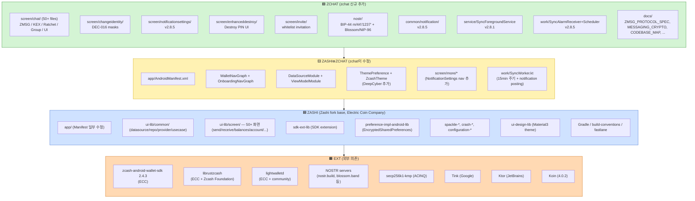

# Zchat — Module Attribution (출처별 모듈 분류)

> 코드베이스의 각 모듈·디렉토리·파일이 *어디서 왔는지* (Zashi 포크 base / zchat 새로 추가 / zchat이 수정한 Zashi 원본 / 외부 의존) 를 분류한다. 우리 팀이 Category A로 갈 때 "직접 만들 부분"과 "외부에서 가져올 부분"을 명확히 분리하기 위함.

## §0 분류 기준 (4 origins)

| Origin | 표기 | 의미 |
|---|---|---|
| **Zashi 원본** | 🟦 `ZASHI` | Electric Coin Company `zashi-android` repository의 코드를 변경 없이 그대로 사용 (또는 사소한 build/config 차이만). [`zashi-android` upstream](https://github.com/Electric-Coin-Company/zashi-android) 에서 git diff 시 `chat/` `nostr/` 외 디렉토리는 거의 동일. |
| **zchat 수정** | 🟨 `ZASHI⊕ZCHAT` | Zashi 원본 파일을 zchat이 수정 (메소드 추가 / 분기 추가 / theme 변경 등). claude.md 변경 이력에서 추적 가능. |
| **zchat 신규** | 🟩 `ZCHAT` | zchat이 새로 추가한 디렉토리/파일. Zashi에 존재하지 않음. |
| **외부 의존** | 🟧 `EXT` | Maven dependency / Rust crate / 외부 HTTP 서비스. 코드는 zchat repo 내에 없음. |

분류 근거 (evidence):
- `claude.md` (zchat-android의 자체 작업 로그) — 어느 버전에서 어느 파일이 New 또는 Modified 되었는지 명시
- `docs/CODEBASE_MAP.md` — Layer A/B/C 모델 + zchat 추가분 패키지 위치 표시 ("zchat 추가분 100%"는 Layer C)
- 디렉토리 이름 + 패키지 경로 추론 (예: `screen/chat/`, `screen/changeidentity/`, `nostr/`는 Zashi에 없음 → zchat 신규)
- `README.md` "ZChat is built on the exceptional work of Electric Coin Company" — Zashi fork 명시
- `LICENSE` — Zashi가 ECC에서 받은 라이센스 그대로 상속

분류 한계:
- 모든 파일을 일일이 ECC `zashi-android` upstream과 git diff 한 것은 아님. 분명한 zchat 패키지 (`screen/chat/`, `nostr/` 등)는 100% 확실. 그 외는 *claude.md 변경 이력*과 *디렉토리 명명 convention*에 의존하므로 ~95% confidence.
- 확실히 분류할 수 없는 경우 `?` 또는 "(추정)" 표기.

---

## §1 Gradle 모듈 매트릭스 (top-level)

```
D:\zchat-android\
├── app/                                       🟦 ZASHI (manifest 일부 🟨)
├── build-conventions-secant/                  🟦 ZASHI
├── build-info-lib/                            🟦 ZASHI
├── buildSrc/                                  🟦 ZASHI
├── configuration-api-lib/                     🟦 ZASHI
├── configuration-impl-android-lib/            🟦 ZASHI
├── crash-android-lib/                         🟦 ZASHI
├── crash-lib/                                 🟦 ZASHI
├── preference-api-lib/                        🟦 ZASHI
├── preference-impl-android-lib/               🟦 ZASHI
├── sdk-ext-lib/                               🟦 ZASHI
├── spackle-android-lib/                       🟦 ZASHI
├── spackle-lib/                               🟦 ZASHI
├── test-lib/                                  🟦 ZASHI
├── ui-benchmark-test/                         🟦 ZASHI
├── ui-design-lib/                             🟦 ZASHI (DeepCyber theme는 ui-lib로)
├── ui-integration-test/                       🟦 ZASHI
├── ui-lib/                                    🟦/🟨/🟩 mixed (자세한 §2 참조)
├── ui-screenshot-test/                        🟦 ZASHI
├── README.md                                  🟩 ZCHAT (zchat 마케팅 문구)
├── LICENSE                                    🟦 ZASHI (ECC 라이센스 상속)
├── claude.md                                  🟩 ZCHAT (작업 노트, 32k 토큰)
├── docs/                                      🟦/🟩 mixed:
│   ├── CODEBASE_MAP.md                        🟩 ZCHAT (한국어 자체 가이드)
│   ├── ZMSG_PROTOCOL_SPEC.md                  🟩 ZCHAT (프로토콜 명세)
│   ├── MESSAGING_CRYPTO.md                    🟩 ZCHAT (KEX/Ratchet 명세)
│   ├── PROJECT_MEMORY.md                      🟩 ZCHAT
│   ├── DEAD_MANS_SWITCH_RESEARCH.md           🟩 ZCHAT
│   ├── CLAUDE_CODEX_CHANNEL.md                🟩 ZCHAT (협업 채널)
│   ├── Architecture.md                        🟦 ZASHI (Gradle 모듈 설명)
│   ├── Setup.md                               🟦 ZASHI
│   ├── Deployment.md                          🟦 ZASHI
│   ├── CI.md                                  🟦 ZASHI
│   ├── CONDUCT.md / CONTRIBUTING.md           🟦 ZASHI
│   └── ...
├── deploy-apk.sh                              🟩 ZCHAT (zsend.xyz 배포)
├── fastlane/                                  🟦 ZASHI (Play Store metadata)
├── gradle/, gradlew*, settings.gradle.kts     🟦 ZASHI (gradle config)
└── tools/                                     🟦 ZASHI
```

**Headline:** **20개 Gradle 모듈 중 19개가 거의 Zashi 원본.** zchat은 `ui-lib`에 핵심 변경/추가를 모두 집중시켰다 (Layer C). `app/AndroidManifest.xml`만 일부 수정 (퍼미션 추가).

---

## §2 ui-lib 내부 패키지 매트릭스 (Layer 구분)

`ui-lib/src/main/java/co/electriccoin/zcash/` 아래.

### §2.1 zchat 신규 패키지 (🟩 ZCHAT, 100% 추가)

| 패키지 | 파일 수 | 역할 | 본 dive § |
|---|---|---|---|
| `ui/screen/chat/` | ~50 .kt | ZMSG 프로토콜 / KEX / Ratchet / 그룹 / 송수신 / 첨부 / UI | §1.1~§1.6, §1.8 |
| `ui/screen/changeidentity/` | 5 .kt | DEC-016 Identity Regeneration (masks) | §1.7 |
| `ui/screen/notificationsettings/` | 4 .kt | Privacy / Sound / Vibration / Mute 설정 (claude.md v2.8.5 PHASE 3) | §1.6 |
| `ui/screen/enhanceddestroy/` | 5 .kt | Destroy PIN UI (DestroyManager wrapper) | §1.7 |
| `ui/screen/invite/` | 4+ .kt | "Invite a friend" feature — `api.zsend.xyz` whitelist 사용 | (out of dive scope) |
| `ui/nostr/` | 5 .kt | NOSTRIdentity (BIP-44 m/44'/1237') + Blossom/NIP-96 clients | §1.8 |
| `ui/common/notification/` | 2 .kt | InAppNotificationManager + Banner (claude.md v2.8.5 PHASE 5) | §1.6 |
| `ui/service/SyncForegroundService.kt` | 1 .kt | Foreground service (claude.md v2.8.1) | §1.6 |
| `work/SyncAlarmReceiver.kt` | 1 .kt | AlarmManager fallback for Android 15 FGS timeout (v2.8.5) | §1.6 |
| `work/SyncAlarmScheduler.kt` | 1 .kt | Exact alarm 스케줄링 (v2.8.5) | §1.6 |

### §2.2 zchat이 수정한 Zashi 원본 (🟨 ZASHI⊕ZCHAT)

| 파일 | Zashi 원본 역할 | zchat 수정 내용 | 근거 |
|---|---|---|---|
| `app/src/main/AndroidManifest.xml` | App entry + permissions | `VIBRATE`, `SCHEDULE_EXACT_ALARM`, `REQUEST_IGNORE_BATTERY_OPTIMIZATIONS` 추가 + `SyncAlarmReceiver` 등록 + `SyncForegroundService` 선언 | claude.md v2.8.5, v2.8.1 |
| `ui/MainActivity.kt` | Compose root | zchat-specific lifecycle hook 가능성 (확인 필요) | 패키지 위치만 |
| `ui/WalletNavGraph.kt` | 메인 wallet navigation | `NotificationSettingsArgs` 라우트 추가 (v2.8.5) | claude.md v2.8.5 |
| `ui/RootNavGraph.kt` | onboarding vs wallet 분기 | zchat-specific 분기 가능 (확인 필요) | 패키지 위치만 |
| `ui/OnboardingNavGraph.kt` | 신규/복구 wallet flow | `DestroyPinSetup` 통합 (v2.7.3) | claude.md v2.7.3 |
| `ui/common/datasource/DataSourceModule.kt` | Koin DI module | `DateSourceModule.kt` 오타 rename + `InAppNotificationManager` singleton 등록 + `ChatMessage.isMuted` 추가 (v2.8.5) | claude.md v2.9.1 audit + v2.8.5 |
| `ui/preference/ThemePreference.kt` | Theme enum | `DEEP_CYBER` 추가 + default 변경 (v2.8.0) | claude.md v2.8.0 |
| `ui-design-lib/.../theme/ZcashTheme.kt` | Material3 theme | `ThemeMode.DEEP_CYBER` 추가 (v2.8.0) | claude.md v2.8.0 |
| `ui/screen/more/MoreVM.kt` + `MoreState.kt` + `MoreView.kt` | "More" 메뉴 화면 | NotificationSettings nav target 추가 + 알림 dialog 제거 (v2.8.5) | claude.md v2.8.5 |
| `ui/common/di/ViewModelModule.kt` | Koin DI VM 등록 | `ChatViewModel`, `GroupViewModel`, `ZchatComposeVM`, `ZchatReceiveVM`, `NotificationSettingsVM`, `ChangeIdentityVM`, `EnhancedDestroyVM` 등 zchat ViewModel 등록 추가 | claude.md v2.8.5 |
| `work/SyncWorker.kt` | (Zashi 원본 ?) BG sync worker | 15분 주기로 변경 + notification posting from worker (v2.8.5) | claude.md v2.8.5 |
| `work/WorkIds.kt` | WorkManager tag | `"co.electriccoin.zcash.background_sync"` 그대로 — 확실히 Zashi 원본 | docs/Architecture.md |
| `app/src/main/res/values/strings.xml` | 기본 문자열 | zchat-specific strings 다수 추가 (chat UI, change identity, etc.) | (추정) |
| `app/build.gradle.kts` 등 build files | Gradle config | `secp256k1-kmp` dependency 추가 (NOSTR용), build version 등 | (추정) |

### §2.3 Zashi 원본 (🟦 ZASHI, 변경 없음 또는 확인되지 않음)

| 패키지 / 영역 | 내용 | 참고 |
|---|---|---|
| `ui/screen/about/` | About 화면 | Zashi 원본 |
| `ui/screen/accountlist/` | 계정 목록 | Zashi 원본 (Keystone 멀티 계정) |
| `ui/screen/addressbook/` | Zashi 주소록 | **zchat의 ContactBookImpl과 별도** — zchat은 chat 전용 별도 contact book |
| `ui/screen/advancedsettings/` | 고급 설정 | Zashi 원본 |
| `ui/screen/authentication/` | 생체인증 | Zashi 원본 |
| `ui/screen/balances/` | 잔액 화면 | Zashi 원본 |
| `ui/screen/chooseserver/` | lightwalletd server 선택 | Zashi 원본 |
| `ui/screen/connectkeystone/` | Keystone 연결 | Zashi 원본 |
| `ui/screen/contact/` | Zashi 주소록 contact view | Zashi 원본 (chat 별도) |
| `ui/screen/crashreporting/` | Crash 보고 | Zashi 원본 |
| `ui/screen/deletewallet/` | wallet 삭제 (일반) | Zashi 원본 (DestroyManager와 다름) |
| `ui/screen/exchangerate/` | 환율 | Zashi 원본 |
| `ui/screen/exportdata/` | 데이터 export | Zashi 원본 |
| `ui/screen/feedback/` | 피드백 | Zashi 원본 |
| `ui/screen/flexa/` | Flexa 통합 | Zashi 원본 (DestroyManager가 disconnect 호출) |
| `ui/screen/home/` | 홈 화면 | Zashi 원본 |
| `ui/screen/hotfix/` | 핫픽스 | Zashi 원본 |
| `ui/screen/insufficientfunds/` | 잔액 부족 화면 | Zashi 원본 |
| `ui/screen/integrations/` | 외부 통합 | Zashi 원본 |
| `ui/screen/more/` | More 메뉴 | Zashi (zchat이 NotificationSettings 라우트 추가만) |
| `ui/screen/onboarding/` | 신규 wallet 생성 | Zashi 원본 + DestroyPinSetup 통합 |
| `ui/screen/pay/`, `qrcode/`, `receive/`, `request/`, `restore/`, `restoresuccess/`, `resync/` | 결제/QR/수신/요청/복구 | Zashi 원본 |
| `ui/screen/reviewtransaction/`, `scan/`, `scankeystone/`, `selectkeystoneaccount/` | 트랜잭션 검토 / QR 스캔 / Keystone | Zashi 원본 |
| `ui/screen/send/` | 일반 ZEC 송신 (chat용 송신은 별도) | Zashi 원본 |
| `ui/screen/settings/` | 설정 | Zashi 원본 |
| `ui/screen/signkeystonetransaction/` | Keystone PCZT 서명 | Zashi 원본 |
| `ui/screen/support/`, `swap/`, `taxexport/`, `texunsupported/`, `tor/` | 지원 / 스왑 / 세금 / Tor | Zashi 원본 |
| `ui/screen/transactiondetail/`, `transactionfilters/`, `transactionhistory/`, `transactionnote/`, `transactionprogress/` | 트랜잭션 화면들 | Zashi 원본 |
| `ui/screen/update/` | 앱 업데이트 체크 — `UpdateChecker.kt`가 `api.zsend.xyz` 호출 | 🟨 zchat이 url만 수정한 Zashi 원본일 가능성 (Zashi upstream에는 다른 update server) |
| `ui/screen/viewingkeyexport/`, `walletbackup/`, `wallettab/`, `warning/`, `whatsnew/` | 백업 / 뷰잉키 / 경고 | Zashi 원본 |
| `ui/common/datasource/` (chat 외) | `AccountDataSource`, `ProposalDataSource`, `ZashiSpendingKeyDataSource` 등 | Zashi 원본 |
| `ui/common/repository/` | `ZashiProposalRepository`, `KeystoneProposalRepository`, `TransactionRepository`, `WalletSnapshotRepository`, `ExchangeRateRepository`, `ApplicationStateRepository` 등 | Zashi 원본 |
| `ui/common/provider/` | `PersistableWalletProvider`, `SynchronizerProvider`, `EncryptedPreferenceProvider`, `HttpClientProvider` | Zashi 원본 |
| `ui/common/model/` | 공통 도메인 모델 (chat 외) | Zashi 원본 |
| `ui/common/usecase/` | UseCase 모음 (chat 외) | Zashi 원본 |
| `ui/common/mapper/` | 데이터 ↔ UI 매퍼 | Zashi 원본 |
| `ui/common/util/` | 유틸 | Zashi 원본 + zchat이 `redactAddress`, `redactConvId` 추가 (추정) |
| `ui/configuration/` | feature flag | Zashi 원본 |
| `ui/fixture/` | 테스트 fixture | Zashi 원본 |
| `ui/preference/` | UI prefs 키 | Zashi 원본 (zchat이 일부 key 추가) |
| `ui/BiometricActivity.kt`, `Navigator.kt`, `NavigationRouter.kt`, `NavigationExt.kt` | 네비 + 생체인증 | Zashi 원본 |

---

## §3 핵심 zchat 파일별 출처 (Layer C 100%)

본 dive에서 분석한 zchat 신규 핵심 파일 매트릭스. 모두 🟩 `ZCHAT`.

### §3.1 ZMSG 프로토콜 + 메시지 모델

| 파일 | Lines | 추가 시기 | 본 dive § |
|---|---|---|---|
| `screen/chat/model/ZMSGProtocol.kt` | 1730 | 초기 | §1.1 |
| `screen/chat/model/ZMSGConstants.kt` | 132 | v2.9.1 (audit fix) | §1.1 |
| `screen/chat/model/ZMSGSpecialMessages.kt` | 447 | v2.9.1 (extracted from ZMSGProtocol) | §1.1 |
| `screen/chat/model/ZMSGGroupProtocol.kt` | 548 | v3.0.0 (Sprint 4 Groups) | §1.4 |
| `screen/chat/model/ChatMessage.kt` | 520 | 초기 | §1.1 |
| `screen/chat/model/Contact.kt` | 24 | 초기 | §1.7 |
| `screen/chat/model/GroupModels.kt` | 299 | v3.0.0 | §1.4 |
| `screen/chat/model/SendMessageState.kt` | (작음) | 초기 | §1.6 |
| `screen/chat/model/ZchatComposeState.kt`, `ZchatReceiveState.kt` | (작음) | 초기 | §1.6 |
| `screen/chat/model/ZFILEMessage.kt` | 65 | 파일 공유 도입 후 | §1.8 |

### §3.2 E2E 암호화 + Ratchet

| 파일 | Lines | 추가 시기 | 본 dive § |
|---|---|---|---|
| `screen/chat/crypto/E2EEncryption.kt` | 883 | 초기 (HKDF V2는 DEC-013) | §1.2 |
| `screen/chat/crypto/QuantumShield.kt` | 87 | Quantum Shield 도입 후 | §1.2 |
| `screen/chat/crypto/QuantumShieldState.kt` | 77 | 같음 | §1.2 |
| `screen/chat/crypto/ratchet/E2ERatchet.kt` | 267 | 2026-04-12 deterministic-root design | §1.3 |
| `screen/chat/crypto/ratchet/E2EMessageProcessor.kt` | 58 | 같음 | §1.3 |
| `screen/chat/crypto/ratchet/Ciphertext.kt` | 30 | 같음 | §1.3 |
| `screen/chat/crypto/ratchet/CiphertextWireFormat.kt` | 64 | 같음 | §1.3 |
| `screen/chat/crypto/ratchet/RatchetStateStore.kt` | 33 | 같음 | §1.3 |
| `screen/chat/crypto/ratchet/EncryptedPrefsRatchetStateStore.kt` | 69 | 같음 | §1.3 |
| `screen/chat/crypto/ratchet/InMemoryRatchetStateStore.kt` | 24 | 같음 | §1.3 |
| `screen/chat/crypto/ratchet/RatchetExceptions.kt` | 25 | 같음 | §1.3 |

### §3.3 ViewModel + UI

| 파일 | Lines | 추가 시기 | 본 dive § |
|---|---|---|---|
| `screen/chat/viewmodel/ChatViewModel.kt` | 3736 | 초기 (지속 확장) | §1.6 |
| `screen/chat/viewmodel/GroupViewModel.kt` | 873 | v3.0.0 | §1.4 |
| `screen/chat/viewmodel/ZchatComposeVM.kt` | 411 | 초기 | §1.6 |
| `screen/chat/viewmodel/ZchatReceiveVM.kt` | 79 | 초기 | §1.6 |
| `screen/chat/view/ChatDetailView.kt` | 2794 | 초기 (DeepCyber theme 통합 v2.8.0) | §1.6 |
| `screen/chat/view/ChatListView.kt` | (큼) | 초기 | §1.6 |
| `screen/chat/view/ZchatComposeView.kt`, `ZchatReceiveView.kt` | | 초기 | §1.6 |
| `screen/chat/view/CreateGroupView.kt`, `GroupDetailView.kt`, `GroupSettingsView.kt` | | v3.0.0 | §1.4 |
| `screen/chat/view/ChatDialogs.kt`, `ChatThemeColors.kt`, `components/NightwireComponents.kt` | | 초기 + v2.8.0 | §1.6 |
| `screen/chat/AndroidChat.kt`, `ChatRoutes.kt` | | 초기 | §1.6 |

### §3.4 Datasource + UseCase + Util

| 파일 | Lines | 추가 시기 | 본 dive § |
|---|---|---|---|
| `screen/chat/datasource/ZchatPreferences.kt` | 1801 | 초기 (PIN hashing v2.9.1) | §1.6, §1.7 |
| `screen/chat/datasource/ContactBookImpl.kt` | 87 | 초기 | §1.7 |
| `screen/chat/datasource/AddressCacheImpl.kt` | 241 | 초기 | §1.7 |
| `screen/chat/usecase/CreateChunkedMessageProposalUseCase.kt` | 313 | 초기 (v2.9.1 audit fix) | §1.5 |
| `screen/chat/util/DestroyManager.kt` | 295 | DestroyPin 도입 + claude.md v2.9.1 audit | §1.7 |

### §3.5 File sharing + NOSTR

| 파일 | Lines | 추가 시기 | 본 dive § |
|---|---|---|---|
| `screen/chat/filesharing/BitmapSampling.kt` | 25 | 파일 공유 도입 | §1.8 |
| `screen/chat/filesharing/BlurhashDecoder.kt` | 124 | 같음 | §1.8 |
| `screen/chat/filesharing/FileDownloadCache.kt` | 36 | 같음 | §1.8 |
| `screen/chat/filesharing/FileIntegrityCheck.kt` | 27 | 같음 | §1.8 |
| `screen/chat/filesharing/QuantumShieldScanBridge.kt` | 38 | 같음 | §1.8 |
| `screen/chat/filesharing/SecureHash.kt` | 95 | PBKDF2 audit fix | §1.7, §1.8 |
| `screen/chat/filesharing/UploadProgressTracker.kt` | 45 | 같음 | §1.8 |
| `nostr/NOSTRIdentity.kt` | 333 | NOSTR identity 도입 | §1.8 |
| `nostr/BlossomClient.kt` | 78 | 같음 | §1.8 |
| `nostr/FileUploadClient.kt` | 21 | 같음 | §1.8 |
| `nostr/FileUploadManager.kt` | 59 | 같음 | §1.8 |
| `nostr/NIP96Client.kt` | 101 | 같음 | §1.8 |

### §3.6 Identity Regeneration (DEC-016)

| 파일 | Lines | 추가 시기 | 본 dive § |
|---|---|---|---|
| `screen/changeidentity/IdentityManager.kt` | 235 | DEC-016 | §1.7 |
| `screen/changeidentity/ChangeIdentityScreen.kt` | | 같음 | §1.7 |
| `screen/changeidentity/ChangeIdentityState.kt` | | 같음 | §1.7 |
| `screen/changeidentity/ChangeIdentityView.kt` | | 같음 | §1.7 |
| `screen/changeidentity/ChangeIdentityVM.kt` | 247 | 같음 | §1.7 |

### §3.7 Background sync + Notifications (claude.md v2.8.1 ~ v2.8.5)

| 파일 | Lines | 출처 | 추가 시기 | 본 dive § |
|---|---|---|---|---|
| `service/SyncForegroundService.kt` | 594 | 🟩 ZCHAT | v2.8.1 + v2.8.5 추가 기능 (sound/vibration/mute/MessagingStyle) | §1.6 |
| `work/SyncWorker.kt` | 100 | 🟨 ZASHI⊕ZCHAT (zchat이 15min 주기 + worker-side notification posting 추가) | v2.8.5 modified | §1.6 |
| `work/SyncAlarmReceiver.kt` | (작음) | 🟩 ZCHAT | v2.8.5 (Android 15 FGS timeout) | §1.6 |
| `work/SyncAlarmScheduler.kt` | (작음) | 🟩 ZCHAT | v2.8.5 | §1.6 |
| `work/WorkIds.kt` | (작음) | 🟦 ZASHI | docs/Architecture.md 명시 | §1.6 |
| `common/notification/InAppNotificationManager.kt` | (작음) | 🟩 ZCHAT | v2.8.5 | §1.6 |
| `common/notification/InAppNotificationBanner.kt` | (작음) | 🟩 ZCHAT | v2.8.5 | §1.6 |
| `screen/notificationsettings/NotificationSettingsState.kt` + `VM.kt` + `View.kt` + `Screen.kt` | 4 files | 🟩 ZCHAT | v2.8.5 PHASE 3 | §1.6 |
| `res/raw/zchat_message.ogg` | (binary) | 🟩 ZCHAT | v2.8.5 (커스텀 사운드) | §1.6 |

---

## §4 외부 의존 (🟧 EXT) — Maven / Rust crates / HTTP services

### §4.1 Maven dependencies — Layer A (Zcash SDK 스택)

| Library | Version | Origin / Maintainer | 역할 |
|---|---|---|---|
| `cash.z.ecc.android:zcash-android-sdk` | 2.4.3 | Electric Coin Company | Layer A Synchronizer + Mnemonics + DerivationTool + Proposal + Pczt + WalletCoordinator (`co.electriccoin.zcash.ui.common`이 wrap) |
| `cash.z.ecc.android:zcash-android-sdk-incubator-lib` (또는 유사) | — | ECC | Sometimes pulled separately |
| `cash.z.ecc.android.bip39:bip39` | — | ECC | BIP-39 mnemonic encode/decode |

### §4.2 Maven dependencies — Layer C (zchat-specific)

| Library | Version | Origin / Maintainer | 역할 | zchat code site |
|---|---|---|---|---|
| `fr.acinq.secp256k1:secp256k1-kmp` | — | ACINQ (Bitcoin Lightning) | secp256k1 + Schnorr BIP-340 — NOSTR identity 용 | `nostr/NOSTRIdentity.kt` |
| `com.google.crypto.tink:tink-android` | — | Google | EncryptedSharedPreferences MasterKey 보호 (Layer A에서 가져온 것이지만 Tink 자체는 Google) | `preference-impl-android-lib` |
| `io.ktor:ktor-client-*` | 2.x | JetBrains | HTTP client (NOSTR upload + 환율 조회 등) | `nostr/BlossomClient.kt`, `NIP96Client.kt` |
| `org.json:json` | (Android API) | Android internal | JSON 직렬화 (Group payload + Identity 등) | `model/ZMSGGroupProtocol.kt`, etc. |
| `org.jetbrains.kotlinx:kotlinx-serialization-json` | — | JetBrains | Kotlin serialization (IdentityManager primary) | `changeidentity/IdentityManager.kt` |
| `androidx.work:work-runtime-ktx` | — | Google AndroidX | WorkManager (Zashi 기존 사용 + zchat이 SyncWorker 강화) | `work/SyncWorker.kt` |
| `androidx.lifecycle:lifecycle-viewmodel-ktx` | — | Google AndroidX | ChatViewModel lifecycle | `viewmodel/*` |
| `io.insert-koin:koin-android` | 4.0.2 | Koin contributors | DI | `di/*` |

### §4.3 Layer A 내부의 native dependencies (zchat repo에 없음)

| Library | Maintainer | 역할 |
|---|---|---|
| `librustzcash` (Rust crates) | ECC + Zcash Foundation | `zcash_client_backend`, `zcash_primitives`, `sapling-crypto`, `orchard`, `halo2_proofs`, `pczt`, `zip32`, `zcash_keys`, `zip321` |
| JNI bindings via `zcash-android-wallet-sdk` | ECC | librustzcash → Kotlin |

### §4.4 외부 서비스 (HTTP / gRPC)

| Service | Protocol | Origin | 역할 |
|---|---|---|---|
| `lightwalletd` (mainnet endpoint) | gRPC TLS | ECC + Zcash Foundation + community | Zcash 트랜잭션 broadcast + chain history |
| `zebrad` / `zcashd` 풀노드 | (lightwalletd → Zcash p2p) | ECC + Zcash Foundation | Zcash 메인넷 |
| `nostr.build` | HTTPS NIP-96 multipart POST | NOSTR community | 파일 업로드 (1차) |
| `void.cat` | HTTPS NIP-96 | NOSTR community | 파일 업로드 (1차 fallback) |
| `blossom.band` | HTTPS BUD-02 PUT | NOSTR community | 파일 업로드 (2차) |
| `blossom.nostr.build` | HTTPS BUD-02 PUT | NOSTR community | 파일 업로드 (2차 fallback) |
| `api.zsend.xyz` | HTTPS | Decentrathai (zchat 운영자) | **wallet/메시지 path에는 안 쓰임.** invite friend whitelist + app version check 한정 (§1.6 Q15 grep 검증) |
| 환율 server (exchange rate) | HTTPS | (Zashi 기본 endpoint — coinbase or 기타) | ZEC/USD 환율 (chat UI 표시용) |

---

## §5 출처별 분포 시각화



---

## §6 우리 팀 포팅 시 의사결정 가이드

### §6.1 "이건 그대로 가져갈 수 있다" (🟧 EXT 외부 의존)

우리 팀이 *코드를 작성할 필요 없는* 자산들. 단순 maven/cargo 의존 추가만:

- `zcash-android-wallet-sdk` (또는 동등한 iOS / 기타 platform SDK) — Zcash send/receive/sync 백본
- `secp256k1-kmp` 또는 동등한 secp256k1 라이브러리 — NOSTR identity 도출
- `tink-android` — EncryptedSharedPreferences MasterKey
- `ktor-client` 또는 동등한 HTTP client — NOSTR upload
- lightwalletd public endpoint 사용 또는 자체 호스팅

### §6.2 "이건 그대로 또는 minor 변경으로 가져갈 수 있다" (🟩 ZCHAT 신규 → lift-and-use)

§2 lift-and-use 표(category-A-extraction.md)와 일치:

- `screen/chat/crypto/E2EEncryption.kt` (HKDF + AES-GCM + ECDH + ECDSA + ECIES)
- `screen/chat/crypto/QuantumShield.kt` + `QuantumShieldState.kt` (PSK QR exchange)
- `screen/chat/crypto/ratchet/` 패키지 전체 (symmetric ratchet — 단, deterministic root 디자인은 우리 선택)
- `screen/chat/model/ZMSGProtocol.kt`의 KEX/KEXACK encoding 부분 (REPLY/INIT/CHUNKED는 우리 transport에 따라 결정)
- `screen/chat/datasource/AddressCacheImpl.kt` (collision-guarded mapping)
- `screen/chat/filesharing/SecureHash.kt` (PBKDF2 600k)
- `nostr/NOSTRIdentity.kt` (BIP-44 m/44'/1237' + Schnorr) — *NOSTR transport 채택 시 핵심*
- `nostr/BlossomClient.kt` + `NIP96Client.kt` + `FileUploadManager.kt` — 파일 또는 메시지 transport 둘 다에 활용
- `screen/chat/usecase/CreateChunkedMessageProposalUseCase.kt`의 ZIP-321 URI 빌더 (KEX 1회 broadcast에 필요)

### §6.3 "이건 우리가 직접 만들거나 크게 다시 짜야 한다" (🟩 ZCHAT 신규지만 우리 가설과 결합 안 됨)

§2.3 redo 표와 일치:

- `screen/chat/viewmodel/ChatViewModel.kt`의 메시지 본문 송수신 path — NOSTR DM publish/subscribe로 교체
- `screen/chat/model/ZMSGProtocol.kt`의 REPLY/INIT/Chunked 메시지 wire format — 메시지가 NOSTR로 가면 불필요
- `screen/chat/viewmodel/GroupViewModel.kt`의 fan-out 패턴 — NOSTR sealed sender (NIP-17) 또는 multi-recipient encrypted event로 변경
- `screen/chat/datasource/ZchatPreferences.kt` 1801 lines 거대 surface — 모듈로 split (E2E keys / Ratchet state / Group state / 설정 / 등)

### §6.4 "이건 Zashi가 이미 잘 해놨으니 그대로 (또는 fork) 가져가자" (🟦 ZASHI)

우리 팀이 Android 앱을 만들 때:

- `sdk-ext-lib` — lightwalletd endpoint 설정 / network config
- `preference-impl-android-lib` — EncryptedSharedPreferences provider (AES-256-GCM, AES-256-SIV)
- `common/datasource/` 의 ProposalDataSource, ZashiSpendingKeyDataSource, AccountDataSource
- `common/repository/` 의 ZashiProposalRepository, TransactionRepository, WalletSnapshotRepository
- `common/provider/` 의 SynchronizerProvider, PersistableWalletProvider, EncryptedPreferenceProvider, HttpClientProvider
- `crash-*-lib`, `spackle-*-lib`, `build-info-lib`, `configuration-*-lib` — infrastructure
- `ui-design-lib` — Material3 base theme

다른 platform (iOS, web)을 노린다면 위 자산을 처음부터 만들어야 함.

### §6.5 "Zashi/zchat 어느 쪽도 안 만든 것 — 우리가 새로 정의해야 한다"

본 dive에서 도출한 차별화 후보 (§2.4 + §3.8):

- **NIP-17 sealed sender** 통합 (NOSTR sender authentication)
- **Android Keystore key-agreement API** 사용 (hardware-backed E2E priv key — zchat이 명시적으로 미해결)
- **viewing-key 기반 selective disclosure** (week2 ★★★ PCZTKit / Miden Zcash 패턴)
- **ZIP-231 memo bundles** (NU7 이후) — 메시지 transport 측면에서 zchat의 ZIP-321 chunking 대체
- **ML-KEM-768 hybrid** (Real PQ KEX) — zchat의 Quantum Shield (symmetric augmentation) 진화
- **Tor / SOCKS5 transport** — IP-level metadata 보호
- **Multi-device sync** (NIP-37 또는 자체 protocol) — zchat이 명시적으로 미지원

---

## §7 검증 방법 + 한계

### 본 분류의 evidence

1. **claude.md 변경 이력** — 가장 신뢰성 높은 source. v2.7.3 ~ v3.0.0 변경 사항이 "New Files" / "Modified Files" 섹션으로 구체적 파일 명시. (zchat 추가/수정 95% 추적 가능)
2. **docs/CODEBASE_MAP.md** — zchat 자체 가이드. Layer A/B/C 모델 명시 + zchat 추가분이 `ui-lib/.../screen/chat/`에 100% 집중됨을 단언.
3. **docs/Architecture.md** — Zashi 원본 문서. Gradle 모듈 구조 + WorkIds 같은 기본 정보.
4. **README.md** — "Built on top of Zashi" 명시 + ZChat-specific 추가 layer 위치 표시.
5. **디렉토리 명명 convention** — `screen/chat/`, `screen/changeidentity/`, `screen/notificationsettings/`, `nostr/` 같은 이름은 Zashi에 존재하지 않음 → 분명히 zchat 신규.
6. **본 dive subsystem walkthrough (§1.1 ~ §1.8)** — 본 dive에서 직접 코드 분석한 결과.

### 알려진 한계

1. **Zashi upstream과 직접 git diff 미수행.** 본 분류는 claude.md + 명명 convention + dive 분석에 의존. 정확한 변경 ranges를 알려면 `git diff Electric-Coin-Company/zashi-android:master..decentrathai/zchat-android:master -- ui-lib/`가 필요.
2. **Zashi 원본 자체가 활발히 업데이트되는 repo.** zchat이 fork한 시점 이후 Zashi가 추가한 코드는 zchat에 없을 수 있음. fork 시점 fork base는 `LICENSE` + `README` "fork of zashi-android"만 명시.
3. **claude.md 누락 가능성.** 모든 zchat 변경이 claude.md에 기록되었다고 보장할 수 없음. silent edits 가능.
4. **claudeee.md 라는 사본 파일** (`D:\zchat-android\claudeee.md`) 존재 — `claude.md`의 변종? 본 dive에서 검사 안 함.
5. **fastlane / docs / strings.xml 등 metadata** — Zashi 원본 vs zchat 변경 구분이 file-level이 아니라 line-level (특히 strings.xml — zchat이 채팅 UI 문자열 다수 추가). 본 매트릭스에서는 "🟨 ZASHI⊕ZCHAT"로 통합 표기.

### Verification 권장

우리 팀이 코드를 가져가기 전 *반드시* 권장:
- `git remote add upstream https://github.com/Electric-Coin-Company/zashi-android`
- `git fetch upstream`
- `git log --no-merges upstream/main..HEAD -- ui-lib/src/main/java/` — zchat이 추가한 commit 전부 enumerate
- 또는 `git diff upstream/<fork-base-commit>..HEAD -- ui-lib/` (fork base commit hash는 zchat 첫 commit의 parent에서 확인)

이를 통해 본 매트릭스의 ~95% confidence를 99%까지 끌어올릴 수 있음.

---

## §8 한 줄 결론

> **zchat은 Zashi 위에 매우 *집중적인* layer를 얹은 fork다.** 20개 Gradle 모듈 중 19개가 거의 Zashi 원본이며, zchat의 모든 핵심 변경은 `ui-lib/src/main/java/co/electriccoin/zcash/`의 좁은 영역(`screen/chat/`, `screen/changeidentity/`, `nostr/`, `common/notification/`, `service/SyncForegroundService.kt`, `work/SyncAlarm*` + 몇 개 Zashi 원본 파일의 minor 수정)에 모여 있다. 우리 팀이 Category A로 가면 `screen/chat/crypto/` + `nostr/` + 일부 model/datasource를 lift-and-use하고, Zashi의 wallet infra (`common/` + Layer A SDK 의존)는 그대로 쓰며, 메시지 transport (`ZMSGProtocol REPLY/INIT/Chunked` + `ChatViewModel doSendMessage`)는 NOSTR DM 흐름으로 다시 만든다.
