# Zchat — 시나리오별 Sequence Diagrams

> 코드 흐름을 시각화한 mermaid sequenceDiagram 모음. 각 시나리오의 자세한 분석은 해당 §1.X 참조.

## 참여자 약식 표기

| Alias | 실체 | 위치 |
|---|---|---|
| User | 사용자 (사람) | — |
| UI | Compose UI (ChatListView/ChatDetailView/etc.) | `screen/chat/view/` |
| CVM | ChatViewModel | `screen/chat/viewmodel/ChatViewModel.kt` (3736 lines) |
| GVM | GroupViewModel | `screen/chat/viewmodel/GroupViewModel.kt` (873 lines) |
| E2E | E2EEncryption (ECDH + HKDF + AES-GCM + ECDSA + ECIES) | `screen/chat/crypto/E2EEncryption.kt` |
| Ratchet | E2ERatchet + E2EMessageProcessor | `screen/chat/crypto/ratchet/` |
| ZMSG | ZMSGProtocol / ZMSGGroupProtocol / ZMSGSpecialMessages | `screen/chat/model/` |
| UC | CreateChunkedMessageProposalUseCase | `screen/chat/usecase/` |
| Prefs | ZchatPreferences (4 separate prefs files) | `screen/chat/datasource/` |
| Cache | AddressCacheImpl + ContactBookImpl | `screen/chat/datasource/` |
| Identity | NOSTRIdentity (BIP-44 m/44'/1237') | `nostr/NOSTRIdentity.kt` |
| Upload | FileUploadManager + NIP96Client/BlossomClient | `nostr/` |
| Repo | ZashiProposalRepository | `common/repository/` |
| USK | ZashiSpendingKeyDataSource (ZIP-32 → USK) | `common/datasource/` |
| SDK | zcash-android-wallet-sdk Synchronizer (Layer A) | `cash.z.ecc.android.sdk.*` |
| Rust | librustzcash via JNI (Orchard Halo2 + RedPallas) | (native) |
| LWD | lightwalletd gRPC | (external server) |
| Chain | Zcash mainnet (zebrad) | (external) |
| BlossomSrv | Blossom / NIP-96 file servers | nostr.build / blossom.band 등 |

Alice 디바이스 (송신자) 와 Bob 디바이스 (수신자) 가 모두 등장하는 경우 prefix `A_` / `B_` 사용.

---

## Scenario 1 — 첫 메시지 (KEX 없이 plaintext INIT)

> 두 사용자가 처음 만나는 시점. KEX는 아직 시작 안 됨. INIT 메시지는 **plaintext** 송신 (Zcash 노트 암호화만 적용). 사용자가 의도적으로 E2E enable 안 했거나, 첫 메시지를 빠르게 보내고 싶을 때.

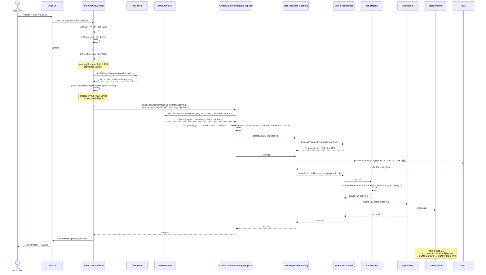
```mermaid
sequenceDiagram
    actor User as Alice User
    participant UI as Alice UI
    participant CVM as Alice ChatViewModel
    participant Prefs as Alice Prefs
    participant ZMSG as ZMSGProtocol
    participant UC as CreateChunkedMessageProposal
    participant Repo as ZashiProposalRepository
    participant SDK as SDK Synchronizer
    participant Rust as librustzcash
    participant LWD as lightwalletd
    participant Chain as Zcash mainnet

    User->>UI: "Hi Bob!" + Bob 주소 paste
    UI->>CVM: sendMessage(bobAddr, "Hi Bob!")
    CVM->>CVM: Orchard 잔액 확인 (line 2312)
    CVM->>CVM: 비용 disclaimer (첫 송신만)
    User-->>CVM: confirm
    CVM->>CVM: doSendMessage (line 2429)
    Note over CVM: pendingMessage 즉시 UI 표시<br/>(optimistic update)
    CVM->>Prefs: getOrCreateConversationId(bobAddr)
    Prefs-->>CVM: ("ABC12345", isFirstMessage=true)
    CVM->>CVM: getOrCreateMessageProcessor(peer, convId)
    Note over CVM: processor=null (KEX 미완료)<br/>→ plaintext fallback
    CVM->>UC: invoke(rawMemo=false, isFirstMessage=true,<br/>conversationId="ABC12345", message="Hi Bob!")
    UC->>ZMSG: createChunkedV4InitMessages("ABC12345", aliceAddr, "Hi Bob!")
    ZMSG-->>UC: ["ZMSG|v4|ABC12345|INIT|u1alice...|Hi Bob!"]
    UC->>UC: buildZip321Uri(...) → "zcash:u1bob...?amount=0.00001&memo=...&address.1=u1platform...&amount.1=0.00001"
    UC->>Repo: createZip321Proposal(uri)
    Repo->>SDK: proposeTransferFromUri(account, uri)
    SDK-->>Repo: Proposal (notes 선택 + fee 계산)
    UC->>Repo: submit()
    Repo->>USK: getZashiSpendingKey() (BIP-39→ZIP-32→USK 매번)
    USK-->>Repo: UnifiedSpendingKey
    Repo->>SDK: createProposedTransactions(proposal, usk)
    SDK->>Rust: JNI call
    Rust->>Rust: Orchard Halo2 proof + RedPallas spend auth sig + binding sig
    Rust-->>SDK: signed raw tx bytes
    SDK->>LWD: submitTransaction (gRPC)
    LWD->>Chain: broadcast
    LWD-->>SDK: tx hash
    SDK-->>Repo: success
    Repo-->>UC: success
    UC-->>CVM: success
    CVM->>UI: SendMessageState.Success
    UI-->>User: ✓ (1 checkmark — SENT)
    Note over Chain: ~75초 후 블록 포함<br/>→ SDK.transactions Flow가 update<br/>→ CVM이 pending → CONFIRMED 전환
```

자세한 분석: [§1.6 송수신 흐름](./subsystems/06-send-receive-flow.md), [§1.5 ZIP-321 청킹](./subsystems/05-zip321-tx-chunking.md)

---

## Scenario 2 — KEX 핸드셰이크 (양방향 키 교환)

> Alice가 E2E 활성화하려고 KEX 시작. Bob 디바이스가 자동으로 KEXACK 응답. 이 시점에 양쪽이 ratchet root을 도출하지만 아직 첫 ratchet 메시지는 없음.

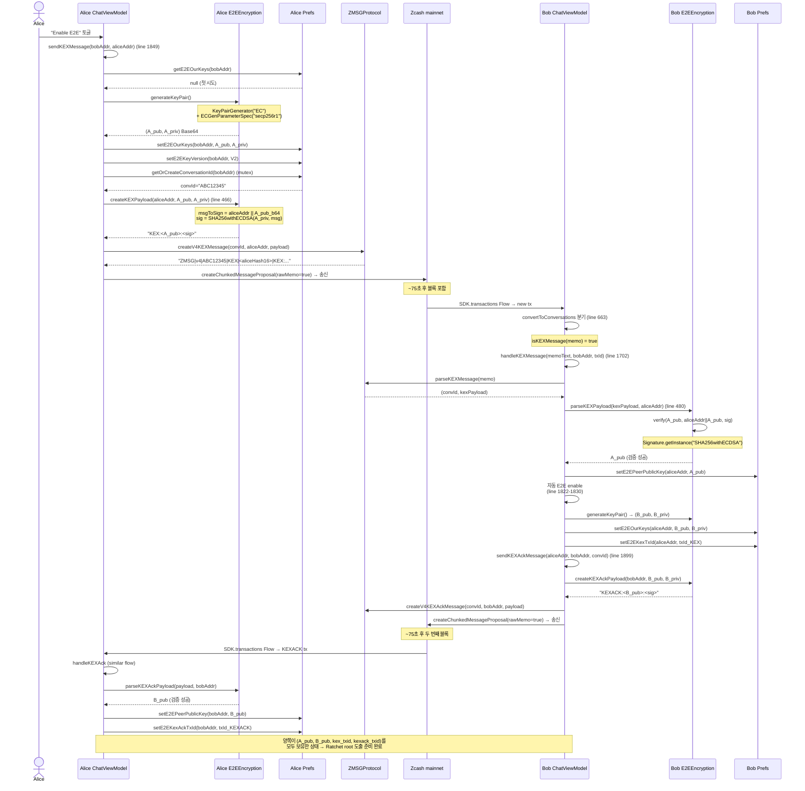
```mermaid
sequenceDiagram
    actor AUser as Alice
    participant ACVM as Alice ChatViewModel
    participant AE2E as Alice E2EEncryption
    participant APrefs as Alice Prefs
    participant AZMSG as ZMSGProtocol
    participant Chain as Zcash mainnet
    participant BCVM as Bob ChatViewModel
    participant BE2E as Bob E2EEncryption
    participant BPrefs as Bob Prefs

    AUser->>ACVM: "Enable E2E" 토글
    ACVM->>ACVM: sendKEXMessage(bobAddr, aliceAddr) (line 1849)
    ACVM->>APrefs: getE2EOurKeys(bobAddr)
    APrefs-->>ACVM: null (첫 시도)
    ACVM->>AE2E: generateKeyPair()
    Note over AE2E: KeyPairGenerator("EC")<br/>+ ECGenParameterSpec("secp256r1")
    AE2E-->>ACVM: (A_pub, A_priv) Base64
    ACVM->>APrefs: setE2EOurKeys(bobAddr, A_pub, A_priv)
    ACVM->>APrefs: setE2EKeyVersion(bobAddr, V2)
    ACVM->>APrefs: getOrCreateConversationId(bobAddr) (mutex)
    APrefs-->>ACVM: convId="ABC12345"
    ACVM->>AE2E: createKEXPayload(aliceAddr, A_pub, A_priv) (line 466)
    Note over AE2E: msgToSign = aliceAddr || A_pub_b64<br/>sig = SHA256withECDSA(A_priv, msg)
    AE2E-->>ACVM: "KEX:<A_pub>:<sig>"
    ACVM->>AZMSG: createV4KEXMessage(convId, aliceAddr, payload)
    AZMSG-->>ACVM: "ZMSG|v4|ABC12345|KEX|<aliceHash16>|KEX:..."
    ACVM->>Chain: createChunkedMessageProposal(rawMemo=true) → 송신
    Note over Chain: ~75초 후 블록 포함
    
    Chain->>BCVM: SDK.transactions Flow → new tx
    BCVM->>BCVM: convertToConversations 분기 (line 663)
    Note over BCVM: isKEXMessage(memo) = true
    BCVM->>BCVM: handleKEXMessage(memoText, bobAddr, txId) (line 1702)
    BCVM->>AZMSG: parseKEXMessage(memo)
    AZMSG-->>BCVM: (convId, kexPayload)
    BCVM->>BE2E: parseKEXPayload(kexPayload, aliceAddr) (line 480)
    BE2E->>BE2E: verify(A_pub, aliceAddr||A_pub, sig)
    Note over BE2E: Signature.getInstance("SHA256withECDSA")
    BE2E-->>BCVM: A_pub (검증 성공)
    BCVM->>BPrefs: setE2EPeerPublicKey(aliceAddr, A_pub)
    BCVM->>BCVM: 자동 E2E enable<br/>(line 1822-1830)
    BCVM->>BE2E: generateKeyPair() → (B_pub, B_priv)
    BCVM->>BPrefs: setE2EOurKeys(aliceAddr, B_pub, B_priv)
    BCVM->>BPrefs: setE2EKexTxId(aliceAddr, txId_KEX)
    BCVM->>BCVM: sendKEXAckMessage(aliceAddr, bobAddr, convId) (line 1899)
    BCVM->>BE2E: createKEXAckPayload(bobAddr, B_pub, B_priv)
    BE2E-->>BCVM: "KEXACK:<B_pub>:<sig>"
    BCVM->>AZMSG: createV4KEXAckMessage(convId, bobAddr, payload)
    BCVM->>Chain: createChunkedMessageProposal(rawMemo=true) → 송신
    Note over Chain: ~75초 후 두 번째 블록
    Chain->>ACVM: SDK.transactions Flow → KEXACK tx
    ACVM->>ACVM: handleKEXAck (similar flow)
    ACVM->>AE2E: parseKEXAckPayload(payload, bobAddr)
    AE2E-->>ACVM: B_pub (검증 성공)
    ACVM->>APrefs: setE2EPeerPublicKey(bobAddr, B_pub)
    ACVM->>APrefs: setE2EKexAckTxId(bobAddr, txId_KEXACK)
    Note over ACVM,BCVM: 양쪽이 (A_pub, B_pub, kex_txid, kexack_txid)를<br/>모두 보유한 상태 → Ratchet root 도출 준비 완료
```

자세한 분석: [§1.2 KEX + E2E 암호화](./subsystems/02-kex-e2e-encryption.md)

---

## Scenario 3 — Ratchet root 도출 + 첫 ratchet 메시지

> KEX/KEXACK 완료 후 첫 ratchet 메시지를 보내는 시점. 양쪽이 같은 root + chain key 도출 (deterministic). `getOrCreateMessageProcessor`가 처음으로 non-null processor 반환.

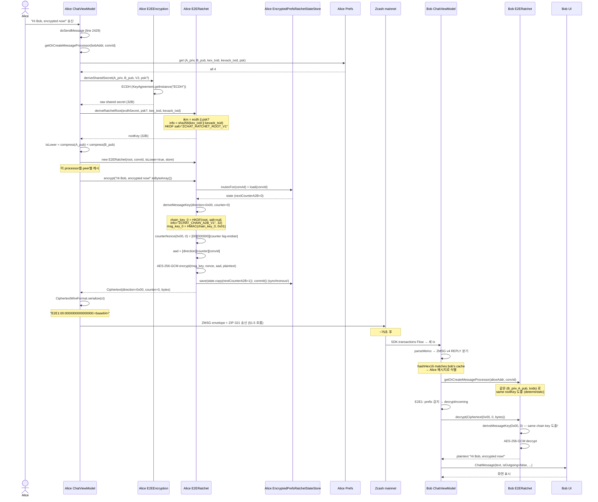
```mermaid
sequenceDiagram
    actor AUser as Alice
    participant ACVM as Alice ChatViewModel
    participant AE2E as Alice E2EEncryption
    participant ARatchet as Alice E2ERatchet
    participant AStore as Alice EncryptedPrefsRatchetStateStore
    participant APrefs as Alice Prefs
    participant Chain as Zcash mainnet
    participant BCVM as Bob ChatViewModel
    participant BRatchet as Bob E2ERatchet
    participant BUI as Bob UI

    AUser->>ACVM: "Hi Bob, encrypted now!" 송신
    ACVM->>ACVM: doSendMessage (line 2429)
    ACVM->>ACVM: getOrCreateMessageProcessor(bobAddr, convId)
    ACVM->>APrefs: get (A_priv, B_pub, kex_txid, kexack_txid, psk)
    APrefs-->>ACVM: all 4
    ACVM->>AE2E: deriveSharedSecret(A_priv, B_pub, V2, psk?)
    AE2E->>AE2E: ECDH (KeyAgreement.getInstance("ECDH"))
    AE2E-->>ACVM: raw shared secret (32B)
    ACVM->>ARatchet: deriveRatchetRoot(ecdhSecret, psk?, kex_txid, kexack_txid)
    Note over ARatchet: ikm = ecdh || psk?<br/>info = sha256(kex_txid || kexack_txid)<br/>HKDF salt="ZCHAT_RATCHET_ROOT_V1"
    ARatchet-->>ACVM: rootKey (32B)
    ACVM->>ACVM: isLower = compress(A_pub) < compress(B_pub)
    ACVM->>ARatchet: new E2ERatchet(root, convId, isLower=true, store)
    Note over ACVM: 이 processor를 peer별 캐시
    
    ACVM->>ARatchet: encrypt("Hi Bob, encrypted now!".toByteArray())
    ARatchet->>AStore: mutexFor(convId) + load(convId)
    AStore-->>ARatchet: state (nextCounterA2B=0)
    ARatchet->>ARatchet: deriveMessageKey(direction=0x00, counter=0)
    Note over ARatchet: chain_key_0 = HKDF(root, salt=null,<br/>info="ZCHAT_CHAIN_A2B_V1", 32)<br/>msg_key_0 = HMAC(chain_key_0, 0x01)
    ARatchet->>ARatchet: counterNonce(0x00, 0) = [00][000000][counter big-endian]
    ARatchet->>ARatchet: aad = [direction][counter][convId]
    ARatchet->>ARatchet: AES-256-GCM encrypt(msg_key, nonce, aad, plaintext)
    ARatchet->>AStore: save(state.copy(nextCounterA2B=1)) .commit() (synchronous!)
    ARatchet-->>ACVM: Ciphertext(direction=0x00, counter=0, bytes)
    ACVM->>ACVM: CiphertextWireFormat.serialize(ct)
    Note over ACVM: "E2E1:00:0000000000000000:<base64>"
    ACVM->>Chain: ZMSG envelope + ZIP-321 송신 (§1.5 흐름)
    
    Note over Chain: ~75초 후
    Chain->>BCVM: SDK.transactions Flow → 새 tx
    BCVM->>BCVM: parseMemo → ZMSG v4 REPLY 분기
    Note over BCVM: hashHex16 matches bob's cache<br/>→ Alice 메시지로 식별
    BCVM->>BRatchet: getOrCreateMessageProcessor(aliceAddr, convId)
    Note over BRatchet: 같은 (B_priv, A_pub, txids) 로<br/>same rootKey 도출 (deterministic)
    BCVM->>BCVM: E2E1: prefix 감지 → decryptIncoming
    BCVM->>BRatchet: decrypt(Ciphertext(0x00, 0, bytes))
    BRatchet->>BRatchet: deriveMessageKey(0x00, 0) — same chain key 도출!
    BRatchet->>BRatchet: AES-256-GCM decrypt
    BRatchet-->>BCVM: plaintext "Hi Bob, encrypted now!"
    BCVM->>BUI: ChatMessage(text, isOutgoing=false, ...)
    BUI-->>BCVM: 화면 표시
```

자세한 분석: [§1.3 Double Ratchet](./subsystems/03-double-ratchet.md)

---

## Scenario 4 — 일반 메시지 송수신 (이미 ratchet 활성)

> 짧은 시퀀스. Alice가 두 번째, 세 번째, ... 메시지를 ratchet으로 보낸다. 각 메시지마다 chain key advance.

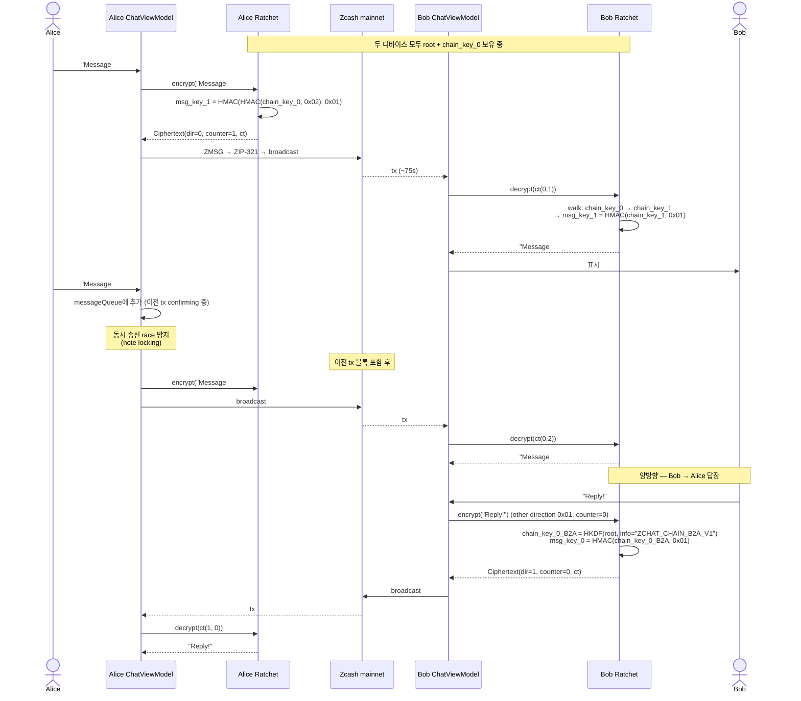
```mermaid
sequenceDiagram
    actor AUser as Alice
    participant ACVM as Alice ChatViewModel
    participant ARatchet as Alice Ratchet
    participant Chain as Zcash mainnet
    participant BCVM as Bob ChatViewModel
    participant BRatchet as Bob Ratchet
    actor BUser as Bob

    Note over ARatchet,BRatchet: 두 디바이스 모두 root + chain_key_0 보유 중

    AUser->>ACVM: "Message #2"
    ACVM->>ARatchet: encrypt("Message #2") (counter=1)
    ARatchet->>ARatchet: msg_key_1 = HMAC(HMAC(chain_key_0, 0x02), 0x01)
    ARatchet-->>ACVM: Ciphertext(dir=0, counter=1, ct)
    ACVM->>Chain: ZMSG → ZIP-321 → broadcast
    Chain-->>BCVM: tx (~75s)
    BCVM->>BRatchet: decrypt(ct(0,1))
    BRatchet->>BRatchet: walk: chain_key_0 → chain_key_1<br/>→ msg_key_1 = HMAC(chain_key_1, 0x01)
    BRatchet-->>BCVM: "Message #2"
    BCVM->>BUser: 표시

    AUser->>ACVM: "Message #3" (빠르게 burst)
    ACVM->>ACVM: messageQueue에 추가 (이전 tx confirming 중)
    Note over ACVM: 동시 송신 race 방지<br/>(note locking)
    Note over Chain: 이전 tx 블록 포함 후
    ACVM->>ARatchet: encrypt("Message #3") (counter=2)
    ACVM->>Chain: broadcast
    Chain-->>BCVM: tx
    BCVM->>BRatchet: decrypt(ct(0,2))
    BRatchet-->>BCVM: "Message #3"

    Note over BUser,BRatchet: 양방향 — Bob → Alice 답장
    BUser->>BCVM: "Reply!"
    BCVM->>BRatchet: encrypt("Reply!") (other direction 0x01, counter=0)
    BRatchet->>BRatchet: chain_key_0_B2A = HKDF(root, info="ZCHAT_CHAIN_B2A_V1")<br/>msg_key_0 = HMAC(chain_key_0_B2A, 0x01)
    BRatchet-->>BCVM: Ciphertext(dir=1, counter=0, ct)
    BCVM->>Chain: broadcast
    Chain-->>ACVM: tx
    ACVM->>ARatchet: decrypt(ct(1, 0))
    ARatchet-->>ACVM: "Reply!"
```

핵심: chain은 direction별로 독립. A2B chain은 Alice 송신/Bob 수신, B2A chain은 Bob 송신/Alice 수신. counter는 송신측이 결정 + nonce 재사용 방지 위해 `.commit()` synchronous.

---

## Scenario 5 — 긴 메시지 청킹 (>512B → multi-output single tx)

> 메시지가 462B 한계 (v4 REPLY first chunk 가용량) 를 넘으면 N개 chunk로 분할 → 1 atomic transaction의 N outputs + platform fee output.

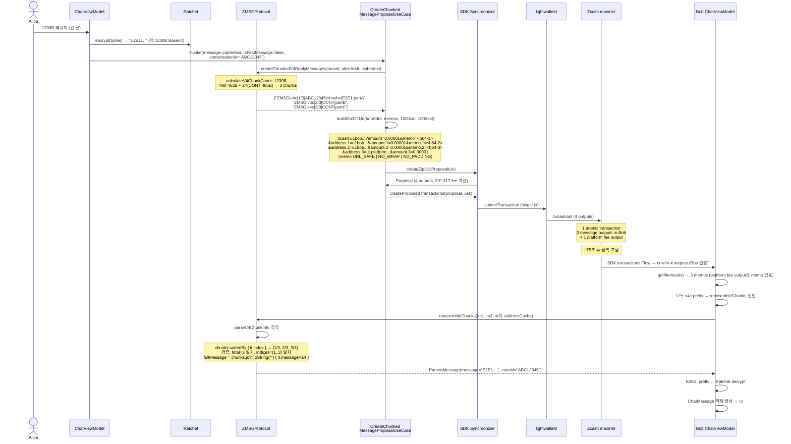
```mermaid
sequenceDiagram
    actor AUser as Alice
    participant ACVM as ChatViewModel
    participant ARatchet as Ratchet
    participant ZMSG as ZMSGProtocol
    participant UC as CreateChunked<br/>MessageProposalUseCase
    participant SDK as SDK Synchronizer
    participant LWD as lightwalletd
    participant Chain as Zcash mainnet
    participant BCVM as Bob ChatViewModel

    AUser->>ACVM: 1200B 메시지 (긴 글)
    ACVM->>ARatchet: encrypt(bytes) → "E2E1:..." (약 1230B Base64)
    ACVM->>UC: invoke(message=ciphertext, isFirstMessage=false,<br/>conversationId="ABC12345")
    UC->>ZMSG: createChunkedV4ReplyMessages(convId, aliceAddr, ciphertext)
    Note over ZMSG: calculateV4ChunkCount: 1230B<br/>= first 462B + 2×(CONT 485B) → 3 chunks
    ZMSG-->>UC: ["ZMSG|v4c|1/3|ABC12345|<hash>|E2E1:partA",<br/>"ZMSG|v4c|2/3|CONT|partB",<br/>"ZMSG|v4c|3/3|CONT|partC"]
    UC->>UC: buildZip321Uri(bobAddr, memos, 1000zat, 1000zat)
    Note over UC: zcash:u1bob...?amount=0.00001&memo=<b64-1><br/>&address.1=u1bob...&amount.1=0.00001&memo.1=<b64-2><br/>&address.2=u1bob...&amount.2=0.00001&memo.2=<b64-3><br/>&address.3=u1platform...&amount.3=0.00001<br/>(memo URL_SAFE | NO_WRAP | NO_PADDING)
    UC->>SDK: createZip321Proposal(uri)
    SDK-->>UC: Proposal (4 outputs, ZIP-317 fee 계산)
    UC->>SDK: createProposedTransactions(proposal, usk)
    SDK->>LWD: submitTransaction (single tx)
    LWD->>Chain: broadcast (4 outputs)
    Note over Chain: 1 atomic transaction<br/>3 message outputs to Bob<br/>+ 1 platform fee output

    Note over Chain: ~75초 후 블록 포함
    Chain->>BCVM: SDK.transactions Flow → tx with 4 outputs (Bob 입장)
    BCVM->>BCVM: getMemos(tx) → 3 memos (platform fee output은 memo 없음)
    BCVM->>BCVM: 모두 v4c prefix → reassembleChunks 진입
    BCVM->>ZMSG: reassembleChunks([m1, m2, m3], addressCache)
    ZMSG->>ZMSG: parseV4ChunkInfo 각각
    Note over ZMSG: chunks.sortedBy { it.index } → [1/3, 2/3, 3/3]<br/>검증: total=3 일치, indices=(1..3) 일치<br/>fullMessage = chunks.joinToString("") { it.messagePart }
    ZMSG-->>BCVM: ParsedMessage(message="E2E1:...", convId="ABC12345")
    BCVM->>BCVM: E2E1: prefix → Ratchet decrypt
    BCVM->>BCVM: ChatMessage 객체 생성 → UI
```

핵심: chunk 순서는 ZIP-321 URI 순서가 아니라 `v4c|1/3` 같은 header의 chunk index. 수신측이 정렬 후 검증.

자세한 분석: [§1.5 ZIP-321 트랜잭션 청킹](./subsystems/05-zip321-tx-chunking.md), [§1.1 ZMSG 프로토콜](./subsystems/01-zmsg-protocol.md)

---

## Scenario 6 — 파일 전송 (이미지) via NOSTR 보조채널

> Alice가 1MB JPEG 첨부. 파일 본체는 NIP-96 server (nostr.build)에 AES-GCM 암호화 업로드. URL + hash + wrappedKey만 ZFILE memo로 Zcash.

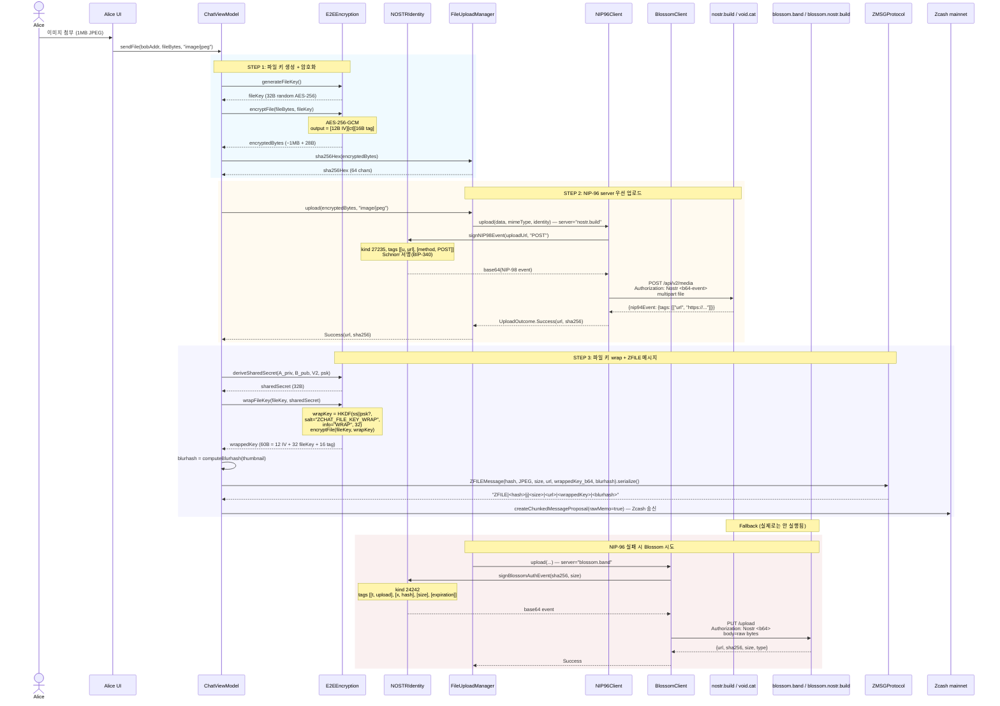
```mermaid
sequenceDiagram
    actor AUser as Alice
    participant AUI as Alice UI
    participant ACVM as ChatViewModel
    participant AE2E as E2EEncryption
    participant Identity as NOSTRIdentity
    participant FUM as FileUploadManager
    participant NIP96 as NIP96Client
    participant Blossom as BlossomClient
    participant Srv as nostr.build / void.cat
    participant SrvFB as blossom.band / blossom.nostr.build
    participant ZMSG as ZMSGProtocol
    participant Chain as Zcash mainnet

    AUser->>AUI: 이미지 첨부 (1MB JPEG)
    AUI->>ACVM: sendFile(bobAddr, fileBytes, "image/jpeg")
    
    rect rgb(240, 250, 255)
        Note over ACVM,AE2E: STEP 1: 파일 키 생성 + 암호화
        ACVM->>AE2E: generateFileKey()
        AE2E-->>ACVM: fileKey (32B random AES-256)
        ACVM->>AE2E: encryptFile(fileBytes, fileKey)
        Note over AE2E: AES-256-GCM<br/>output = [12B IV][ct][16B tag]
        AE2E-->>ACVM: encryptedBytes (~1MB + 28B)
        ACVM->>FUM: sha256Hex(encryptedBytes)
        FUM-->>ACVM: sha256Hex (64 chars)
    end

    rect rgb(255, 250, 240)
        Note over FUM,Srv: STEP 2: NIP-96 server 우선 업로드
        ACVM->>FUM: upload(encryptedBytes, "image/jpeg")
        FUM->>NIP96: upload(data, mimeType, identity) — server="nostr.build"
        NIP96->>Identity: signNIP98Event(uploadUrl, "POST")
        Note over Identity: kind 27235, tags [[u, url], [method, POST]]<br/>Schnorr 서명(BIP-340)
        Identity-->>NIP96: base64(NIP-98 event)
        NIP96->>Srv: POST /api/v2/media<br/>Authorization: Nostr <b64-event><br/>multipart file
        Srv-->>NIP96: {nip94Event: {tags: [["url", "https://..."]]}}
        NIP96-->>FUM: UploadOutcome.Success(url, sha256)
        FUM-->>ACVM: Success(url, sha256)
    end

    rect rgb(245, 245, 255)
        Note over AE2E,ZMSG: STEP 3: 파일 키 wrap + ZFILE 메시지
        ACVM->>AE2E: deriveSharedSecret(A_priv, B_pub, V2, psk)
        AE2E-->>ACVM: sharedSecret (32B)
        ACVM->>AE2E: wrapFileKey(fileKey, sharedSecret)
        Note over AE2E: wrapKey = HKDF(ss||psk?,<br/>salt="ZCHAT_FILE_KEY_WRAP",<br/>info="WRAP", 32)<br/>encryptFile(fileKey, wrapKey)
        AE2E-->>ACVM: wrappedKey (60B = 12 IV + 32 fileKey + 16 tag)
        ACVM->>ACVM: blurhash = computeBlurhash(thumbnail)
        ACVM->>ZMSG: ZFILEMessage(hash, JPEG, size, url, wrappedKey_b64, blurhash).serialize()
        ZMSG-->>ACVM: "ZFILE|<hash>|j|<size>|<url>|<wrappedKey>|<blurhash>"
        ACVM->>Chain: createChunkedMessageProposal(rawMemo=true) — Zcash 송신
    end

    Note over Srv,SrvFB: Fallback (실제로는 안 실행됨)
    rect rgb(250, 240, 240)
        Note over FUM,SrvFB: NIP-96 실패 시 Blossom 시도
        FUM->>Blossom: upload(...) — server="blossom.band"
        Blossom->>Identity: signBlossomAuthEvent(sha256, size)
        Note over Identity: kind 24242<br/>tags [[t, upload], [x, hash], [size], [expiration]]
        Identity-->>Blossom: base64 event
        Blossom->>SrvFB: PUT /upload<br/>Authorization: Nostr <b64><br/>body=raw bytes
        SrvFB-->>Blossom: {url, sha256, size, type}
        Blossom-->>FUM: Success
    end
```

자세한 분석: [§1.8 NOSTR 보조채널 + 파일공유](./subsystems/08-nostr-side-channel.md)

---

## Scenario 7 — 파일 수신 + 다운로드 + 복호화

> Bob이 ZFILE 메시지 수신 → Blurhash placeholder 즉시 표시 → 백그라운드 다운로드 → SHA-256 무결성 검증 → file key unwrap → 복호화 → 캐시 → 표시

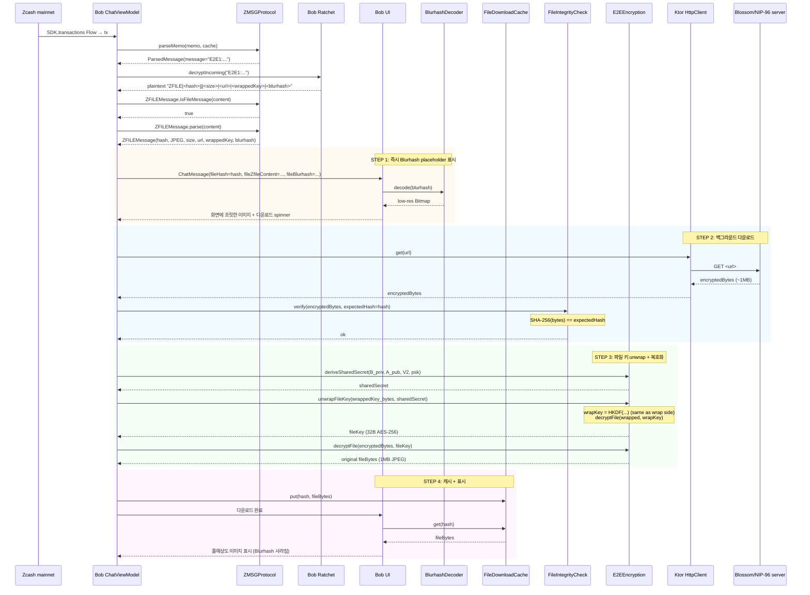
```mermaid
sequenceDiagram
    participant Chain as Zcash mainnet
    participant BCVM as Bob ChatViewModel
    participant ZMSG as ZMSGProtocol
    participant BRatchet as Bob Ratchet
    participant BUI as Bob UI
    participant Blur as BlurhashDecoder
    participant FDC as FileDownloadCache
    participant FIC as FileIntegrityCheck
    participant BE2E as E2EEncryption
    participant HTTP as Ktor HttpClient
    participant Srv as Blossom/NIP-96 server

    Chain->>BCVM: SDK.transactions Flow → tx
    BCVM->>ZMSG: parseMemo(memo, cache)
    ZMSG-->>BCVM: ParsedMessage(message="E2E1:...")
    BCVM->>BRatchet: decryptIncoming("E2E1:...")
    BRatchet-->>BCVM: plaintext "ZFILE|<hash>|j|<size>|<url>|<wrappedKey>|<blurhash>"
    BCVM->>ZMSG: ZFILEMessage.isFileMessage(content)
    ZMSG-->>BCVM: true
    BCVM->>ZMSG: ZFILEMessage.parse(content)
    ZMSG-->>BCVM: ZFILEMessage(hash, JPEG, size, url, wrappedKey, blurhash)

    rect rgb(255, 250, 240)
        Note over BUI,Blur: STEP 1: 즉시 Blurhash placeholder 표시
        BCVM->>BUI: ChatMessage(fileHash=hash, fileZfileContent=..., fileBlurhash=...)
        BUI->>Blur: decode(blurhash)
        Blur-->>BUI: low-res Bitmap
        BUI-->>BCVM: 화면에 흐릿한 이미지 + 다운로드 spinner
    end

    rect rgb(240, 250, 255)
        Note over HTTP,Srv: STEP 2: 백그라운드 다운로드
        BCVM->>HTTP: get(url)
        HTTP->>Srv: GET <url>
        Srv-->>HTTP: encryptedBytes (~1MB)
        HTTP-->>BCVM: encryptedBytes
        BCVM->>FIC: verify(encryptedBytes, expectedHash=hash)
        Note over FIC: SHA-256(bytes) == expectedHash
        FIC-->>BCVM: ok
    end

    rect rgb(245, 255, 245)
        Note over BE2E: STEP 3: 파일 키 unwrap + 복호화
        BCVM->>BE2E: deriveSharedSecret(B_priv, A_pub, V2, psk)
        BE2E-->>BCVM: sharedSecret
        BCVM->>BE2E: unwrapFileKey(wrappedKey_bytes, sharedSecret)
        Note over BE2E: wrapKey = HKDF(...) (same as wrap side)<br/>decryptFile(wrapped, wrapKey)
        BE2E-->>BCVM: fileKey (32B AES-256)
        BCVM->>BE2E: decryptFile(encryptedBytes, fileKey)
        BE2E-->>BCVM: original fileBytes (1MB JPEG)
    end

    rect rgb(255, 245, 255)
        Note over FDC,BUI: STEP 4: 캐시 + 표시
        BCVM->>FDC: put(hash, fileBytes)
        BCVM->>BUI: 다운로드 완료
        BUI->>FDC: get(hash)
        FDC-->>BUI: fileBytes
        BUI-->>BCVM: 풀해상도 이미지 표시 (Blurhash 사라짐)
    end
```

핵심: file key wrap은 *long-term* ECDH shared secret 사용 (Ratchet message key가 아님). → 파일은 forward secrecy 없음 (long-term priv key leak 시 과거 모든 첨부파일 복호화 가능).

---

## Scenario 8 — 그룹 생성 + GROUP_INVITE fan-out

> Alice가 "Friends" 그룹 생성 + Bob, Carol 초대. 각 멤버에게 별도 transaction. ECIES wrap (KEX 완료된 멤버) 또는 plaintext fallback (KEX 미완료 멤버).

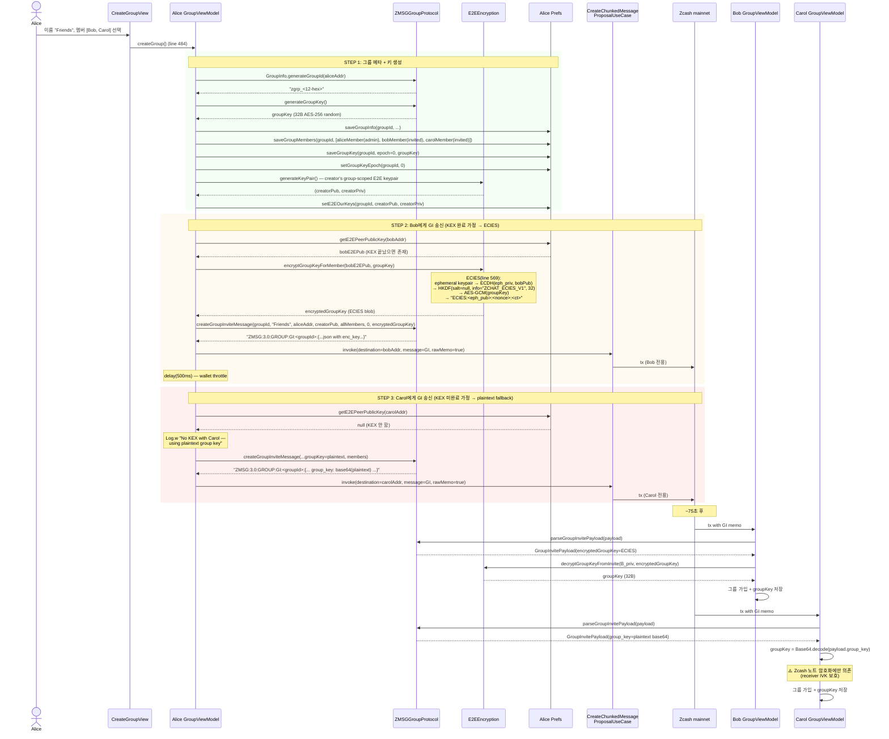
```mermaid
sequenceDiagram
    actor AUser as Alice
    participant AUI as CreateGroupView
    participant GVM as Alice GroupViewModel
    participant ZGP as ZMSGGroupProtocol
    participant AE2E as E2EEncryption
    participant APrefs as Alice Prefs
    participant UC as CreateChunkedMessage<br/>ProposalUseCase
    participant Chain as Zcash mainnet
    participant BVM as Bob GroupViewModel
    participant CVM as Carol GroupViewModel

    AUser->>AUI: 이름 "Friends", 멤버 [Bob, Carol] 선택
    AUI->>GVM: createGroup() (line 484)

    rect rgb(245, 255, 245)
        Note over GVM,APrefs: STEP 1: 그룹 메타 + 키 생성
        GVM->>ZGP: GroupInfo.generateGroupId(aliceAddr)
        ZGP-->>GVM: "zgrp_<12-hex>"
        GVM->>ZGP: generateGroupKey()
        ZGP-->>GVM: groupKey (32B AES-256 random)
        GVM->>APrefs: saveGroupInfo(groupId, ...)
        GVM->>APrefs: saveGroupMembers(groupId, [aliceMember(admin), bobMember(invited), carolMember(invited)])
        GVM->>APrefs: saveGroupKey(groupId, epoch=0, groupKey)
        GVM->>APrefs: setGroupKeyEpoch(groupId, 0)
        GVM->>AE2E: generateKeyPair() — creator's group-scoped E2E keypair
        AE2E-->>GVM: (creatorPub, creatorPriv)
        GVM->>APrefs: setE2EOurKeys(groupId, creatorPub, creatorPriv)
    end

    rect rgb(255, 250, 240)
        Note over GVM,Chain: STEP 2: Bob에게 GI 송신 (KEX 완료 가정 → ECIES)
        GVM->>APrefs: getE2EPeerPublicKey(bobAddr)
        APrefs-->>GVM: bobE2EPub (KEX 끝났으면 존재)
        GVM->>AE2E: encryptGroupKeyForMember(bobE2EPub, groupKey)
        Note over AE2E: ECIES(line 569):<br/>ephemeral keypair → ECDH(eph_priv, bobPub)<br/>→ HKDF(salt=null, info="ZCHAT_ECIES_V1", 32)<br/>→ AES-GCM(groupKey)<br/>→ "ECIES:<eph_pub>:<nonce>:<ct>"
        AE2E-->>GVM: encryptedGroupKey (ECIES blob)
        GVM->>ZGP: createGroupInviteMessage(groupId, "Friends", aliceAddr, creatorPub, allMembers, 0, encryptedGroupKey)
        ZGP-->>GVM: "ZMSG:3.0:GROUP:GI:<groupId>:{...json with enc_key...}"
        GVM->>UC: invoke(destination=bobAddr, message=GI, rawMemo=true)
        UC->>Chain: tx (Bob 전용)
        Note over GVM: delay(500ms) — wallet throttle
    end

    rect rgb(255, 240, 240)
        Note over GVM,Chain: STEP 3: Carol에게 GI 송신 (KEX 미완료 가정 → plaintext fallback)
        GVM->>APrefs: getE2EPeerPublicKey(carolAddr)
        APrefs-->>GVM: null (KEX 안 함)
        Note over GVM: Log.w "No KEX with Carol —<br/>using plaintext group key"
        GVM->>ZGP: createGroupInviteMessage(...groupKey=plaintext, members)
        ZGP-->>GVM: "ZMSG:3.0:GROUP:GI:<groupId>:{... group_key: base64(plaintext) ...}"
        GVM->>UC: invoke(destination=carolAddr, message=GI, rawMemo=true)
        UC->>Chain: tx (Carol 전용)
    end

    Note over Chain: ~75초 후

    Chain->>BVM: tx with GI memo
    BVM->>ZGP: parseGroupInvitePayload(payload)
    ZGP-->>BVM: GroupInvitePayload(encryptedGroupKey=ECIES)
    BVM->>AE2E: decryptGroupKeyFromInvite(B_priv, encryptedGroupKey)
    AE2E-->>BVM: groupKey (32B)
    BVM->>BVM: 그룹 가입 + groupKey 저장

    Chain->>CVM: tx with GI memo
    CVM->>ZGP: parseGroupInvitePayload(payload)
    ZGP-->>CVM: GroupInvitePayload(group_key=plaintext base64)
    CVM->>CVM: groupKey = Base64.decode(payload.group_key)
    Note over CVM: ⚠️ Zcash 노트 암호화에만 의존<br/>(receiver IVK 보호)
    CVM->>CVM: 그룹 가입 + groupKey 저장
```

자세한 분석: [§1.4 그룹 메시징](./subsystems/04-group-messaging.md)

---

## Scenario 9 — 그룹 메시지 송수신 (fan-out N tx)

> 그룹 메시지 한 통이 활성 멤버 N명에게 N개 *별도* transaction으로 fan-out. 각 tx는 같은 ciphertext (group key가 하나).

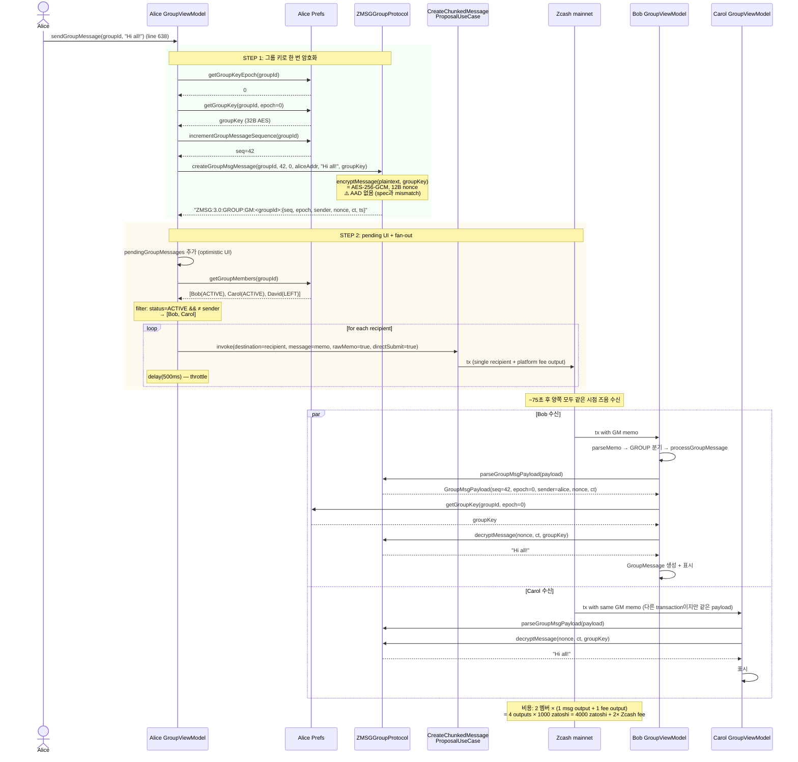
```mermaid
sequenceDiagram
    actor AUser as Alice
    participant GVM as Alice GroupViewModel
    participant APrefs as Alice Prefs
    participant ZGP as ZMSGGroupProtocol
    participant UC as CreateChunkedMessage<br/>ProposalUseCase
    participant Chain as Zcash mainnet
    participant BVM as Bob GroupViewModel
    participant CVM as Carol GroupViewModel

    AUser->>GVM: sendGroupMessage(groupId, "Hi all!") (line 638)

    rect rgb(245, 255, 245)
        Note over GVM,ZGP: STEP 1: 그룹 키로 한 번 암호화
        GVM->>APrefs: getGroupKeyEpoch(groupId)
        APrefs-->>GVM: 0
        GVM->>APrefs: getGroupKey(groupId, epoch=0)
        APrefs-->>GVM: groupKey (32B AES)
        GVM->>APrefs: incrementGroupMessageSequence(groupId)
        APrefs-->>GVM: seq=42
        GVM->>ZGP: createGroupMsgMessage(groupId, 42, 0, aliceAddr, "Hi all!", groupKey)
        Note over ZGP: encryptMessage(plaintext, groupKey)<br/>= AES-256-GCM, 12B nonce<br/>⚠️ AAD 없음 (spec과 mismatch)
        ZGP-->>GVM: "ZMSG:3.0:GROUP:GM:<groupId>:{seq, epoch, sender, nonce, ct, ts}"
    end

    rect rgb(255, 250, 240)
        Note over GVM,Chain: STEP 2: pending UI + fan-out
        GVM->>GVM: pendingGroupMessages 추가 (optimistic UI)
        GVM->>APrefs: getGroupMembers(groupId)
        APrefs-->>GVM: [Bob(ACTIVE), Carol(ACTIVE), David(LEFT)]
        Note over GVM: filter: status=ACTIVE && ≠ sender<br/>→ [Bob, Carol]
        loop for each recipient
            GVM->>UC: invoke(destination=recipient, message=memo, rawMemo=true, directSubmit=true)
            UC->>Chain: tx (single recipient + platform fee output)
            Note over GVM: delay(500ms) — throttle
        end
    end

    Note over Chain: ~75초 후 양쪽 모두 같은 시점 즈음 수신

    par Bob 수신
        Chain->>BVM: tx with GM memo
        BVM->>BVM: parseMemo → GROUP 분기 → processGroupMessage
        BVM->>ZGP: parseGroupMsgPayload(payload)
        ZGP-->>BVM: GroupMsgPayload(seq=42, epoch=0, sender=alice, nonce, ct)
        BVM->>APrefs: getGroupKey(groupId, epoch=0)
        APrefs-->>BVM: groupKey
        BVM->>ZGP: decryptMessage(nonce, ct, groupKey)
        ZGP-->>BVM: "Hi all!"
        BVM->>BVM: GroupMessage 생성 + 표시
    and Carol 수신
        Chain->>CVM: tx with same GM memo (다른 transaction이지만 같은 payload)
        CVM->>ZGP: parseGroupMsgPayload(payload)
        CVM->>ZGP: decryptMessage(nonce, ct, groupKey)
        ZGP-->>CVM: "Hi all!"
        CVM->>CVM: 표시
    end

    Note over Chain: 비용: 2 멤버 × (1 msg output + 1 fee output)<br/>= 4 outputs × 1000 zatoshi = 4000 zatoshi + 2× Zcash fee
```

핵심: **N명 = N tx** (ZIP-321 multi-recipient *안* 씀). 비용은 N에 정비례. 또한 GROUP_MSG의 AAD가 spec에는 있지만 코드에는 없음 (정직한 implementation gap).

---

## Scenario 10 — Quantum Shield PSK 교환 (QR 양방향)

> 두 사용자가 QR을 서로 스캔 — order-independent로 mutual PSK 도출.

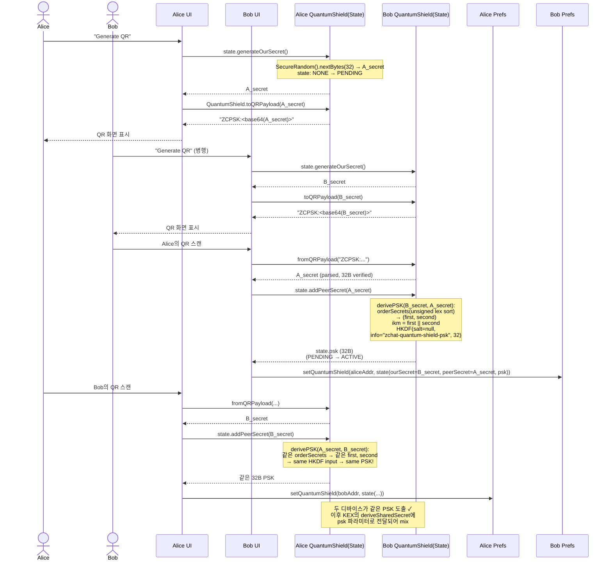
```mermaid
sequenceDiagram
    actor AUser as Alice
    actor BUser as Bob
    participant AUI as Alice UI
    participant BUI as Bob UI
    participant AQS as Alice QuantumShield(State)
    participant BQS as Bob QuantumShield(State)
    participant APrefs as Alice Prefs
    participant BPrefs as Bob Prefs

    AUser->>AUI: "Generate QR"
    AUI->>AQS: state.generateOurSecret()
    Note over AQS: SecureRandom().nextBytes(32) → A_secret<br/>state: NONE → PENDING
    AQS-->>AUI: A_secret
    AUI->>AQS: QuantumShield.toQRPayload(A_secret)
    AQS-->>AUI: "ZCPSK:<base64(A_secret)>"
    AUI-->>AUser: QR 화면 표시

    BUser->>BUI: "Generate QR" (병행)
    BUI->>BQS: state.generateOurSecret()
    BQS-->>BUI: B_secret
    BUI->>BQS: toQRPayload(B_secret)
    BQS-->>BUI: "ZCPSK:<base64(B_secret)>"
    BUI-->>BUser: QR 화면 표시

    BUser->>BUI: Alice의 QR 스캔
    BUI->>BQS: fromQRPayload("ZCPSK:...")
    BQS-->>BUI: A_secret (parsed, 32B verified)
    BUI->>BQS: state.addPeerSecret(A_secret)
    Note over BQS: derivePSK(B_secret, A_secret):<br/>orderSecrets(unsigned lex sort)<br/>→ (first, second)<br/>ikm = first || second<br/>HKDF(salt=null,<br/>info="zchat-quantum-shield-psk", 32)
    BQS-->>BUI: state.psk (32B)<br/>(PENDING → ACTIVE)
    BUI->>BPrefs: setQuantumShield(aliceAddr, state(ourSecret=B_secret, peerSecret=A_secret, psk))

    AUser->>AUI: Bob의 QR 스캔
    AUI->>AQS: fromQRPayload(...)
    AQS-->>AUI: B_secret
    AUI->>AQS: state.addPeerSecret(B_secret)
    Note over AQS: derivePSK(A_secret, B_secret):<br/>같은 orderSecrets → 같은 first, second<br/>→ same HKDF input → same PSK!
    AQS-->>AUI: 같은 32B PSK
    AUI->>APrefs: setQuantumShield(bobAddr, state(...))

    Note over AQS,BQS: 두 디바이스가 같은 PSK 도출 ✓<br/>이후 KEX의 deriveSharedSecret에<br/>psk 파라미터로 전달되어 mix
```

핵심: order-independent. 두 사람 누가 먼저 스캔해도 같은 PSK. 이후 ECDH `ikm = sharedSecret || psk` 로 HKDF augmentation.

자세한 분석: [§1.2 KEX + E2E 암호화](./subsystems/02-kex-e2e-encryption.md#b-quantum-shield-psk-교환)

---

## Scenario 11 — Time-lock 메시지 (Payment-gated) + Unlock

> Alice가 "10000 zatoshi 결제 받으면 해제되는" 메시지 송신. Bob이 결제하면 메시지 본문 노출.

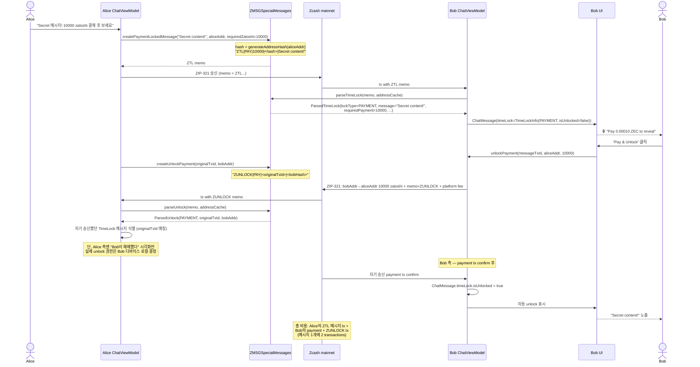
```mermaid
sequenceDiagram
    actor AUser as Alice
    participant ACVM as Alice ChatViewModel
    participant ZSM as ZMSGSpecialMessages
    participant Chain as Zcash mainnet
    participant BCVM as Bob ChatViewModel
    participant BUI as Bob UI
    actor BUser as Bob

    AUser->>ACVM: "Secret 메시지! 10000 zatoshi 결제 후 보세요"
    ACVM->>ZSM: createPaymentLockedMessage("Secret content!", aliceAddr, requiredZatoshi=10000)
    Note over ZSM: hash = generateAddressHash(aliceAddr)<br/>"ZTL|PAY|10000|<hash>|Secret content!"
    ZSM-->>ACVM: ZTL memo
    ACVM->>Chain: ZIP-321 송신 (memo = ZTL...)
    Chain->>BCVM: tx with ZTL memo
    BCVM->>ZSM: parseTimeLock(memo, addressCache)
    ZSM-->>BCVM: ParsedTimeLock(lockType=PAYMENT, message="Secret content!",<br/>requiredPayment=10000, ...)
    BCVM->>BUI: ChatMessage(timeLock=TimeLockInfo(PAYMENT, isUnlocked=false))
    BUI-->>BUser: 🔒 "Pay 0.00010 ZEC to reveal"

    BUser->>BUI: "Pay & Unlock" 클릭
    BUI->>BCVM: unlockPayment(messageTxId, aliceAddr, 10000)
    ACVM->>ZSM: createUnlockPayment(originalTxId, bobAddr)
    Note over ZSM: "ZUNLOCK|PAY|<originalTxId>|<bobHash>"
    BCVM->>Chain: ZIP-321: bobAddr→aliceAddr 10000 zatoshi + memo=ZUNLOCK + platform fee
    
    Chain->>ACVM: tx with ZUNLOCK memo
    ACVM->>ZSM: parseUnlock(memo, addressCache)
    ZSM-->>ACVM: ParsedUnlock(PAYMENT, originalTxId, bobAddr)
    ACVM->>ACVM: 자기 송신했던 TimeLock 메시지 식별 (originalTxId 매칭)
    Note over ACVM: 단, Alice 측엔 "Bob이 해제했다" 시각화만<br/>실제 unlock 권한은 Bob 디바이스 로컬 결정

    Note over BCVM: Bob 측 — payment tx confirm 후
    Chain->>BCVM: 자기 송신 payment tx confirm
    BCVM->>BCVM: ChatMessage.timeLock.isUnlocked = true
    BCVM->>BUI: 자동 unlock 표시
    BUI-->>BUser: "Secret content!" 노출

    Note over Chain: 총 비용: Alice의 ZTL 메시지 tx +<br/>Bob의 payment + ZUNLOCK tx<br/>(메시지 1개에 2 transactions)
```

자세한 분석: [§1.1 ZMSG 프로토콜](./subsystems/01-zmsg-protocol.md) (`ZMSGSpecialMessages.kt`)

---

## Scenario 12 — Payment Request (ZREQ)

> Alice가 Bob에게 0.01 ZEC 결제 요청. Bob이 메시지 안의 "Pay" 버튼으로 즉시 결제.

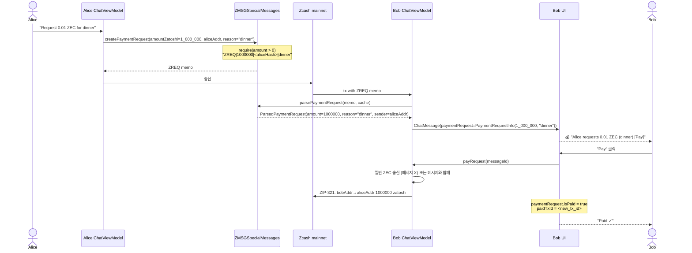
```mermaid
sequenceDiagram
    actor AUser as Alice
    participant ACVM as Alice ChatViewModel
    participant ZSM as ZMSGSpecialMessages
    participant Chain as Zcash mainnet
    participant BCVM as Bob ChatViewModel
    participant BUI as Bob UI
    actor BUser as Bob

    AUser->>ACVM: "Request 0.01 ZEC for dinner"
    ACVM->>ZSM: createPaymentRequest(amountZatoshi=1_000_000, aliceAddr, reason="dinner")
    Note over ZSM: require(amount > 0)<br/>"ZREQ|1000000|<aliceHash>|dinner"
    ZSM-->>ACVM: ZREQ memo
    ACVM->>Chain: 송신
    Chain->>BCVM: tx with ZREQ memo
    BCVM->>ZSM: parsePaymentRequest(memo, cache)
    ZSM-->>BCVM: ParsedPaymentRequest(amount=1000000, reason="dinner", sender=aliceAddr)
    BCVM->>BUI: ChatMessage(paymentRequest=PaymentRequestInfo(1_000_000, "dinner"))
    BUI-->>BUser: 💰 "Alice requests 0.01 ZEC (dinner) [Pay]"
    
    BUser->>BUI: "Pay" 클릭
    BUI->>BCVM: payRequest(messageId)
    BCVM->>BCVM: 일반 ZEC 송신 (메시지 X) 또는 메시지와 함께
    BCVM->>Chain: ZIP-321: bobAddr→aliceAddr 1000000 zatoshi
    Note over BUI: paymentRequest.isPaid = true<br/>paidTxId = <new_tx_id>
    BUI-->>BUser: "Paid ✓"
```

---

## Scenario 13 — Reaction (ZREACT)

> Bob이 Alice의 메시지에 ❤️ 이모지 반응.

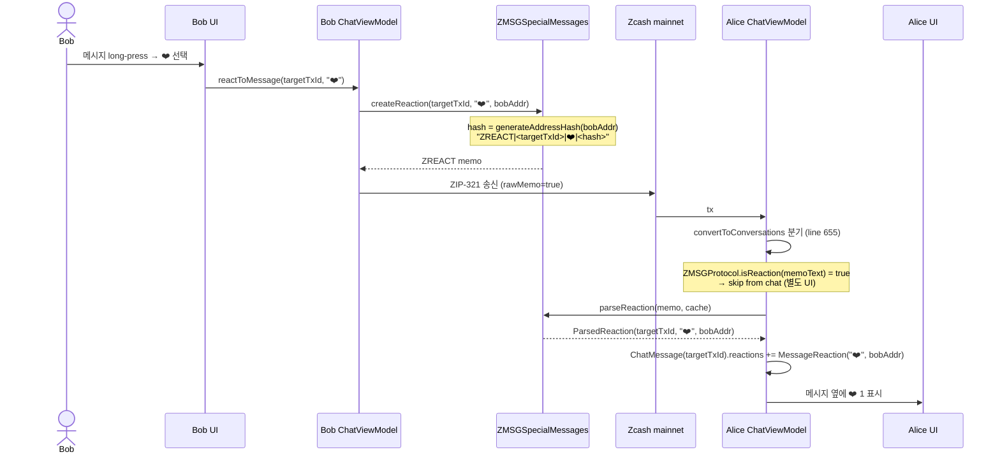
```mermaid
sequenceDiagram
    actor BUser as Bob
    participant BUI as Bob UI
    participant BCVM as Bob ChatViewModel
    participant ZSM as ZMSGSpecialMessages
    participant Chain as Zcash mainnet
    participant ACVM as Alice ChatViewModel
    participant AUI as Alice UI

    BUser->>BUI: 메시지 long-press → ❤️ 선택
    BUI->>BCVM: reactToMessage(targetTxId, "❤️")
    BCVM->>ZSM: createReaction(targetTxId, "❤️", bobAddr)
    Note over ZSM: hash = generateAddressHash(bobAddr)<br/>"ZREACT|<targetTxId>|❤️|<hash>"
    ZSM-->>BCVM: ZREACT memo
    BCVM->>Chain: ZIP-321 송신 (rawMemo=true)
    Chain->>ACVM: tx
    ACVM->>ACVM: convertToConversations 분기 (line 655)
    Note over ACVM: ZMSGProtocol.isReaction(memoText) = true<br/>→ skip from chat (별도 UI)
    ACVM->>ZSM: parseReaction(memo, cache)
    ZSM-->>ACVM: ParsedReaction(targetTxId, "❤️", bobAddr)
    ACVM->>ACVM: ChatMessage(targetTxId).reactions += MessageReaction("❤️", bobAddr)
    ACVM->>AUI: 메시지 옆에 ❤️ 1 표시
```

핵심: ZREACT는 *별도 메시지 entry로 표시 안 됨* — target 메시지의 metadata로 부착. 채팅 화면 line 655에서 skip.

---

## Scenario 14 — Read Receipt (ZRCPT)

> Bob이 Alice의 메시지를 *열어보면* 자동으로 ZRCPT 발사. Alice 측에선 blue double checkmark.

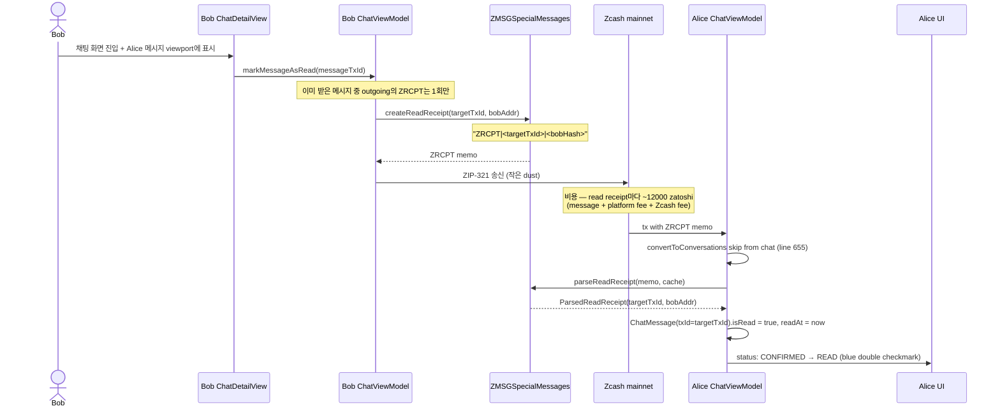
```mermaid
sequenceDiagram
    actor BUser as Bob
    participant BUI as Bob ChatDetailView
    participant BCVM as Bob ChatViewModel
    participant ZSM as ZMSGSpecialMessages
    participant Chain as Zcash mainnet
    participant ACVM as Alice ChatViewModel
    participant AUI as Alice UI

    BUser->>BUI: 채팅 화면 진입 + Alice 메시지 viewport에 표시
    BUI->>BCVM: markMessageAsRead(messageTxId)
    Note over BCVM: 이미 받은 메시지 중 outgoing의 ZRCPT는 1회만
    BCVM->>ZSM: createReadReceipt(targetTxId, bobAddr)
    Note over ZSM: "ZRCPT|<targetTxId>|<bobHash>"
    ZSM-->>BCVM: ZRCPT memo
    BCVM->>Chain: ZIP-321 송신 (작은 dust)
    Note over Chain: 비용 — read receipt마다 ~12000 zatoshi<br/>(message + platform fee + Zcash fee)
    
    Chain->>ACVM: tx with ZRCPT memo
    ACVM->>ACVM: convertToConversations skip from chat (line 655)
    ACVM->>ZSM: parseReadReceipt(memo, cache)
    ZSM-->>ACVM: ParsedReadReceipt(targetTxId, bobAddr)
    ACVM->>ACVM: ChatMessage(txId=targetTxId).isRead = true, readAt = now
    ACVM->>AUI: status: CONFIRMED → READ (blue double checkmark)
```

핵심: 모든 read receipt가 별도 Zcash transaction → 비용 누적. 사용자가 *진짜* 읽었는지 자동 추적 vs 비용 trade-off — 설정에서 disable 가능 (NotificationSettings).

---

## Scenario 15 — Identity Regeneration (DEC-016) + ADDR migration

> Alice가 새 "Business" identity 생성 + 활성 전환. 기존 contacts에게 *수동으로* ADDR broadcast (현재 자동화 미구현).

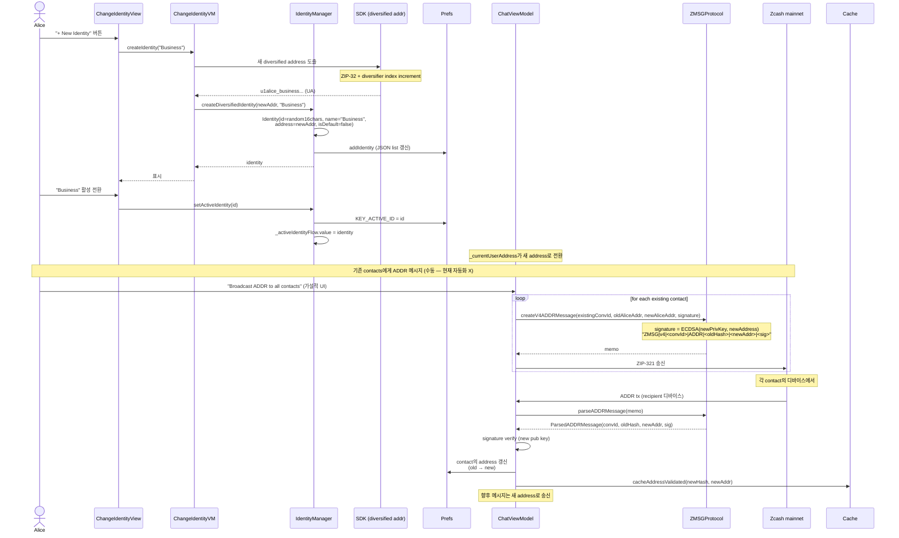
```mermaid
sequenceDiagram
    actor AUser as Alice
    participant AUI as ChangeIdentityView
    participant IVM as ChangeIdentityVM
    participant IM as IdentityManager
    participant SDK as SDK (diversified addr)
    participant Prefs as Prefs
    participant CVM as ChatViewModel
    participant ZMSG as ZMSGProtocol
    participant Chain as Zcash mainnet

    AUser->>AUI: "+ New Identity" 버튼
    AUI->>IVM: createIdentity("Business")
    IVM->>SDK: 새 diversified address 도출
    Note over SDK: ZIP-32 + diversifier index increment
    SDK-->>IVM: u1alice_business... (UA)
    IVM->>IM: createDiversifiedIdentity(newAddr, "Business")
    IM->>IM: Identity(id=random16chars, name="Business",<br/>address=newAddr, isDefault=false)
    IM->>Prefs: addIdentity (JSON list 갱신)
    IM-->>IVM: identity
    IVM-->>AUI: 표시

    AUser->>AUI: "Business" 활성 전환
    AUI->>IM: setActiveIdentity(id)
    IM->>Prefs: KEY_ACTIVE_ID = id
    IM->>IM: _activeIdentityFlow.value = identity
    Note over CVM: _currentUserAddress가 새 address로 전환

    Note over AUser,Chain: 기존 contacts에게 ADDR 메시지 (수동 — 현재 자동화 X)
    AUser->>CVM: "Broadcast ADDR to all contacts" (가설적 UI)
    loop for each existing contact
        CVM->>ZMSG: createV4ADDRMessage(existingConvId, oldAliceAddr, newAliceAddr, signature)
        Note over ZMSG: signature = ECDSA(newPrivKey, newAddress)<br/>"ZMSG|v4|<convId>|ADDR|<oldHash>|<newAddr>|<sig>"
        ZMSG-->>CVM: memo
        CVM->>Chain: ZIP-321 송신
    end

    Note over Chain: 각 contact의 디바이스에서
    Chain->>CVM: ADDR tx (recipient 디바이스)
    CVM->>ZMSG: parseADDRMessage(memo)
    ZMSG-->>CVM: ParsedADDRMessage(convId, oldHash, newAddr, sig)
    CVM->>CVM: signature verify (new pub key)
    CVM->>Prefs: contact의 address 갱신<br/>(old → new)
    CVM->>Cache: cacheAddressValidated(newHash, newAddr)
    Note over CVM: 향후 메시지는 새 address로 송신
```

핵심: `IdentityManager`가 cryptographic separation을 제공하지 *않음* — 같은 seed에서 다른 diversified address만 도출. viewing key 가진 사람은 모든 identity의 트랜잭션을 한꺼번에 본다.

자세한 분석: [§1.7 컨택트 + Identity](./subsystems/07-contact-book-address-cache.md)

---

## Scenario 16 — Remote Kill — destroy 트리거

> 외부 (사용자 자신 또는 누군가)가 사전 정의된 (amount, phrase) 조합의 메시지를 보내면 디바이스가 11단계 폭파.

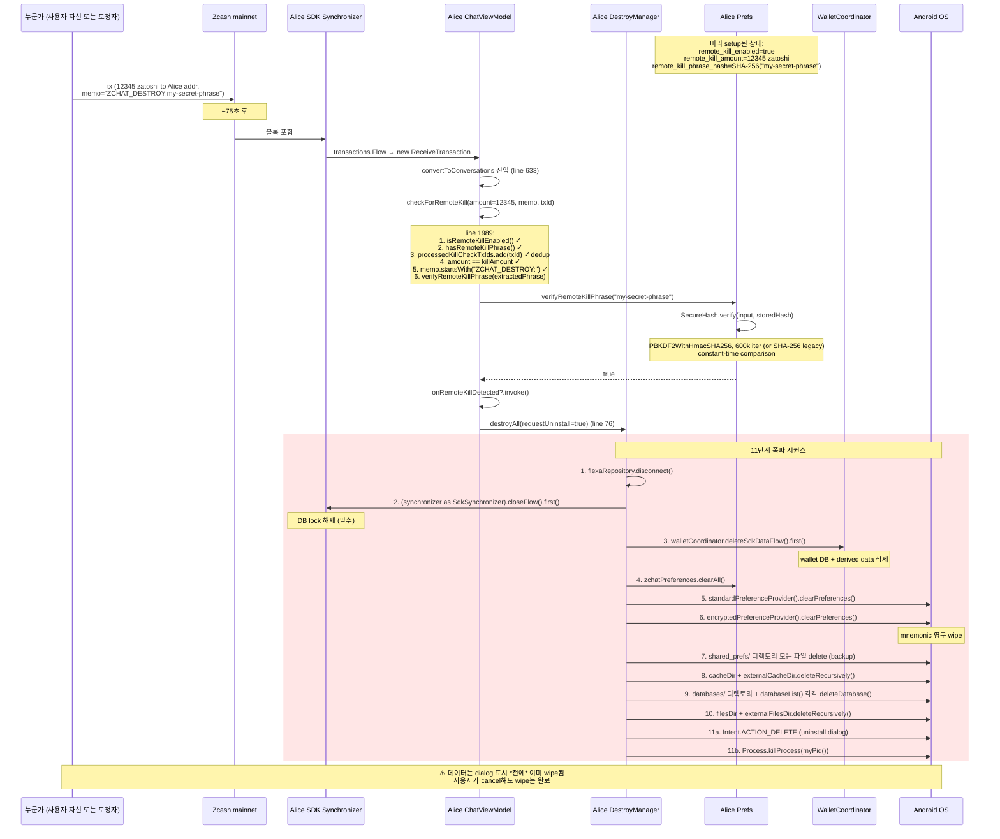
```mermaid
sequenceDiagram
    participant Attacker as 누군가 (사용자 자신 또는 도청자)
    participant Chain as Zcash mainnet
    participant SDK as Alice SDK Synchronizer
    participant CVM as Alice ChatViewModel
    participant DM as Alice DestroyManager
    participant Prefs as Alice Prefs
    participant Coord as WalletCoordinator
    participant OS as Android OS

    Note over Prefs: 미리 setup된 상태:<br/>remote_kill_enabled=true<br/>remote_kill_amount=12345 zatoshi<br/>remote_kill_phrase_hash=SHA-256("my-secret-phrase")

    Attacker->>Chain: tx (12345 zatoshi to Alice addr,<br/>memo="ZCHAT_DESTROY:my-secret-phrase")

    Note over Chain: ~75초 후
    Chain->>SDK: 블록 포함
    SDK->>CVM: transactions Flow → new ReceiveTransaction
    CVM->>CVM: convertToConversations 진입 (line 633)
    CVM->>CVM: checkForRemoteKill(amount=12345, memo, txId)
    Note over CVM: line 1989:<br/>1. isRemoteKillEnabled() ✓<br/>2. hasRemoteKillPhrase() ✓<br/>3. processedKillCheckTxIds.add(txId) ✓ dedup<br/>4. amount == killAmount ✓<br/>5. memo.startsWith("ZCHAT_DESTROY:") ✓<br/>6. verifyRemoteKillPhrase(extractedPhrase)
    CVM->>Prefs: verifyRemoteKillPhrase("my-secret-phrase")
    Prefs->>Prefs: SecureHash.verify(input, storedHash)
    Note over Prefs: PBKDF2WithHmacSHA256, 600k iter (or SHA-256 legacy)<br/>constant-time comparison
    Prefs-->>CVM: true
    CVM->>CVM: onRemoteKillDetected?.invoke()
    CVM->>DM: destroyAll(requestUninstall=true) (line 76)

    rect rgb(255, 230, 230)
        Note over DM,OS: 11단계 폭파 시퀀스
        DM->>DM: 1. flexaRepository.disconnect()
        DM->>SDK: 2. (synchronizer as SdkSynchronizer).closeFlow().first()
        Note over SDK: DB lock 해제 (필수)
        DM->>Coord: 3. walletCoordinator.deleteSdkDataFlow().first()
        Note over Coord: wallet DB + derived data 삭제
        DM->>Prefs: 4. zchatPreferences.clearAll()
        DM->>OS: 5. standardPreferenceProvider().clearPreferences()
        DM->>OS: 6. encryptedPreferenceProvider().clearPreferences()
        Note over OS: mnemonic 영구 wipe
        DM->>OS: 7. shared_prefs/ 디렉토리 모든 파일 delete (backup)
        DM->>OS: 8. cacheDir + externalCacheDir.deleteRecursively()
        DM->>OS: 9. databases/ 디렉토리 + databaseList() 각각 deleteDatabase()
        DM->>OS: 10. filesDir + externalFilesDir.deleteRecursively()
        DM->>OS: 11a. Intent.ACTION_DELETE (uninstall dialog)
        DM->>OS: 11b. Process.killProcess(myPid())
    end

    Note over Attacker,OS: ⚠️ 데이터는 dialog 표시 *전에* 이미 wipe됨<br/>사용자가 cancel해도 wipe는 완료
```

핵심:
- Phrase는 *plaintext memo*에 들어감 (claude.md "Known Technical Debt"). 그러나 phrase 자체는 PBKDF2 hash로 보호 — brute force 비용 ↑↑.
- "true silent uninstall"은 불가 (device admin 아니라 일반 앱). Wipe + uninstall dialog.

자세한 분석: [§1.7 컨택트 + Identity](./subsystems/07-contact-book-address-cache.md#c-remote-kill-destroy-pin-trigger)

---

## Scenario 17 — Diversified address 처리 (Bob이 다른 주소로 응답)

> Alice가 Bob의 d1 주소로 송신. Bob이 *다른* diversified d2로 응답. AddressCache는 d2 hash를 모르지만 convID로 thread 유지.

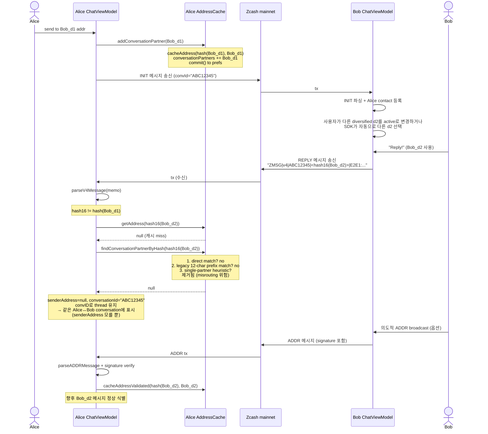
```mermaid
sequenceDiagram
    actor AUser as Alice
    participant ACVM as Alice ChatViewModel
    participant ACache as Alice AddressCache
    participant Chain as Zcash mainnet
    participant BCVM as Bob ChatViewModel
    actor BUser as Bob

    AUser->>ACVM: send to Bob_d1 addr
    ACVM->>ACache: addConversationPartner(Bob_d1)
    Note over ACache: cacheAddress(hash(Bob_d1), Bob_d1)<br/>conversationPartners += Bob_d1<br/>commit() to prefs
    ACVM->>Chain: INIT 메시지 송신 (convId="ABC12345")

    Chain->>BCVM: tx
    BCVM->>BCVM: INIT 파싱 + Alice contact 등록
    BCVM->>BCVM: 사용자가 다른 diversified d2를 active로 변경하거나<br/>SDK가 자동으로 다른 d2 선택
    BUser->>BCVM: "Reply!" (Bob_d2 사용)
    BCVM->>Chain: REPLY 메시지 송신<br/>"ZMSG|v4|ABC12345|<hash16(Bob_d2)>|E2E1:..."

    Chain->>ACVM: tx (수신)
    ACVM->>ACVM: parseV4Message(memo)
    Note over ACVM: hash16 != hash(Bob_d1)
    ACVM->>ACache: getAddress(hash16(Bob_d2))
    ACache-->>ACVM: null (캐시 miss)
    ACVM->>ACache: findConversationPartnerByHash(hash16(Bob_d2))
    Note over ACache: 1. direct match? no<br/>2. legacy 12-char prefix match? no<br/>3. single-partner heuristic? <br/>제거됨 (misrouting 위험)
    ACache-->>ACVM: null
    Note over ACVM: senderAddress=null, conversationId="ABC12345"<br/>convID로 thread 유지<br/>→ 같은 Alice↔Bob conversation에 표시<br/>(senderAddress 모를 뿐)

    BUser->>BCVM: 의도적 ADDR broadcast (옵션)
    BCVM->>Chain: ADDR 메시지 (signature 포함)
    Chain->>ACVM: ADDR tx
    ACVM->>ACVM: parseADDRMessage + signature verify
    ACVM->>ACache: cacheAddressValidated(hash(Bob_d2), Bob_d2)
    Note over ACVM: 향후 Bob_d2 메시지 정상 식별
```

핵심: convID 덕분에 *어떤 diversified address에서 와도* thread는 유지. 다만 sender hash 매핑은 없을 수 있어 "Unknown sender" 표시 가능. ADDR 메시지가 명시적 해결책.

자세한 분석: [§1.7 컨택트 + Identity](./subsystems/07-contact-book-address-cache.md#a-diversified-address-처리)

---

## Scenario 18 — 백그라운드 sync (3-layer 협력)

> 사용자가 앱을 백그라운드로 보내거나 화면 꺼도 메시지 수신을 보장하려면 Foreground Service + WorkManager + AlarmManager 세 layer가 협력.

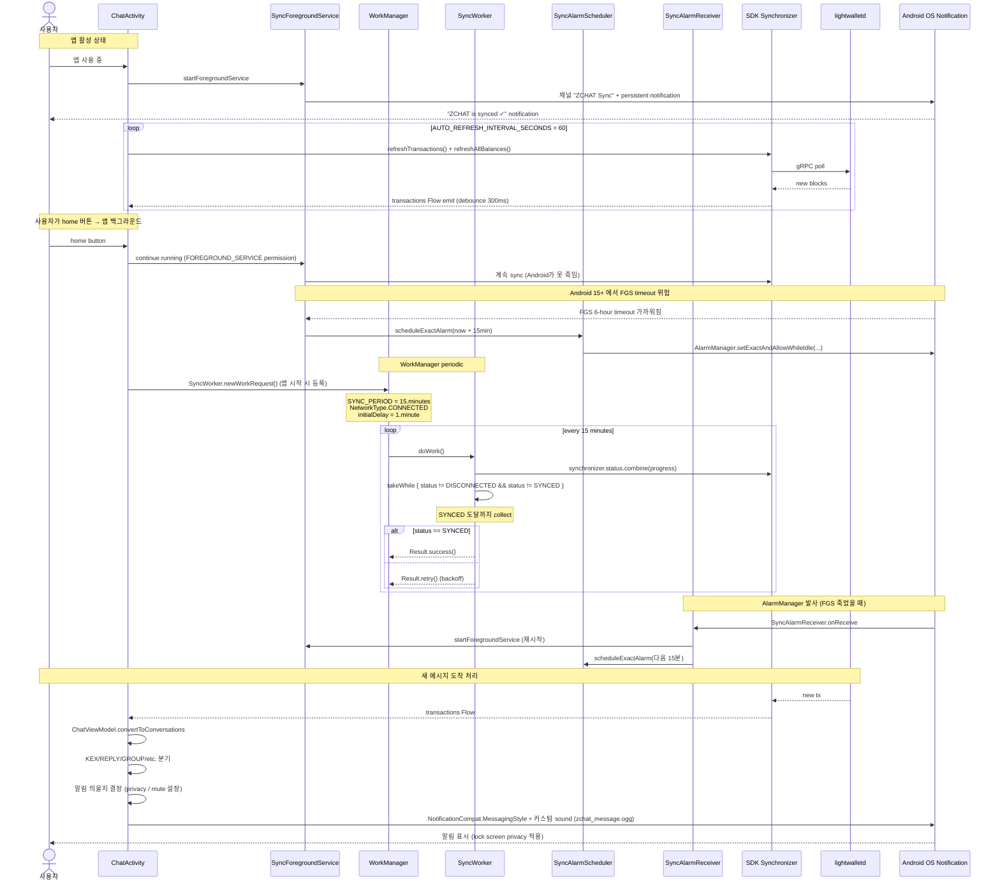
```mermaid
sequenceDiagram
    actor User as 사용자
    participant App as ChatActivity
    participant FGS as SyncForegroundService
    participant WM as WorkManager
    participant SW as SyncWorker
    participant AS as SyncAlarmScheduler
    participant AR as SyncAlarmReceiver
    participant SDK as SDK Synchronizer
    participant LWD as lightwalletd
    participant OS as Android OS Notification

    Note over User,App: 앱 활성 상태
    User->>App: 앱 사용 중
    App->>FGS: startForegroundService
    FGS->>OS: 채널 "ZCHAT Sync" + persistent notification
    OS-->>User: "ZCHAT is synced ✓" notification
    loop AUTO_REFRESH_INTERVAL_SECONDS = 60
        App->>SDK: refreshTransactions() + refreshAllBalances()
        SDK->>LWD: gRPC poll
        LWD-->>SDK: new blocks
        SDK-->>App: transactions Flow emit (debounce 300ms)
    end

    Note over User,App: 사용자가 home 버튼 → 앱 백그라운드
    User->>App: home button
    App->>FGS: continue running (FOREGROUND_SERVICE permission)
    FGS->>SDK: 계속 sync (Android가 못 죽임)

    Note over FGS,OS: Android 15+ 에서 FGS timeout 위험
    OS-->>FGS: FGS 6-hour timeout 가까워짐
    FGS->>AS: scheduleExactAlarm(now + 15min)
    AS->>OS: AlarmManager.setExactAndAllowWhileIdle(...)

    Note over WM,SW: WorkManager periodic
    App->>WM: SyncWorker.newWorkRequest() (앱 시작 시 등록)
    Note over WM: SYNC_PERIOD = 15.minutes<br/>NetworkType.CONNECTED<br/>initialDelay = 1.minute
    loop every 15 minutes
        WM->>SW: doWork()
        SW->>SDK: synchronizer.status.combine(progress)
        SW->>SW: takeWhile { status != DISCONNECTED && status != SYNCED }
        Note over SW: SYNCED 도달까지 collect
        alt status == SYNCED
            SW-->>WM: Result.success()
        else
            SW-->>WM: Result.retry() (backoff)
        end
    end

    Note over OS,AR: AlarmManager 발사 (FGS 죽었을 때)
    OS->>AR: SyncAlarmReceiver.onReceive
    AR->>FGS: startForegroundService (재시작)
    AR->>AS: scheduleExactAlarm(다음 15분)

    Note over LWD,User: 새 메시지 도착 처리
    LWD-->>SDK: new tx
    SDK-->>App: transactions Flow
    App->>App: ChatViewModel.convertToConversations
    App->>App: KEX/REPLY/GROUP/etc. 분기
    App->>App: 알림 띄울지 결정 (privacy / mute 설정)
    App->>OS: NotificationCompat.MessagingStyle + 커스텀 sound (zchat_message.ogg)
    OS-->>User: 알림 표시 (lock screen privacy 적용)
```

핵심: 3-layer redundancy — Foreground Service (active sync) + WorkManager (15min periodic, network constraint) + AlarmManager (FGS timeout fallback). claude.md v2.8.5 audit fix.

자세한 분석: [§1.6 송수신 흐름](./subsystems/06-send-receive-flow.md#d-백그라운드-sync)

---

## Scenario 19 — Insufficient funds + queue retry (note locking)

> Alice가 빠르게 3개 메시지를 burst send. 첫 tx는 OK, 두번째는 첫 tx의 change가 confirm 안 돼서 InsufficientFunds → MessageQueue에 재삽입 → 새 block 도착 시 retry.

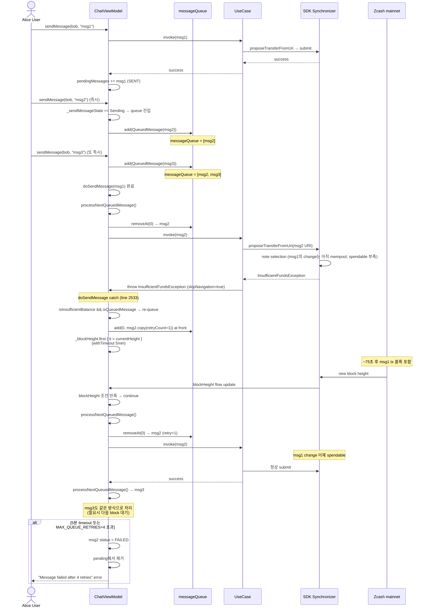
```mermaid
sequenceDiagram
    actor User as Alice User
    participant CVM as ChatViewModel
    participant Q as messageQueue
    participant UC as UseCase
    participant SDK as SDK Synchronizer
    participant Chain as Zcash mainnet

    User->>CVM: sendMessage(bob, "msg1")
    CVM->>UC: invoke(msg1)
    UC->>SDK: proposeTransferFromUri → submit
    SDK-->>UC: success
    UC-->>CVM: success
    CVM->>CVM: pendingMessages += msg1 (SENT)

    User->>CVM: sendMessage(bob, "msg2") (즉시)
    CVM->>CVM: _sendMessageState == Sending → queue 진입
    CVM->>Q: add(QueuedMessage(msg2))
    Note over Q: messageQueue = [msg2]

    User->>CVM: sendMessage(bob, "msg3") (또 즉시)
    CVM->>Q: add(QueuedMessage(msg3))
    Note over Q: messageQueue = [msg2, msg3]

    CVM->>CVM: doSendMessage(msg1) 완료
    CVM->>CVM: processNextQueuedMessage()
    CVM->>Q: removeAt(0) → msg2
    CVM->>UC: invoke(msg2)
    UC->>SDK: proposeTransferFromUri(msg2 URI)
    SDK->>SDK: note selection (msg1의 change는 아직 mempool, spendable 부족)
    SDK-->>UC: InsufficientFundsException
    UC->>CVM: throw InsufficientFundsException (skipNavigation=true)

    Note over CVM: doSendMessage catch (line 2533)
    CVM->>CVM: isInsufficientBalance && isQueuedMessage → re-queue
    CVM->>Q: add(0, msg2.copy(retryCount=1)) at front
    CVM->>CVM: _blockHeight.first { it > currentHeight }<br/>(withTimeout 5min)
    
    Note over Chain: ~75초 후 msg1 tx 블록 포함
    Chain->>SDK: new block height
    SDK->>CVM: blockHeight flow update
    CVM->>CVM: blockHeight 조건 만족 → continue
    CVM->>CVM: processNextQueuedMessage()
    CVM->>Q: removeAt(0) → msg2 (retry=1)
    CVM->>UC: invoke(msg2)
    Note over SDK: msg1 change 이제 spendable
    UC->>SDK: 정상 submit
    UC-->>CVM: success
    
    CVM->>CVM: processNextQueuedMessage() → msg3
    Note over CVM: msg3도 같은 방식으로 처리<br/>(필요시 다음 block 대기)

    alt 5분 timeout 또는 MAX_QUEUE_RETRIES=4 초과
        CVM->>CVM: msg2 status = FAILED
        CVM->>CVM: pending에서 제거
        CVM-->>User: "Message failed after 4 retries" error
    end
```

핵심: Zcash note locking — 한 번 spend로 사용된 note의 change는 다음 block confirm 전까지 다시 spendable 안 됨. zchat의 message queue가 자동 retry로 UX 매끈하게.

자세한 분석: [§1.6 송수신 흐름](./subsystems/06-send-receive-flow.md), [§1.5](./subsystems/05-zip321-tx-chunking.md#d-잔액-부족-분류-line-134-156)

---

## Scenario 20 — 앱 부팅 → seed restore → 모든 identity 복원

> 새 device에서 BIP-39 24 단어 입력. ZIP-32 (Zcash UA) + BIP-44 (NOSTR) 둘 다 동일 복원. Ratchet root는 blockchain 스캔으로 재도출 가능하지만 ratchet counter state는 비어있음 (multi-device 미지원의 protocol 측면).

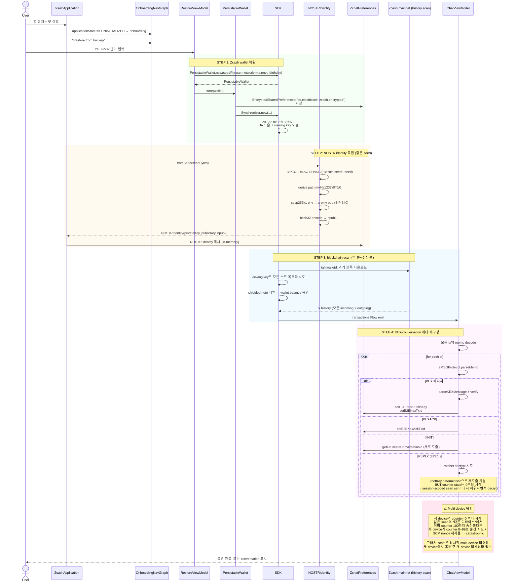
```mermaid
sequenceDiagram
    actor User
    participant App as ZcashApplication
    participant Onb as OnboardingNavGraph
    participant RVM as RestoreViewModel
    participant PW as PersistableWallet
    participant SDK as SDK
    participant NId as NOSTRIdentity
    participant Prefs as ZchatPreferences
    participant Chain as Zcash mainnet (history scan)
    participant CVM as ChatViewModel

    User->>App: 앱 설치 + 첫 실행
    App->>Onb: applicationState == UNINITIALIZED → onboarding
    User->>Onb: "Restore from backup"
    User->>RVM: 24 BIP-39 단어 입력

    rect rgb(245, 255, 245)
        Note over RVM,SDK: STEP 1: Zcash wallet 복원
        RVM->>SDK: PersistableWallet.new(seedPhrase, network=mainnet, birthday)
        SDK-->>RVM: PersistableWallet
        RVM->>PW: store(wallet)
        PW->>Prefs: EncryptedSharedPreferences("co.electriccoin.zcash.encrypted")<br/>저장
        PW->>SDK: Synchronizer.new(...)
        SDK->>SDK: ZIP-32 m/32'/133'/0'/...<br/>UA 도출 + viewing key 도출
    end

    rect rgb(255, 250, 240)
        Note over NId,Prefs: STEP 2: NOSTR identity 복원 (같은 seed)
        App->>NId: fromSeed(seedBytes)
        NId->>NId: BIP-32: HMAC-SHA512("Bitcoin seed", seed)
        NId->>NId: derive path m/44'/1237'/0'/0/0
        NId->>NId: secp256k1 priv → x-only pub (BIP-340)
        NId->>NId: bech32 encode → npub1...
        NId-->>App: NOSTRIdentity(privateKey, publicKey, npub)
        App->>Prefs: NOSTR identity 캐시 (in-memory)
    end

    rect rgb(240, 250, 255)
        Note over SDK,Chain: STEP 3: blockchain scan (수 분~수십 분)
        SDK->>Chain: lightwalletd: 과거 블록 다운로드
        SDK->>SDK: viewing key로 모든 노트 복호화 시도
        SDK->>SDK: shielded note 식별 → wallet balance 복원
        Chain-->>SDK: tx history (모든 incoming + outgoing)
        SDK->>CVM: transactions Flow emit
    end

    rect rgb(255, 245, 255)
        Note over CVM,Prefs: STEP 4: KEX/conversation 메타 재구성
        CVM->>CVM: 모든 tx의 memo decode
        loop for each tx
            CVM->>CVM: ZMSGProtocol.parseMemo
            alt KEX 메시지
                CVM->>CVM: parseKEXMessage + verify
                CVM->>Prefs: setE2EPeerPublicKey<br/>setE2EKexTxId
            else KEXACK
                CVM->>Prefs: setE2EKexAckTxId
            else INIT
                CVM->>Prefs: getOrCreateConversationId (새로 도출)
            else REPLY (E2E1:)
                CVM->>CVM: ratchet decrypt 시도
                Note over CVM: rootKey deterministic으로 재도출 가능<br/>BUT counter state는 0부터 시작<br/>→ session-scoped seen set이 다시 채워지면서 decrypt
            end
        end
    end

    rect rgb(255, 230, 240)
        Note over CVM: ⚠️ Multi-device 위험
        Note over CVM: 새 device의 counter=0 부터 시작.<br/>같은 seed의 *다른 디바이스*에서<br/>이미 counter 100까지 송신했다면<br/>새 device가 counter 0~99로 송신 시도 시<br/>GCM nonce 재사용 → catastrophic
        Note over CVM: 그래서 zchat은 명시적 multi-device 비허용.<br/>새 device에서 복원 후 옛 device 비활성화 필수.
    end

    CVM-->>User: 복원 완료, 모든 conversation 표시
```

핵심: BIP-39 seed → Zcash UA + NOSTR identity 둘 다 deterministic 복원. KEX/Ratchet root도 blockchain 스캔으로 재도출. *그러나* counter state는 device-local → multi-device 시 nonce reuse 위험으로 단일 device per identity 강제.

자세한 분석: [§3.2 ZIP-32 derivation](./zcash-tool-inventory.md#32-zip-32-derivation-경로-bip-44-dual-derivation-검증), [§1.3 Double Ratchet](./subsystems/03-double-ratchet.md)

---

## Cross-scenario 참고

| 시나리오 | 메인 §1.X | 추가 §1.X |
|---|---|---|
| 1. 첫 INIT plaintext | §1.6 + §1.5 | §1.1 |
| 2. KEX 핸드셰이크 | §1.2 | §1.6 |
| 3. Ratchet root + 첫 메시지 | §1.3 | §1.2 + §1.6 |
| 4. 일반 메시지 | §1.3 + §1.6 | §1.1 |
| 5. 청킹 | §1.5 + §1.1 | §1.6 |
| 6. 파일 전송 | §1.8 + §1.2 | §1.5 |
| 7. 파일 수신 | §1.8 | §1.6 |
| 8. 그룹 초대 | §1.4 + §1.2 | §1.5 |
| 9. 그룹 메시지 | §1.4 | §1.5 |
| 10. PSK 교환 | §1.2 | §1.7 |
| 11. Time-lock | §1.1 (special types) | §1.6 |
| 12. Payment request | §1.1 | §1.6 |
| 13. Reaction | §1.1 | §1.6 |
| 14. Read receipt | §1.1 | §1.6 |
| 15. Identity regen | §1.7 | §1.1 (ADDR) |
| 16. Remote kill | §1.7 + §1.6 | §1.8 (SecureHash) |
| 17. Diversified addr | §1.7 | §1.1 |
| 18. 백그라운드 sync | §1.6 | — |
| 19. Queue retry | §1.6 + §1.5 | — |
| 20. Seed restore | §3.2 + §1.3 | §1.8 |

전반적 한 줄: **모든 시나리오의 송신 경로는 ChatViewModel → CreateChunkedMessageProposalUseCase → ZIP-321 → SDK → librustzcash JNI → lightwalletd로 수렴하며, 수신 경로는 SDK transactions Flow → ChatViewModel.convertToConversations 분기 dispatch로 수렴한다.** 차이는 그 사이에 어떤 메시지 타입 / 암호화 layer / 외부 시스템이 끼어드는지에서만 발생.
