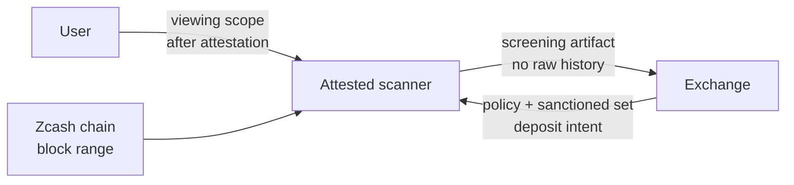

# Zcash Private Off-Ramp Screening

Zcash shielded-origin ZEC를 거래소에 입금할 때, 사용자의 전체 거래 내역을 공개하지 않으면서도 **특정 viewing scope 안에서 sanctioned address와 직접 상호작용하지 않았음**을 검증 가능하게 만드는 아이디어이다.

핵심은 사용자가 임의의 record list를 넣어 ZK proof를 만드는 것이 아니다. 그 방식은 사용자가 일부 record를 빼면 무너진다. 따라서 이 문서의 최신 방향은 다음이다.

```txt
사용자가 attested scanner에 read-only viewing scope를 제공한다.
scanner는 지정된 block range 전체를 scan한다.
scanner는 그 scope에서 관측 가능한 모든 relevant record를 검사한다.
거래소는 raw history가 아니라 screening artifact만 검증한다.
```

이 프로젝트는 **full compliance proof**가 아니다. 특정 wallet/viewing scope와 특정 audit window에 대한 **wallet-scope screening proof/attestation**이다.

## 왜 단순 ZK Record Proof는 부족한가

초기 아이디어는 다음과 같았다.

```txt
사용자가 outgoing recipient record list를 만든다.
그 list와 sanctioned address set의 교집합이 없음을 ZK로 증명한다.
```

문제는 명확하다.

```txt
ZK proof는 "넣은 데이터에 대해 claim이 true"임만 증명한다.
"넣어야 할 데이터를 전부 넣었다"는 것은 자동으로 증명하지 못한다.
```

예를 들어 사용자가 sanctioned recipient가 들어 있는 record를 witness에서 빼면, circuit은 그 누락을 알 수 없다. `ledgerCommitment`도 해결책이 아니다. Commitment는 "이 list가 바뀌지 않았다"를 보장할 뿐, "이 list가 완전하다"를 보장하지 않는다.

따라서 의미 있는 버전은 record source를 사용자 임의 JSON이 아니라 다음에 묶어야 한다.

```txt
viewing scope + complete chain scan over [start, end]
```

## 최종 Claim

이 프로젝트가 목표로 하는 claim은 다음이다.

```txt
특정 Zcash viewing scope에 대해,
attested scanner가 지정된 block range [start, end] 전체를 scan했고,
그 scope에서 관측 가능한 모든 relevant record를 대상으로 검사했으며,
sanctioned ZEC address set과 매칭되는 outgoing recipient가 없었다.
```

영어로는 다음과 같다.

```txt
Given a specific Zcash viewing scope,
an attested scanner processed the complete block range [start, end],
derived all relevant records visible under that scope,
and found no outgoing recipient matching the sanctioned ZEC address set.
```

이 claim은 여전히 좁다. 하지만 기존 mock JSON proof보다 훨씬 정직하고 의미 있는 claim이다.

## System Overview



## 실행 흐름

1. 거래소가 screening request를 만든다.
   - deposit address
   - amount
   - nonce
   - expiry
   - audit block range
   - sanctioned ZEC address set

2. 사용자가 scanner attestation을 확인한다.
   - scanner code hash
   - enclave/TEE attestation
   - policy version
   - 어떤 데이터를 보고 어떤 결과만 내보내는지

3. 사용자가 attested scanner에 viewing scope를 제공한다.
   - long-term spending key는 제공하지 않는다.
   - read-only viewing capability만 제공한다.
   - scanner는 raw wallet history를 거래소에 넘기지 않는다.

4. scanner가 지정된 block range 전체를 scan한다.
   - Zcash chain 또는 compact block source에서 필요한 데이터를 가져온다.
   - viewing scope로 관측 가능한 relevant records를 derive한다.
   - outgoing recipient 정보를 추출 가능한 범위에서 normalize/hash한다.

5. scanner가 sanctioned set과 비교한다.
   - 모든 derived recipient hash를 sanctioned address hash와 비교한다.
   - 매칭이 있으면 FAIL이다.
   - 매칭이 없으면 PASS이다.

6. scanner가 screening artifact를 만든다.
   - scanner attestation
   - policy hash
   - deposit intent hash
   - scan range
   - viewing-scope commitment
   - PASS/FAIL result
   - optional ZK proof

7. 거래소가 artifact를 검증한다.
   - attestation이 유효한가?
   - code measurement가 예상한 scanner인가?
   - policy hash가 거래소가 요청한 policy와 같은가?
   - deposit intent hash가 현재 deposit request와 같은가?
   - scan range가 맞는가?
   - result/proof가 valid한가?

## 네 가지 버전

| Version | 의미 | 용도 |
|---|---|---|
| Mock JSON ZK proof | 사용자가 넣은 record list에 대해서만 non-interaction 증명 | 교육용/demo toy |
| Direct viewing key disclosure | 거래소나 감사자에게 viewing key를 넘겨 직접 scan하게 함 | completeness는 강하지만 privacy 손실이 큼 |
| Attested scanner MVP | viewing scope로 complete block range scan 후 screening artifact 생성 | 현실적인 hackathon MVP |
| Pure ZK full scan | circuit 안에서 Zcash scan completeness까지 증명 | 연구 프로젝트, MVP 범위 밖 |

`Direct viewing key disclosure`는 가장 단순한 completeness 해결책이다. 거래소가 직접 scan하므로 사용자가 record를 누락하기 어렵다. 대신 거래소가 viewable history를 직접 보게 되므로 privacy-preserving 방향과 충돌한다.

`Attested scanner MVP`는 이 disclosure를 줄이기 위한 중간 지점이다. 사용자는 viewing scope를 거래소가 아니라 attested scanner에 제공한다. scanner는 complete scan을 수행하되, 거래소에는 raw history가 아니라 screening artifact만 내보낸다.

## ZK Circuit은 어디에 쓰이나

ZK circuit 자체는 여전히 쓸 수 있다. 다만 역할을 정확히 봐야 한다.

ZK circuit이 잘하는 것은 다음이다.

```txt
주어진 private recipient set과 public sanctioned set 사이에
교집합이 없음을 recipient를 공개하지 않고 증명
```

ZK circuit이 혼자 해결하지 못하는 것은 다음이다.

```txt
그 private recipient set이 complete한지 증명
```

따라서 최신 구조는 다음과 같다.

```txt
completeness -> attested scanner가 complete block range scan으로 담당
non-interaction privacy -> optional ZK proof가 담당
```

즉, ZK는 보조 layer이다. 핵심 보장은 **attested complete scan**에서 온다.

## Non-Interaction Check

recipient hash와 sanctioned hash가 같지 않음을 circuit에서 보일 때는 inverse trick을 쓴다.

```txt
diff = recipientHash - sanctionedHash
diff * invDiff = 1
```

`diff = 0`이면 inverse가 존재하지 않으므로 proof generation이 실패한다. 이 검사를 모든 active recipient와 모든 sanctioned address 조합에 대해 수행하면 set non-intersection을 증명할 수 있다.

단, 이 검사는 **입력된 recipient set에 대해서만** 의미가 있다. 따라서 production 방향에서는 입력 set을 attested scanner가 complete scan으로 만들어야 한다.

## Deposit Intent Binding

proof나 artifact는 특정 deposit request에 묶여야 한다. 그렇지 않으면 사용자가 예전에 만든 valid result를 다른 deposit에 재사용할 수 있다.

```txt
depositIntentHash = Hash(
  exchangeDepositAddress,
  depositAmountZat,
  nonce,
  expiryUnix
)
```

거래소는 artifact 검증 시 `depositIntentHash`가 현재 deposit request와 일치하지 않으면 reject해야 한다.

## Policy Binding

artifact는 특정 screening policy에도 묶여야 한다.

policy에 포함될 값은 다음이다.

```txt
policyName
policyVersion
auditStartHeight
auditEndHeight
sanctionedAddressSetHash
scannerMeasurement
depositIntentHash
```

거래소는 `policyHash`가 요청한 policy와 다르면 reject해야 한다.

## 이 방식이 증명하는 것

- 특정 viewing scope에 대해 scanner가 지정된 block range 전체를 처리했다는 것.
- 그 scope에서 관측 가능한 relevant record를 대상으로 screening을 수행했다는 것.
- 해당 record들의 outgoing recipient가 provided sanctioned set과 매칭되지 않았다는 것.
- result가 특정 policy와 특정 deposit intent에 묶여 있다는 것.
- 거래소가 raw transaction history를 직접 받지 않는다는 것.

## 이 방식이 증명하지 않는 것

- 사용자가 가진 모든 wallet이 검사되었다는 것.
- 사용자가 제출하지 않은 다른 viewing scope가 clean하다는 것.
- ZEC의 전체 upstream history가 clean하다는 것.
- full OFAC/AML compliance가 완료되었다는 것.
- sanctioned address set이 완전하다는 것.
- TEE/hardware trust assumption이 없다는 것.

이 한계는 숨기면 안 된다. claim을 좁게 유지해야 기술적으로 정직하다.

## Trust Model

| Entity | Trust required | 이유 |
|---|---|---|
| User | 제출한 viewing scope가 검사 대상이라는 점 | 사용자가 다른 wallet을 숨길 수는 있음 |
| Attested scanner | code measurement대로 실행된다는 점 | completeness는 scanner 실행에 의존 |
| TEE/hardware vendor | enclave memory와 attestation이 안전하다는 점 | pure cryptographic guarantee는 아님 |
| Exchange | artifact를 policy input으로만 사용한다는 점 | PASS가 full compliance clearance는 아님 |
| Sanctioned list provider | 제공한 address set이 정확하다는 점 | incomplete list면 proof도 그 범위까지만 의미 있음 |

## MVP Scope

MVP에서 만들 것은 다음이다.

```txt
1. Mock scanner
   - mock chain/block data
   - mock viewing scope
   - complete scan simulation

2. Screening artifact
   - policyHash
   - depositIntentHash
   - scanRange
   - viewingScopeCommitment
   - result

3. Optional ZK layer
   - recipient set non-intersection circuit
   - mock recipient hashes

4. Web demo
   - prover/scanner view
   - exchange verifier view
```

실제 Zcash wallet scanning은 후속 단계이다. 하지만 문서와 demo narrative는 처음부터 record completeness 문제를 정면으로 다뤄야 한다.

## Future Work

- real Zcash viewing key 기반 scanner
- `zcash_client_backend` 또는 lightwalletd 연동
- TEE deployment와 remote attestation verification
- large sanctioned set을 위한 Merkle/accumulator non-membership
- scanner output에 대한 ZK proof 결합
- multiple viewing scopes/account scopes 지원
- exchange policy engine integration

## 발표용 한 문장

```txt
이 프로젝트는 사용자가 임의로 고른 record에 대한 proof가 아니라,
특정 Zcash viewing scope와 block range 전체를 attested scanner가 검사했다는 artifact를 통해,
raw shielded history를 공개하지 않고도 sanctioned recipient와의 직접 상호작용이 없었음을 보여주는 private off-ramp screening demo이다.
```
