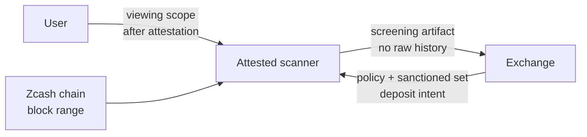

# Zcash Private Off-Ramp Screening

This project explores how a Zcash user can provide a useful off-ramp screening signal without revealing their full shielded transaction history.

The updated direction is not a simple "user submits arbitrary records to a ZK circuit" design. That version has a fatal completeness problem: the user could omit records. The stronger MVP is:

```txt
The user authorizes an attested scanner with a read-only viewing scope.
The scanner processes the complete requested block range.
The scanner derives all relevant records visible under that scope.
The exchange verifies a screening artifact instead of raw wallet history.
```

This is not a full compliance proof. It is a wallet/viewing-scope screening proof or attestation for a specific audit window and deposit intent.

## Why Plain ZK Records Are Not Enough

The initial idea was:

```txt
The user builds a private outgoing-recipient list.
The user proves that this list does not intersect with a sanctioned address set.
```

That is technically possible, but weak by itself.

```txt
A ZK proof proves that a claim is true for the data placed in the witness.
It does not prove that the witness contains every record that should have been included.
```

If the user omits the record that contains a sanctioned recipient, the circuit cannot detect the omission. A `ledgerCommitment` does not solve this. It only commits to the list that was provided; it does not prove that the list is complete.

So the meaningful version must anchor the record source to:

```txt
viewing scope + complete chain scan over [start, end]
```

## Final Claim

The target claim is:

```txt
Given a specific Zcash viewing scope,
an attested scanner processed the complete block range [start, end],
derived all relevant records visible under that scope,
and found no outgoing recipient matching the sanctioned ZEC address set.
```

This remains a narrow claim, but it is much more meaningful than a mock JSON proof.

## System Overview



## Execution Flow

1. The exchange creates a screening request.
   - deposit address
   - amount
   - nonce
   - expiry
   - audit block range
   - sanctioned ZEC address set

2. The user verifies scanner attestation.
   - scanner code hash
   - enclave/TEE attestation
   - policy version
   - what data the scanner reads and what it exports

3. The user provides a viewing scope to the attested scanner.
   - no long-term spending key is provided.
   - only read-only viewing capability is provided.
   - the scanner does not export raw wallet history to the exchange.

4. The scanner processes the full block range.
   - fetches required Zcash chain or compact block data.
   - derives relevant records visible under the viewing scope.
   - normalizes and hashes outgoing recipient data where available.

5. The scanner checks against the sanctioned set.
   - every derived recipient hash is compared against sanctioned address hashes.
   - a match produces FAIL.
   - no match produces PASS.

6. The scanner emits a screening artifact.
   - scanner attestation
   - policy hash
   - deposit intent hash
   - scan range
   - viewing-scope commitment
   - PASS/FAIL result
   - optional ZK proof

7. The exchange verifies the artifact.
   - attestation is valid.
   - code measurement is expected.
   - policy hash matches the requested policy.
   - deposit intent hash matches the current deposit request.
   - scan range matches.
   - result/proof is valid.

## Four Versions

| Version | Meaning | Use |
|---|---|---|
| Mock JSON ZK proof | Proves non-interaction only for user-provided records | Educational/demo toy |
| Direct viewing key disclosure | Gives a viewing key to the exchange or auditor so they can scan directly | Strong completeness, high privacy loss |
| Attested scanner MVP | Uses a viewing scope to scan a complete block range and emit a screening artifact | Realistic hackathon MVP |
| Pure ZK full scan | Proves Zcash scan completeness inside a circuit | Research project, out of MVP scope |

`Direct viewing key disclosure` is the simplest way to solve completeness. The exchange scans directly, so it is hard for the user to omit records. The cost is privacy: the exchange sees viewable history.

`Attested scanner MVP` is the middle path. The user provides the viewing scope to an attested scanner instead of the exchange. The scanner performs the complete scan, but exports only a screening artifact rather than raw history.

## Where ZK Fits

The ZK circuit can still be useful, but its role must be precise.

What ZK can prove:

```txt
For a given private recipient set and public sanctioned set,
there is no intersection, without revealing the recipients.
```

What ZK does not prove by itself:

```txt
That the private recipient set is complete.
```

In the updated architecture:

```txt
completeness -> attested scanner and complete block-range scan
non-interaction privacy -> optional ZK proof
```

ZK becomes a supporting layer. The core completeness guarantee comes from the attested scan.

## Non-Interaction Check

Inside a circuit, inequality can be encoded with an inverse witness:

```txt
diff = recipientHash - sanctionedHash
diff * invDiff = 1
```

If `diff = 0`, no inverse exists and proof generation fails. Repeating this for every active recipient and every sanctioned address proves set non-intersection for the input set.

Again, this only applies to the input set. For a meaningful screening artifact, that set should be produced by the attested scanner's complete scan.

## Deposit Intent Binding

The artifact must be bound to a concrete deposit request. Otherwise, a user could replay an old valid result for a new deposit.

```txt
depositIntentHash = Hash(
  exchangeDepositAddress,
  depositAmountZat,
  nonce,
  expiryUnix
)
```

The exchange rejects the artifact if the hash does not match the current request.

## Policy Binding

The artifact must also be bound to a specific screening policy.

Policy fields should include:

```txt
policyName
policyVersion
auditStartHeight
auditEndHeight
sanctionedAddressSetHash
scannerMeasurement
depositIntentHash
```

The exchange rejects the artifact if `policyHash` does not match the requested policy.

## What This Proves

- A specific viewing scope was scanned over the requested block range.
- The scanner processed the records visible under that scope.
- No derived outgoing recipient matched the provided sanctioned set.
- The result is bound to a specific policy and deposit intent.
- The exchange does not receive raw shielded transaction history.

## What This Does Not Prove

- It does not prove that every wallet controlled by the user was scanned.
- It does not prove that another undisclosed viewing scope is clean.
- It does not prove the full upstream history of the ZEC is clean.
- It does not prove full OFAC, AML, or exchange compliance.
- It does not prove the sanctioned address set is complete.
- It does not remove TEE or hardware trust assumptions.

These limits are part of the design. The claim must stay narrow to remain technically honest.

## Trust Model

| Entity | Trust required | Why |
|---|---|---|
| User | The submitted viewing scope is the intended screening scope | The user can still hide other wallets |
| Attested scanner | The measured code ran as claimed | Completeness depends on scanner execution |
| TEE/hardware vendor | Enclave memory and attestation are sound | This is not a pure cryptographic guarantee |
| Exchange | Treats the artifact as one policy input | PASS is not full compliance clearance |
| Sanctioned list provider | The provided address set is accurate | An incomplete list limits the result |

## MVP Scope

The MVP should build:

```txt
1. Mock scanner
   - mock chain/block data
   - mock viewing scope
   - complete scan simulation

2. Screening artifact
   - policyHash
   - depositIntentHash
   - scanRange
   - viewingScopeCommitment
   - result

3. Optional ZK layer
   - recipient set non-intersection circuit
   - mock recipient hashes

4. Web demo
   - prover/scanner view
   - exchange verifier view
```

Real Zcash wallet scanning is future work. The MVP narrative should still address the record completeness problem directly.

## Future Work

- real Zcash viewing-key scanner
- `zcash_client_backend` or lightwalletd integration
- TEE deployment and remote attestation verification
- Merkle or accumulator non-membership for large sanctioned sets
- ZK proof over scanner output
- multiple viewing scopes or account scopes
- exchange policy engine integration

## Presentation Framing

```txt
This is not a proof over records the user hand-picked.
It is an attested scan over a specific Zcash viewing scope and block range.

The exchange learns a screening result.
It does not receive raw shielded history.
```
