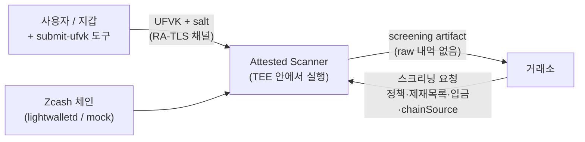
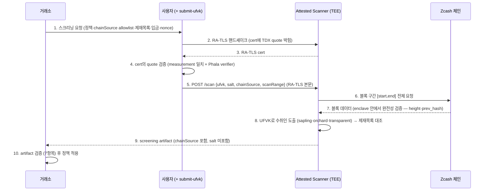

# 아키텍처 — Zcash Private Off-Ramp Screening

> 이 문서는 시스템이 *어떻게* 구성되는지를 다룬다. *왜* 그렇게 했는지는
> [decisions.md](./decisions.md), 용어는 [glossary.md](./glossary.md) 참고.
>
> **상태**: scanner 는 Phala TDX 에 배포·라이브, 실 mainnet UFVK 로 PASS/FAIL 검증됨 (D13).
> 배포 전송 모델(gateway 종단 vs RA-TLS passthrough)·신뢰 모델 차이는 §4 + decisions.md D13.1
> + limitations.md §3.3.

## 1. 구성요소



| 구성요소 | 역할 |
|---|---|
| 사용자 / 지갑 | viewing key 보유. submit-ufvk 도구로 enclave에 직접 전달 |
| 거래소 | 스크리닝 요청 생성 (chainSource allowlist 포함), artifact 검증 |
| Attested Scanner | enclave 안에서 viewing key로 스캔. 전송: 자체 RA-TLS HTTPS(`SCANNER_TRANSPORT=ratls` · **배포 기본 = gateway passthrough**) 또는 평문 HTTP(대안 — gateway TLS 종단, `=http`). D13.1 |
| Zcash 체인 | lightwalletd gRPC (또는 MVP mock) |
| 검증기 | artifact의 서명·measurement·바인딩·chainSource를 검사 (거래소 측) |

## 2. 전체 흐름



핵심 경계:
- **viewing key는 env가 아니라 본문으로만 전달된다** (D10) — 사람 운영자가 평문을 보지 않는다.
  *위 2~4(client 의 RA-TLS quote 풀검증)은 **현재 gateway passthrough 배포**라 end-to-end 로
  가동된다 (+ measurement 자동 핀, TOFU). 대안인 gateway TLS 종단(`--no-verify`) 모드에선 client 가
  enclave 를 직접 검증하지 않고 gateway TEE 를 신뢰 — D13.1 · limitations.md §3.3 ·
  demo-architecture-limitations.md.*
- **raw 거래내역은 거래소로 가지 않는다** — artifact에 PASS/FAIL과 해시뿐.

## 3. 스캐너 바이너리 내부

스캐너는 하나의 바이너리/서비스다. TEE 안/밖 어디서 실행하든 **코드는 동일**하다.

```txt
입력:  RA-TLS 본문 → viewing key (비밀, enclave 안에서만), salt, chainSource, scanRange
       스크리닝 요청 (정책, 제재목록, 입금, scanRange, nonce, chainSource)
─────────────────────────────────────────────
1. 체인 페치     scanRange의 블록을 빠짐없이 가져온다 (Rust 사이드카 in TEE)
2. 완전성 검증   height 연속 + prev_hash chain (lightwalletd 신뢰 약화)
3. 스캔          UFVK로 관측 가능한 record를 도출 (Sapling·Orchard OVK)
4. 수취인 도출   shielded outgoing + 해당 tx의 transparent vout (t-addr 제재 매칭)
5. 정규화·해싱   수취인 주소를 정규화하고 해싱
6. 대조          모든 수취인 해시 vs 제재목록 해시 → 교집합 있으면 FAIL
7. artifact 생성 결과 + 메타(chainSource 포함)를 attestation 키로 서명
─────────────────────────────────────────────
출력:  screening artifact (PASS/FAIL + 메타 + attestation)
```

raw record(수취인 주소, 금액, 메모, txid)는 **enclave 밖으로 나가지 않는다.**
밖으로 나가는 것은 artifact뿐이다.

## 4. TEE 모델

### 4.1 TEE가 보증하는 것 / 안 하는 것

| 보증함 | 보증 안 함 |
|---|---|
| 약속된 코드(measurement 일치)가 실행됐다 | 입력 데이터가 진짜다 (→ 8절 보안) |
| enclave 메모리를 운영자가 못 본다 | 사용자가 모든 지갑을 제출했다 |
| 본문(UFVK)은 TEE 경계 안에서만 평문 (gateway 종단 시 gateway TEE 포함) | 제재목록이 완전하다 |
| 결과가 enclave 키로 서명됐다 | TDX 자체 사이드채널이 완벽하다 |

### 4.2 Attestation

스캐너는 두 가지 방식으로 attestation을 한다:

- **RA-TLS cert** — dstack `getTlsKey({usageRaTls: true})`로 enclave 안에서 생성된
  TLS keypair. cert extension에 TDX quote가 박혀 있어, 사용자가 channel 자체를
  attestation에 묶어 검증할 수 있다 (D10·D12.1). *이 채널 검증은 **현재 gateway passthrough
  배포**라 가동 중 — cert 가 client 까지 도달해 quote 풀검증 + measurement 핀. (대안 gateway 종단
  배포에선 LE cert 라 `--no-verify`, D13.1.)*
- **artifact attestation** — 스캔이 끝난 뒤 결과 핵심 필드 hash에 바인딩된 TDX quote
  (`getQuote(reportData)`).

quote는:
- **code measurement** — 실행된 바이너리/enclave 이미지의 해시 (dstack `tcb_info.compose_hash`).
- **결과 바인딩** — artifact 핵심 필드의 해시 + nonce를 reportData에 포함.
- 하드웨어 키(실 TEE) 또는 시뮬레이션 키(MVP)로 서명.

거래소(검증기)는 measurement가 **허용 목록(allowlist)**에 있는지 확인해 "이 결과는
우리가 검토한 그 코드가 만든 것"임을 신뢰한다.

### 4.3 AttestationProvider 추상화

```ts
interface AttestationProvider {
  readonly providerId: AttestationProviderId;
  getMeasurement(): Promise<string>;
  attest(payload: string, nonce: string): Promise<AttestationQuote>;
  verify(
    quote: AttestationQuote,
    payload: string,
    expectedMeasurement: string,
  ): Promise<boolean>;
}
```

| 구현체 | 단계 | 설명 |
|---|---|---|
| `SimulatedAttestation` | 로컬·데모 (core) | ed25519 키페어 서명 — 진짜 하드웨어 아님 |
| `PhalaAttestation` | 실 TEE (apps/scanner) · **배포됨** | Phala dstack / Intel TDX 실 quote. 전송은 `SCANNER_TRANSPORT` 로 RA-TLS/HTTP 선택 (D13.1) |
| `NitroAttestation` | 대안, 미구현 | AWS Nitro Enclaves |

## 5. 데이터 모델

```ts
// Zcash 데이터 소스 (D9).
type ChainSource =
  | { kind: "mock" }
  | { kind: "lightwalletd"; url: string; network: "main" | "test" };

// 사용자가 스캐너에 제공하는 viewing scope (RA-TLS 본문으로).
// 실제 viewing key는 비밀 — artifact에는 commitment만.
type ViewingScope = {
  scopeId: string;
  network: "main" | "test";
  viewingKey: string;  // 비밀 — enclave 밖으로 안 나감
};
// viewingScopeCommitment = hash(scope || salt)  ← salt는 사용자 제공·보관 (D11)

// 거래소가 정의하는 스크리닝 정책.
type ScreeningPolicy = {
  policyName: string;
  policyVersion: string;
  auditRange: { startHeight: number; endHeight: number };
  sanctionedAddressSetHash: string;
  scannerMeasurement: string;
  depositIntentHash: string;
  approvedChainSources: ChainSource[];  // D9 — 허용 출처 allowlist
};
// policyHash = hash(위 필드 전체, approvedChainSources 포함)

// 거래소 → 스캐너 요청.
type ScreeningRequest = {
  policy: ScreeningPolicy;
  sanctionedAddresses: SanctionedAddress[];
  depositIntent: DepositIntent;
  scanRange: { startHeight: number; endHeight: number };
  chainSource: ChainSource;  // D9 — 이번 스캔에 쓸 출처 (allowlist 중 하나)
  nonce: string;
};

// 스캐너 내부에만 존재. enclave 밖으로 안 나감.
type DerivedRecord = {
  txid: string;
  blockHeight: number;
  direction: "outgoing";
  recipientAddress: string; // OVK 복원 (sapling zs1/orchard u1/transparent t1·t3)
  recipientHash: string;
  amountZat: string;
};

// 거래소로 나가는 유일한 산출물.
type ScreeningArtifact = {
  version: string;
  policyHash: string;
  depositIntentHash: string;
  scanRange: { startHeight: number; endHeight: number };
  chainSource: ChainSource;  // D9 — 실제 사용된 출처, binding payload에 hash로 포함
  viewingScopeCommitment: string;  // hash(scope || salt), salt 미포함 (D11)
  result: "PASS" | "FAIL";
  attestation: {
    provider: "simulated" | "phala-tdx" | "aws-nitro";
    codeMeasurement: string;
    quote: string;
    nonce: string;
    timestamp: number;
  };
};
```

## 6. 검증기

거래소 측 검증기는 artifact를 받아 **순서대로** 확인한다 (총 7항목):

1. `attestation.codeMeasurement`가 신뢰 목록(allowlist)에 있는가
2. `attestation.quote` 서명이 유효한가 (변조·위조 탐지)
3. `policyHash`가 거래소가 요청한 정책과 같은가
4. `depositIntentHash`가 현재 입금 요청과 같은가
5. `scanRange`가 요청한 구간과 같은가
6. `attestation.nonce`가 이번 요청의 nonce와 같은가 (재생 방지)
7. **`chainSource`가 요청과 일치하고 `policy.approvedChainSources` 안에 있는가 (D9)**

하나라도 실패하면 artifact를 거부한다 (`trustedResult = null`).

## 7. 신뢰 모델

| 주체 | 신뢰해야 하는 것 | 이유 |
|---|---|---|
| 사용자 | 제출한 viewing scope가 검사 대상 | 사용자는 다른 지갑을 숨길 수 있음 |
| Attested Scanner | measurement대로 코드가 실행됨 | completeness가 여기 의존 |
| TEE/하드웨어 벤더 | enclave 격리·attestation·RA-TLS가 건전함 | 순수 암호학 보장 아님 |
| 거래소 | artifact를 정책 입력으로만 사용 | PASS가 완전한 면책은 아님 |
| chain source 운영자 | 정확한 블록 제공 | D9가 출처만 묶음, 데이터 정확성은 별도 |
| 제재목록 제공자 | 주소 집합이 정확함 | 목록이 불완전하면 결과도 그만큼만 |

## 8. 보안 고려사항

- **입력 진위 (가짜 체인 주입)** — TEE는 *코드*를 보증하지 *입력*을 보증하지 않는다.
  완화책:
  - **D9** chainSource binding — 거래소가 허용한 출처만 enforce.
  - **블록 구간 완전성 검증** (Rust 사이드카, Phase B) — height 연속 + prev_hash chain.
    lightwalletd가 임의로 블록을 누락·치환하면 throw.
  - **D12.2 PoW 헤더 체인 검증** — Equihash(200, 9) 솔루션 + difficulty target 검증.
    lightwalletd 가 PoW 까지 통과하는 위조 블록을 만들지 못하면 위조 자체가 차단된다.
    `start_anchor_hash` 옵션으로 시작점 위조도 막는다.
  - **남은 한계** — `verify_pow=true` 는 lightwalletd 가 `CompactBlock.header` 를 보내야
    동작. 공개 lightwalletd 다수가 기본적으로 header 를 비워서 보낼 수 있어 — 운영 시 서버
    설정 또는 별도 `GetBlock` 호출이 필요할 수 있음 (후속).
- **viewing key 전달** — D10 RA-TLS + **D12.1 클라이언트 측 quote 풀검증**.
  UFVK는 env가 아니라 RA-TLS 본문으로 enclave 안에만 평문 존재. 처리 후 함수 스코프 벗어나며
  GC 대상 (Rust 측은 zeroize crate로 명시 wipe). 클라이언트(submit-ufvk)는 cert 의 TDX quote
  를 Phala verifier API 로 검증하고 `report_data == sha512("ratls-cert:" || SPKI_DER)` 인지
  확인해 channel-to-enclave anti-substitution 을 강제한다.
- **재생 공격** — artifact는 `depositIntentHash`·`nonce`로 입금에 묶인다.
- **정책 변조** — `policyHash`가 거래소 정책과 다르면 검증 실패.
- **출처 변조** — D9 — `chainSource`가 허용 목록 밖이면 검증 실패.
- **사이드채널 / TDX 자체** — 응용 단 mitigate 어려움. TEE 모델의 한계로 수용.

## 9. Zcash 기술 노트

> "viewing key로 출금 수취인을 본다"는 생각보다 까다롭다.

- Zcash의 **viewing key**:
  - **IVK** — *받은* 노트만 볼 수 있다.
  - **FVK** — IVK + **OVK** + nullifier 키.
- 이 프로젝트는 **출금 수취인**을 봐야 하므로 **FVK(또는 UFVK)**가 필요.
- 출금 수취인 복원에는 **full transaction**이 필요. lightwalletd의 **compact block**에는
  출금 암호문(`out_ciphertext`)이 빠져 있다.
- 실제 스캐너는 (1) FVK로 자기 spend가 든 tx를 찾고, (2) 그 full tx의 출력을 **OVK로
  복호화**(Sapling·Orchard) + (3) 같은 tx의 **transparent vout**도 수취인으로 처리
  (Phase B — OFAC SDN의 ZEC 주소가 대부분 t-addr이므로 필수).
- **D12.3 transparent-only 송금 감지** — shielded outgoing 이 없는 t-addr → t-addr 거래는
  위 흐름으로 못 잡는다. 그래서 UFVK 의 transparent IVK 에서 0..20 t-addr 을 derive 해
  audit window 안 UTXO 를 추적하고, vin 이 우리 UTXO 를 spend 하면 outgoing 으로 처리한다.
  한계: window 시작 *이전* 에 받은 UTXO 는 별도 보강(`GetAddressUtxos`) 없이는 못 잡는다.

## 10. 코드 구조

```txt
clean-wallet/
├─ README.md, README.kr.md       # 프로젝트 README (영문/국문)
├─ docs/                         # 문서 (이 폴더)
├─ packages/core/src/            # 코어 라이브러리
│  ├─ types.ts  hash.ts  mock-chain.ts  demo.ts
│  ├─ scanner.ts  attestation.ts  artifact.ts  verifier.ts
│  └─ cli/                       # scan / verify CLI
├─ apps/
│  ├─ web/                       # Next.js — prover · verifier · results(DB) (D13.2)
│  │  ├─ app/results/            # 결과 조회·재검증 + /api/artifacts 적재 (CLI --save)
│  │  └─ lib/                    # dynamo.ts (DynamoDB), artifacts.ts (pickArtifact·verifyStored)
│  ├─ scanner/                   # 스캐너 서비스 + PhalaAttestation + Dockerfile
│  │  ├─ src/                    # server.ts (SCANNER_TRANSPORT: ratls/http), phala-attestation.ts
│  │  └─ tools/                  # submit-ufvk.ts (--save 포함) + ra-tls-verify.ts (D12.1)
│  └─ zcash-scanner-rs/          # Rust 사이드카 — 실 Zcash 스캔 (D8 + Phase B + D12.2/.3)
├─ docker-compose.yml            # 로컬 (시뮬레이션 attestation)
├─ docker-compose.dstack.yml     # Phala dstack 배포 (SCANNER_TRANSPORT=ratls, gateway passthrough — D13.1)
└─ amplify.yml                   # AWS Amplify (웹 조회 배포 — deploy-web-amplify.md)
```
